# 知识点一：构造函数

## 带参数的构造函数（官方示例在一个文件中）

默认的构造函数没有任何参数，但如果需要，构造函数也可以带有参数。这样在创建对象时就会给对象赋初始值，如下面的例子所示：

```c++
#include <iostream>
 
using namespace std;
 
class Line
{
   public:
      void setLength( double len );
      double getLength( void );
      Line(double len);  // 这是构造函数
 
   private:
      double length;
};
 
// 成员函数定义，包括构造函数
Line::Line( double len)
{
    cout << "Object is being created, length = " << len << endl;
    length = len;
}
 
void Line::setLength( double len )
{
    length = len;
}
 
double Line::getLength( void )
{
    return length;
}
// 程序的主函数
int main( )
{
   Line line(10.0);
 
   // 获取默认设置的长度
   cout << "Length of line : " << line.getLength() <<endl;
   // 再次设置长度
   line.setLength(6.0); 
   cout << "Length of line : " << line.getLength() <<endl;
 
   return 0;
}
```

当上面的代码被编译和执行时，它会产生下列结果：

```c++
Object is being created, length = 10
Length of line : 10
Length of line : 6
```

### 使用初始化列表来初始化字段（官方）

使用初始化列表来初始化字段：

```c++
Line::Line( double len): length(len)
{
    cout << "Object is being created, length = " << len << endl;
}
```

上面的语法等同于如下语法：

```c++
Line::Line( double len)
{
    length = len;
    cout << "Object is being created, length = " << len << endl;
}
```

假设有一个类 C，具有多个字段 X、Y、Z 等需要进行初始化，同理地，您可以使用上面的语法，只需要在不同的字段使用逗号进行分隔，如下所示：

```c++
C::C( double a, double b, double c): X(a), Y(b), Z(c)
{
  ....
}
```

#### 以高飞代码初始化构造函数的方法为例

```
PX4CtrlFSM::PX4CtrlFSM(Parameter_t &param_, LinearControl &controller_) : param(param_), controller(controller_)
{
	state = MANUAL_CTRL;
	hover_pose.setZero();
}
```


## 自我总结构造函数的写法

在.h文件里定义类class声明类中的函数（但不定义）

在.cpp文件中定义成员函数（可以有回调函数，判断函数），包括构造函数（用于在创建实例时初始化类）


**拷贝构造函数**

```
class Entity
{
private:
String m_Name;
public:
Entity():m_Name("Unknown"){}   //构造函数
Entity(const String&name):m_Name(name){}//拷贝构造函数
const String&GetName()const return m_Name;
}

Entity entity=Entity（“Cherno”）；
和下面的一样
Entity entity（“Cherno”）；
```


```c++
#include <iostream>
 
using namespace std;
 
class Line
{
   public:
      int getLength( void );
      Line( int len );             // 简单的构造函数
      Line( const Line &obj);      // 拷贝构造函数
      ~Line();                     // 析构函数
 
   private:
      int *ptr;
};
 
// 成员函数定义，包括构造函数
Line::Line(int len)
{
    cout << "调用构造函数" << endl;
    // 为指针分配内存
    ptr = new int;
    *ptr = len;
}
 
Line::Line(const Line &obj)
{
    cout << "调用拷贝构造函数并为指针 ptr 分配内存" << endl;
    ptr = new int;
    *ptr = *obj.ptr; // 拷贝值
}
 
Line::~Line(void)
{
    cout << "释放内存" << endl;
    delete ptr;
}
int Line::getLength( void )
{
    return *ptr;
}
 
void display(Line obj)
{
   cout << "line 大小 : " << obj.getLength() <<endl;
}
 
// 程序的主函数
int main( )
{
   Line line1(10);
 
   Line line2 = line1; // 这里也调用了拷贝构造函数
 
   display(line1);
   display(line2);
 
   return 0;
}
```

```
输出：：：：：
调用构造函数
调用拷贝构造函数并为指针 ptr 分配内存
调用拷贝构造函数并为指针 ptr 分配内存
line 大小 : 10
释放内存
调用拷贝构造函数并为指针 ptr 分配内存
line 大小 : 10
释放内存
释放内存
释放内存
```

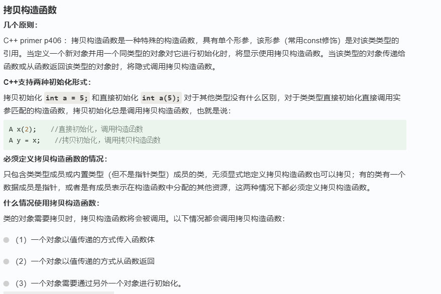


# 知识点二：param参数服务器

rosparam load(先准备 yaml 文件)  从外部文件加载参数

rosparam  command

```xml
<param name="robot_description" command="$(find xacro)/xacro $(find demo01_urdf_helloworld)/urdf/xacro/my_base.urdf.xacro" />
```

- `name="robot_description"`：这是参数的名称。在这个例子中，参数名是 `robot_description`，通常用于存储机器人的URDF（Unified Robot Description Format）描述。

- `command="$(find xacro)/xacro $(find demo01_urdf_helloworld)/urdf/xacro/my_base.urdf.xacro"`：这是一个指令，告诉ROS如何生成这个参数的值。具体来说，这里的指令是调用 `xacro`（XML宏）工具来处理一个Xacro文件，并生成URDF描述。

详细解释 `command` 的内容：

1. `$(find xacro)/xacro`：
   - `$(find xacro)`：这是ROS的一个查找命令，用来找到 `xacro` 包的路径。
   - `/xacro`：这是 `xacro` 包中的 `xacro` 可执行文件。结合前面的查找命令，这部分指定了要运行的程序。

2. `$(find demo01_urdf_helloworld)/urdf/xacro/my_base.urdf.xacro`：
   - `$(find demo01_urdf_helloworld)`：这是另一个ROS的查找命令，用来找到 `demo01_urdf_helloworld` 包的路径。
   - `/urdf/xacro/my_base.urdf.xacro`：这是在 `demo01_urdf_helloworld` 包中指定的Xacro文件的路径。结合前面的查找命令，这部分指定了要处理的文件。

综合起来，这个指令的意思是：

1. 找到 `xacro` 包，并运行其中的 `xacro` 可执行文件。
2. 找到 `demo01_urdf_helloworld` 包，并处理其中的 `urdf/xacro/my_base.urdf.xacro` 文件。
3. `xacro` 工具会将这个Xacro文件转换成URDF文件，并将结果作为 `robot_description` 参数的值。

### 使用这个 `<param>` 标签的典型场景

通常，这个参数会在启动文件（launch file）中使用，以便在启动时加载机器人的URDF描述。例如：

```xml
<launch>
  <!-- Define the robot description parameter -->
  <param name="robot_description" command="$(find xacro)/xacro $(find demo01_urdf_helloworld)/urdf/xacro/my_base.urdf.xacro" />

  <!-- Launch other nodes that need the robot description -->
  <node name="robot_state_publisher" pkg="robot_state_publisher" type="robot_state_publisher" />
</launch>
```

在这个启动文件中，首先定义了 `robot_description` 参数，接着启动 `robot_state_publisher` 节点，这个节点会使用 `robot_description` 参数来获取机器人的URDF描述。

希望这能帮助你理解这个 `<param>` 标签的作用和用法。如果有更多问题或需要进一步解释，请随时问我！


#### 参数服务器获取参数

```
/*
    参数服务器操作之查询_C++实现:
    在 roscpp 中提供了两套 API 实现参数操作
    ros::NodeHandle

        param(键,默认值) 
            存在，返回对应结果，否则返回默认值

        getParam(键,存储结果的变量)
            存在,返回 true,且将值赋值给参数2
            若果键不存在，那么返回值为 false，且不为参数2赋值

        getParamCached键,存储结果的变量)--提高变量获取效率
            存在,返回 true,且将值赋值给参数2
            若果键不存在，那么返回值为 false，且不为参数2赋值

        getParamNames(std::vector<std::string>)
            获取所有的键,并存储在参数 vector 中 

        hasParam(键)
            是否包含某个键，存在返回 true，否则返回 false

        searchParam(参数1，参数2)
            搜索键，参数1是被搜索的键，参数2存储搜索结果的变量

    ros::param ----- 与 NodeHandle 类似


*/

#include "ros/ros.h"

int main(int argc, char *argv[])
{
    setlocale(LC_ALL,"");
    ros::init(argc,argv,"get_param");

    //NodeHandle--------------------------------------------------------
    /*
    ros::NodeHandle nh;
    // param 函数
    int res1 = nh.param("nh_int",100); // 键存在
    int res2 = nh.param("nh_int2",100); // 键不存在
    ROS_INFO("param获取结果:%d,%d",res1,res2);

    // getParam 函数
    int nh_int_value;
    double nh_double_value;
    bool nh_bool_value;
    std::string nh_string_value;
    std::vector<std::string> stus;
    std::map<std::string, std::string> friends;

    nh.getParam("nh_int",nh_int_value);
    nh.getParam("nh_double",nh_double_value);
    nh.getParam("nh_bool",nh_bool_value);
    nh.getParam("nh_string",nh_string_value);
    nh.getParam("nh_vector",stus);
    nh.getParam("nh_map",friends);

    ROS_INFO("getParam获取的结果:%d,%.2f,%s,%d",
            nh_int_value,
            nh_double_value,
            nh_string_value.c_str(),
            nh_bool_value
            );
    for (auto &&stu : stus)
    {
        ROS_INFO("stus 元素:%s",stu.c_str());        
    }

    for (auto &&f : friends)
    {
        ROS_INFO("map 元素:%s = %s",f.first.c_str(), f.second.c_str());
    }

    // getParamCached()
    nh.getParamCached("nh_int",nh_int_value);
    ROS_INFO("通过缓存获取数据:%d",nh_int_value);

    //getParamNames()
    std::vector<std::string> param_names1;
    nh.getParamNames(param_names1);
    for (auto &&name : param_names1)
    {
        ROS_INFO("名称解析name = %s",name.c_str());        
    }
    ROS_INFO("----------------------------");

    ROS_INFO("存在 nh_int 吗? %d",nh.hasParam("nh_int"));
    ROS_INFO("存在 nh_intttt 吗? %d",nh.hasParam("nh_intttt"));

    std::string key;
    nh.searchParam("nh_int",key);
    ROS_INFO("搜索键:%s",key.c_str());
    */
    //param--------------------------------------------------------
    ROS_INFO("++++++++++++++++++++++++++++++++++++++++");
    int res3 = ros::param::param("param_int",20); //存在
    int res4 = ros::param::param("param_int2",20); // 不存在返回默认
    ROS_INFO("param获取结果:%d,%d",res3,res4);

    // getParam 函数
    int param_int_value;
    double param_double_value;
    bool param_bool_value;
    std::string param_string_value;
    std::vector<std::string> param_stus;
    std::map<std::string, std::string> param_friends;

    ros::param::get("param_int",param_int_value);
    ros::param::get("param_double",param_double_value);
    ros::param::get("param_bool",param_bool_value);
    ros::param::get("param_string",param_string_value);
    ros::param::get("param_vector",param_stus);
    ros::param::get("param_map",param_friends);

    ROS_INFO("getParam获取的结果:%d,%.2f,%s,%d",
            param_int_value,
            param_double_value,
            param_string_value.c_str(),
            param_bool_value
            );
    for (auto &&stu : param_stus)
    {
        ROS_INFO("stus 元素:%s",stu.c_str());        
    }

    for (auto &&f : param_friends)
    {
        ROS_INFO("map 元素:%s = %s",f.first.c_str(), f.second.c_str());
    }

    // getParamCached()
    ros::param::getCached("param_int",param_int_value);
    ROS_INFO("通过缓存获取数据:%d",param_int_value);

    //getParamNames()
    std::vector<std::string> param_names2;
    ros::param::getParamNames(param_names2);
    for (auto &&name : param_names2)
    {
        ROS_INFO("名称解析name = %s",name.c_str());        
    }
    ROS_INFO("----------------------------");

    ROS_INFO("存在 param_int 吗? %d",ros::param::has("param_int"));
    ROS_INFO("存在 param_intttt 吗? %d",ros::param::has("param_intttt"));

    std::string key;
    ros::param::search("param_int",key);
    ROS_INFO("搜索键:%s",key.c_str());

    return 0;
}
```


# 知识点三：vector使用

## 好处：向量（`vector`）是一个动态数组，可以根据需要增加其大小。

```
geometry_msgs::Pose wp;
std::vector<geometry_msgs::Pose> waypoints;

// 定义第一个图片靶的位置
wp.position.x = 0; //假设图片1位置
wp.position.y = 0;
wp.position.z = 1;
waypoints.push_back(wp);

// 清空wp变量，重新使用
wp = geometry_msgs::Pose();
wp.position.x = 1; //假设图片2位置
wp.position.y = 0;
wp.position.z = 1;
waypoints.push_back(wp);

// 定义其他图片靶的位置
wp = geometry_msgs::Pose(); 
wp.position.x = 2; //假设图片3位置
wp.position.y = 0;
wp.position.z = 1;
waypoints.push_back(wp);

wp = geometry_msgs::Pose(); 
wp.position.x = 3; //假设图片4位置
wp.position.y = 0;
wp.position.z = 1;
waypoints.push_back(wp);
```

`push_back()` 是 C++ STL（Standard Template Library，标准模板库）中 `std::vector` 类的成员函数，用于向向量（`vector`）的末尾添加一个元素。

### 用法：
```cpp
vector_name.push_back(value);
```

### 参数：
- `vector_name` 是要添加元素的向量的名称。
- `value` 是要添加到向量中的元素的值。

### 功能：
- 将指定的元素添加到向量的末尾，扩展向量的大小，并将新元素放置在新的末尾位置。

### 示例：
```cpp
std::vector<int> my_vector;
my_vector.push_back(10); // 向 my_vector 向量的末尾添加值为 10 的元素
```

### 注意事项：
- `push_back()` 操作会动态增长向量（vector）的大小，因此在添加大量元素时要考虑内存使用。
- 向量（`vector`）是一个动态数组，可以根据需要增加其大小。

### 更多信息：
- `push_back()` 只能在向量末尾添加元素，不能在中间或头部插入。
- 当插入元素时，向量会自动调整大小以容纳新元素。
- 您可以将任何类型的元素添加到向量中，包括自定义类型和结构。

希望这些信息能帮助您更好地理解`push_back()` 函数的用法和语法。

### vector定义

```
vector<int> a;           //无参数 - 构造一个空的vector,
vector<int> a(10);       //定义了10个整型元素的向量（尖括号中为元素类型名，它可以是任何合法的数据类型），但没有给出初值，其值是不确定的。
vector<int> a(10,1);     //定义了10个整型元素的向量,且给出每个元素的初值为1
vector<int> a(b);        //用b向量来创建a向量，整体复制性赋值， 拷贝构造
vector<int> v3=a ;       //移动构造
vector<int> a(b.begin(),b.begin+3);   //定义了a值为b中第0个到第2个（共3个）元素
int b[7]={1,2,3,4,5,9,8};
vector<int> a(b,b+6);    //从数组中获得初值，b[0]~b[5]
```

### 基本操作

```
    （1）a.assign(b.begin(), b.begin()+3); //b为向量，将b的0~2个元素构成的向量赋给a
    （2）a.assign(4,2);        //是a只含4个元素，且每个元素为2
    （3）a.back();             //返回a的最后一个元素
    （4）a.front();            //返回a的第一个元素
    （5）a[i];                 //返回a的第i个元素，当且仅当a[i]存在2013-12-07
    （6）a.clear();            //清空a中的元素
    （7）a.empty();            //判断a是否为空，空则返回ture,不空则返回false
    （8）a.pop_back();         //删除a向量的最后一个元素
    （9）a.erase(a.begin()+1, a.begin()+3);  //删除a中第1个（从第0个算起）到第2个元素，也就是说删除的元素从a.begin()+1算起（包括它）一直到a.begin()+3（不包括它）
    （10）a.push_back(5);      //在a的最后一个向量后插入一个元素，其值为5
    （11）a.insert(a.begin()+1, 5);         //在a的第1个元素（从第0个算起）的位置插入数值5，如a为1,2,3,4，插入元素后为1,5,2,3,4
    （12）a.insert(a.begin()+1, 3,5);       //在a的第1个元素（从第0个算起）的位置插入3个数，其值都为5
    （13）a.insert(a.begin()+1,b+3, b+6);   //b为数组，在a的第1个元素（从第0个算起）的位置插入b的第3个元素到第5个元素（不包括b+6），如b为1,2,3,4,5,9,8，插入元素后为1,4,5,9,2,3,4,5,9,8
    （14）a.size();            //返回a中元素的个数；
    （15）a.capacity();        //返回a在内存中总共可以容纳的元素个数
    （16）a.resize(10);        //将a的现有元素个数调至10个，多则删，少则补，其值随机
    （17）a.resize(10, 2);      //将a的现有元素个数调至10个，多则删，少则补，其值为2
    （18）a.reserve(100);      //将a的容量（capacity）扩充至100，也就是说现在测试a.capacity();的时候返回值是100.这种操作只有在需要给a添加大量数据的时候才显得有意义，因为这将避免内存多次容量扩充操作（当a的容量不足时电脑会自动扩容，当然这必然降低性能） 
    （19）a.swap(b);           //b为向量，将a中的元素和b中的元素进行整体性交换
    （20）a.begin();           // 返回指向容器第一个元素的迭代器
    （21）a.end();             // 返回指向容器最后一个元素的迭代器
    （22）a==b;                //b为向量，向量的比较操作还有!=,>=,<=,>,<
    (23) reverse(a.begin(),a.end()); //对a中的从a.begin()（包括它）到a.end()（不包括它）的元素倒置，但不排列，如a中元素为1,3,2,4,倒置后为4,2,3,1
   （24）copy(a.begin(),a.end(),b.begin()+1); //把a中的从a.begin()（包括它）到a.end()（不包括它）的元素复制到b中，从b.begin()+1的位置（包括它）开        始复制，覆盖掉原有元素
```


**对vertices优化**，提前告诉编辑器vertices有三个空间，这样pushback时就只调用三次拷贝构造函数。若不一开始给编辑器说空间为三则会调用拷贝构造函数次数为（1+2+3=6次）（vector动态增加，第一次添加时vertices大小为1，第二次添加时vertices大小为2，第三次就为3了，所以为6次）

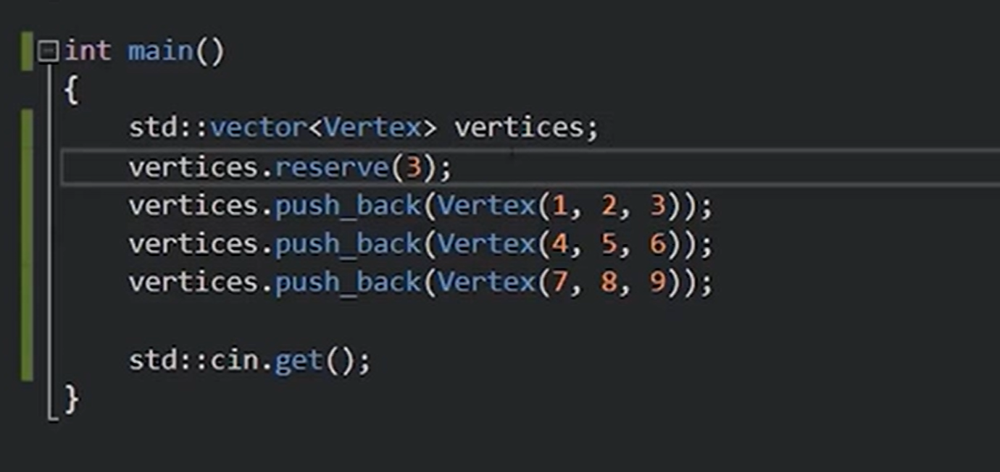

**继续优化**：换为emplaceback，因此要传入初始化参数列表，他将帮忙创建一个vertices类，不会拷贝，即不会调用拷贝构造函数

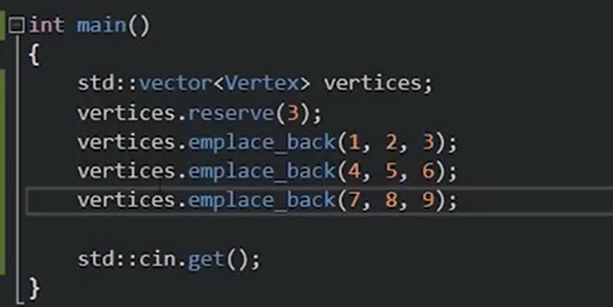

# 知识点四：让无人机进入offboard模式

1.有定位源。查看/mavros/local/position有数据输出

2.发布频率大于2HZ

3./cmd_pose_enu话题和/mavros/ setpoint_position/local话题控制位置区别:用第一个不能进入offfboard模式，用第二个可以进入。

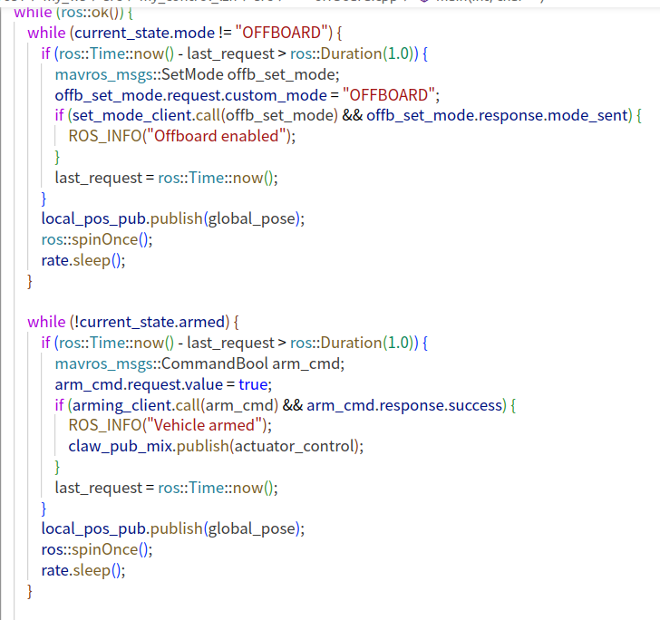


# 知识点五：类模版，命名空间

## 在这段代码中，`square<double> test(x);` 是在 C++ 中创建一个类模板 `square` 的实例对象 `test`。以下是详细解释：

### 1. **类模板 `square` 的定义**
```cpp
template <typename T>
class square {
public:
    T a;
    square(T _a) {
        a = _a * _a;
    }
};
```
- 这里定义了一个类模板 `square`，其中 `T` 是一个模板参数，表示类型参数。`T` 可以是任何数据类型，如 `int`、`float`、`double` 等。
- 类中有一个公共成员变量 `a`，类型为 `T`。
- 构造函数 `square(T _a)` 接受一个类型为 `T` 的参数 `_a`，并将 `_a * _a` 的结果赋值给成员变量 `a`。

### 2. **创建类模板的实例**
```cpp
square<double> test(x);
```
- `square<double>`：这里的 `square<double>` 表示将模板参数 `T` 指定为 `double` 类型，生成一个具体类型的类 `square<double>`。
- `test(x)`：`test` 是一个 `square<double>` 类型的对象，`x` 作为参数传递给 `square<double>` 的构造函数。

### 3. **工作原理**
当你执行 `square<double> test(x);` 时，以下操作会发生：
- 变量 `x` 被传递给 `square<double>` 类的构造函数。
- 在构造函数中，`_a * _a` 被计算出来，结果赋值给 `a`。
- 由于 `x` 是 `5.5`，`_a * _a` 的结果是 `5.5 * 5.5 = 30.25`。
- 因此，`test.a` 的值为 `30.25`。

### 4. **程序输出**
```cpp
std::cout << "the square of " << x << " is " << test.a << std::endl;
```
- 最后，程序输出 `the square of 5.5 is 30.25`，这表明 `test.a` 保存了 `x` 的平方值。

综上所述，`square<double> test(x);` 创建了一个 `square` 类的 `double` 类型实例，计算并存储了 `x` 的平方值。


# 知识点六：const在变量和函数不同位置时的不同作用

在C++中，`const`关键字用于限定变量和函数行为的不变性，但它的具体含义会根据出现的位置而有所不同。以下是一些常见场景的说明：

1. **变量声明中的`const`**

   - **常量变量：**

     ```cpp
     const int a = 10;
     ```

     表示`a`的值在初始化后不可更改。

   - **指针和数组：**

     - `const int* p`（或`int const* p`）：指针`p`指向的内容不可修改，但指针本身可以改变；
     - `int* const p`：指针`p`本身为常量，即指向地址不能改变，但指向内容可修改；
     - `const int* const p`：指针和指针指向的数据都不能修改。

2. **函数参数中的`const`**

   - **传值参数：**
     对基本数据类型（如`int`、`double`等），即使加了`const`修饰也只是告诉函数内部不修改参数的值，但调用者传参时并不会受到影响，因为传值时会产生拷贝。

     ```cpp
     void func(const int x);
     ```

   - **引用和指针参数：**
     当传递对象时，为了避免不必要的拷贝且保证参数不会被修改，通常会使用`const`引用或`const`指针。

     ```cpp
     void func(const std::string& str);
     void func(const int* p);
     ```

     这样既能提高效率，也能保证函数不会意外修改传入的数据。

3. **函数返回值中的`const`**

   - **返回值为常量：**
     为防止调用者修改返回的对象，可以在返回类型前加`const`。如返回一个常量引用或常量指针：

     ```cpp
     const std::string& getName();
     const int* getData();
     ```

     注意，对内置类型或拷贝返回值加`const`意义较小，更多用于防止误用返回对象的某些操作。

4. **成员函数中的`const`**

   - 在类成员函数声明后添加`const`，表示该函数不会修改对象的任何非`mutable`成员变量。

     ```cpp
     class MyClass {
     public:
         int getValue() const;  // 保证不会修改成员变量
     };
     ```

     这不仅是对调用者的一种承诺，也允许在`const`对象上调用该函数。

总结来说，`const`通过限制变量和函数行为，可以保证数据的安全性和程序的正确性，其不同位置的语法规则（例如作用于指针、引用、函数参数或成员函数）赋予了程序员细粒度的控制能力，从而帮助预防意外修改数据以及提高代码的可读性和可维护性。

**举例说明**

下面将针对C++中`const`在不同位置的使用分别举例说明，帮助理解它们各自的含义和效果。

------

1. 变量声明中的 `const`

- **常量变量**
  声明后值不可修改，常用于定义不变的量。

  ```cpp
  const int a = 10;
  // a = 20; // 编译错误，无法修改
  ```

- **指针与`const`的组合**

  1. **指向常量的指针**
     指针指向的内容不可修改，但指针本身可以指向其他地址。

     ```cpp
     const int val1 = 100;
     int val2 = 200;
     const int* ptr1 = &val1;
     // *ptr1 = 150; // 编译错误，不能修改指向的值
     ptr1 = &val2;  // 合法，指针可以重新指向另一个变量
     ```

  2. **常量指针**
     指针本身不可修改，即不能指向其他地址，但指向的内容可以修改（若该内容本身允许修改）。

     ```cpp
     int var1 = 50;
     int var2 = 60;
     int* const ptr2 = &var1;
     *ptr2 = 55;   // 合法，修改了var1的值
     // ptr2 = &var2; // 编译错误，不能改变指针的指向
     ```

  3. **指向常量的常量指针**
     指针本身和指针指向的内容均不可修改。

     ```cpp
     const int var3 = 500;
     const int* const ptr3 = &var3;
     // *ptr3 = 600; // 编译错误，不能修改值
     // ptr3 = &var3; // 编译错误，不能改变指针指向
     ```

------

2. 函数参数中的 `const`

- **传值参数中的`const`**
  对于传值参数，`const`限定符在函数内部保证参数不会被意外修改，但调用者依旧传递的是拷贝。

  ```cpp
  void funcByValue(const int x) {
      // x = 20; // 试图修改x会导致编译错误
  }
  // 注意：调用函数时传入的参数本身不会受影响
  ```

- **引用参数中的`const`**
  使用引用传递（避免拷贝开销）且保证函数内不修改传入的数据。

  ```cpp
  void funcByConstRef(const std::string& str) {
      // str += "abc"; // 编译错误，不能修改str
  }
  ```

- **指针参数中的`const`**

  1. 传递指针地址且不允许函数修改指向的数据

     ```cpp
     void funcByConstPtr(const int* p) {
         // *p = 10; // 编译错误，不能修改指针指向的数据
     }
     ```

  2. 传递常量指针（允许修改指向的数据，但不允许改变指针指向）

     ```cpp
     void funcByPtr(int* const p) {
         *p = 10;  // 合法，修改了指针指向的数据
         // p = nullptr; // 编译错误，不能改变p的指向
     }
     ```

------

3. 函数返回值中的 `const`

- **返回值为常量引用或常量指针**
  这种用法可以防止调用者对返回的对象进行修改。如果返回值是局部对象则需要注意生命周期问题。

  - 返回常量引用（通常用于类成员或全局静态对象）：

    ```cpp
    class MyClass {
    private:
        std::string name;
    public:
        const std::string& getName() const {
            return name;  // 返回引用，不允许修改
        }
    };
    ```

  - 返回指向常量数据的指针：

    ```cpp
    const int* getConstData() {
        static const int data = 42;
        return &data;  // 返回指向常量的指针
    }
    ```

------

4. 成员函数中的 `const`

- **成员函数后加`const`**
  用于表示该成员函数不会修改对象的状态（除了被`mutable`修饰的成员），这对于保证类接口的纯读操作非常重要。

  ```cpp
  class Point {
  private:
      int x, y;
  public:
      Point(int _x, int _y) : x(_x), y(_y) {}
  
      // 保证不修改成员变量
      int getX() const {
          return x;
      }
  
      // 如果尝试在const成员函数中修改成员变量，将会导致编译错误
      // void setX(int _x) const {
      //     x = _x; // 编译错误
      // }
  };
  ```

------

通过这些例子可以看到，`const`在不同的上下文中有着不同的作用：

- 在变量声明中，它能将数据设为只读；
- 在函数参数中，它能保护传入的数据不会被函数修改；
- 在函数返回值中，它帮助传递只读数据；
- 在成员函数中，它保证函数调用不会修改对象状态。

这样灵活而细致的控制，有助于开发出更安全、更稳定和更易维护的C++程序。


# 知识点七：new

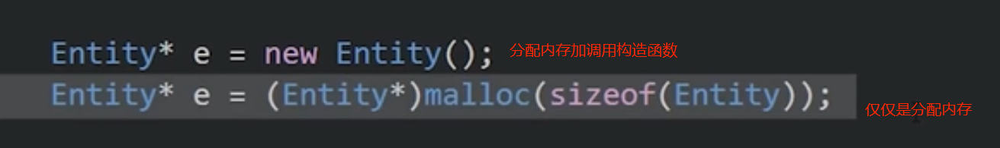

# 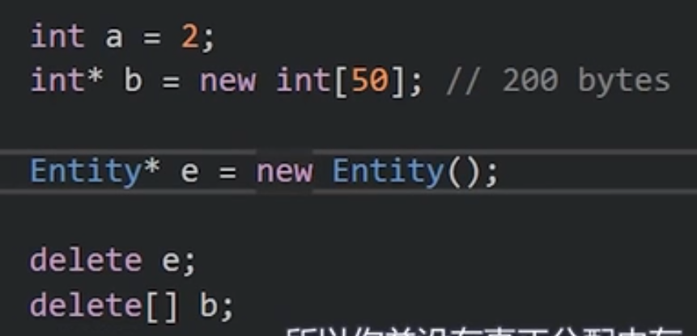


# 知识点八：多态

虚函数的原理：虚函数表

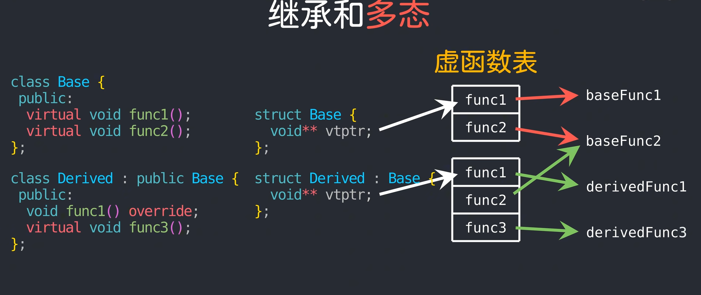

- 使用C语言**实现成员函数**：有两种方法A和B：

A：通过函数指针来实现结构体里放函数

B：直接用外部指针来实现

```c
//外部定义的函数第一个参数都要是函数指针This，在C++的类中成员函数的第一个参数都是This指针但一般都省略不写
void say(X* This, int a){
    This->v=a;
}

///////A(成员函数有虚函数时采用此类方法)
//目的:用函数指针（虚函数列表），不同对象时调用不同的函数，实现多态。
struct X{
    int v;
    void (*X_sayPtr)(X* ,int );
}
//A的调用调用
struct X x;
x.X_sayPtr->say;
x.X_sayPtr(&x,20);
////////////////////////////////////////

///////B(一般成员函数都采用这种方法)
//目的:不用函数指针，可以节约空间，
//缺点：对于父类和子类，调用同一个接口函数时(传入类型为父类（基类）类型，方便扩展)，调用的成员函数会是基类的成员函数，不会调用我们想要的子类成员函数。即无法实现多态！
struct X{
    int v;
}
//B的调用调用
struct X x;
say(&x,20);
/////////////////////////////////////////////
```

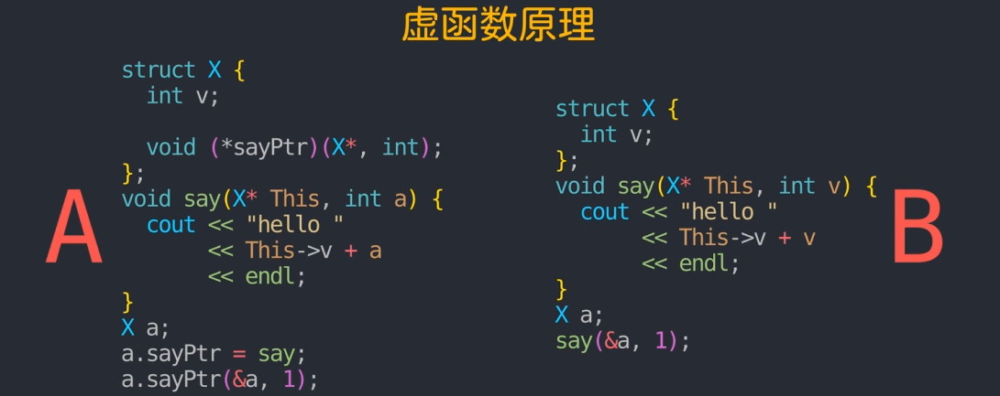

- 优化用A实现成员函数（使用虚函数列表）（虚函数列表定义的引入）

```c
//用上面的A来实现多态：当成员函数有多个虚函数时（多个函数指针）
struct Base{
    void (*X_sayPtr)(Base*);
    int (*Y_sayPtr)(Base* ,int );
    float (*Z_sayPtr)(Base* ,float );
}
//为了优化内存，故将函数指针放到一个数组中去
//故用虚函数表(即指针的指针)   类型 ** 
//又因为函数指针有多种类型，我们便不要求其类型，使其可以接受多种类型用Void
//故类型为         			void ** 
void ** //虚函数表类型

//优化后
struct Base{
    void ** vtptr;
}   
```

- 父类和子类实现虚函数（虚函数原理）

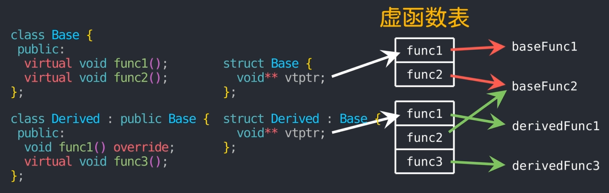

- 使用C语言实现虚函数（多态）：

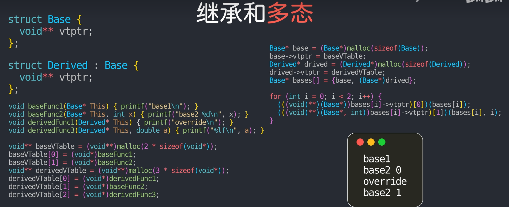

# 知识点九：boost：：bind函数的使用

背景：下面这一行代码将 ROS 订阅到的消息，绑定到 `fsm.cmd_data` 对象的成员函数 `feed`：

```cpp
ros::Subscriber cmd_sub =
  nh.subscribe<quadrotor_msgs::PositionCommand>(
    "cmd",                    // 话题名
    100,                      // 队列长度
    boost::bind(
      &Command_Data_t::feed,  // （1）成员函数指针
      &fsm.cmd_data,          // （2）要调用该成员函数的对象实例地址
      _1                      // （3）占位符：表示将把订阅到的消息作为第 1 个参数传入
    ),
    ros::VoidConstPtr(),
    ros::TransportHints().tcpNoDelay()
  );
```

作用：这样就无需写全局函数或静态函数，把消息直接传给某个类的成员方法，实现代码结构清晰、职责分离。

------

boost::bind 语法拆解

```cpp
boost::bind(&Command_Data_t::feed, &fsm.cmd_data, _1)
```

1. **`&Command_Data_t::feed`**
    这是类 `Command_Data_t` 的成员函数指针，指向函数

   ```cpp
   void Command_Data_t::feed(const quadrotor_msgs::PositionCommand::ConstPtr& msg);
   ```

2. **`&fsm.cmd_data`**
    `fsm` 是某个状态机对象，其成员 `cmd_data` 类型为 `Command_Data_t`。取它的地址，就把这个具体实例“绑”到上面那个成员函数指针上。

3. **`_1`**
    Boost 提供的占位符，表示“把调用者传来的第 1 个参数传给 `feed` 的第 1 个参数”。在 ROS 中，订阅回调会传入一个消息指针，这个指针就会映射到 `_1`。

------

执行流程

1. 当有新消息发布到 `"cmd"` 话题时，ROS 会内部调用这个绑定后的可调用对象（functor），并把消息指针当作参数传入。

2. 绑定对象接收到该指针后，最终执行：

   ```cpp
   fsm.cmd_data.feed(msg_ptr);
   ```

这样就无需写全局函数或静态函数，把消息直接传给某个类的成员方法，实现代码结构清晰、职责分离。

------

通用形式

如果有任意类成员函数要绑定，模式都是：

```cpp
boost::bind(&ClassName::method,    // 成员函数指针
            object_ptr_or_ref,     // 调用该函数的对象
            _1, _2, …);            // 占位符，对应函数参数
```

你也可以同时绑定常量参数：

```cpp
boost::bind(&MyClass::foo, &obj, 5, _1);
// 每次调用时，foo(5, incoming_msg) 会被执行
```

------

与 std::bind 的对比

C++11 起也可用标准库：

```cpp
using std::placeholders::_1;
…
nh.subscribe<…>(
  "cmd", 100,
  std::bind(&Command_Data_t::feed, &fsm.cmd_data, _1),
  …
);
```

两者功能相同，只是 ROS 生态里历史上大量使用 Boost.Function/Boost.Bind，因此你经常会看到 `boost::bind`。

# 知识点十：成员函数与普通函数指针

在 C++ 里，“普通函数指针” 和 “成员函数指针” 是两种不同的类型，语法和语义都不一样。下面分几方面说明，帮助理解为什么写成 `&Command_Data_t::feed` 而不是直接写 `Command_Data_t::feed`。

------

1. 普通函数 vs 成员函数

- **普通函数**（free function）比如

  ```cpp
  void foo(int);
  ```

  它的名字 `foo` 在大多数上下文里会退化（decay）成一个指向该函数的指针，类型是 `void(*)(int)`。此时写 `foo` 就相当于取地址，写 `&foo` 也是一样，二者等价。

- **成员函数**（member function）属于某个类，签名上隐含了一个额外的 `this` 指针：

  ```cpp
  struct A {
    void bar(int);
  };
  ```

  `bar` 的类型并不是 `void(*)(A*,int)`（普通函数指针），而是**成员函数指针**： `void (A::*)(int)`。它需要记录“这是哪个类的成员”这个信息，编译器内部处理也不同。

------

2. 语法要求：必须带类作用域和取址符

C++ 标准规定：

- 成员函数指针必须写成 `&类名::成员函数名` 的形式，编译器才能识别这是在取“指向成员函数”的地址。
- 如果你写单独的 `Command_Data_t::feed`，这不是一个完整的表达式，编译器不知道你是要取地址还是调用它，因而会报错。

举例对比：

| 写法                    | 含义                                                | 是否正确      |
| ----------------------- | --------------------------------------------------- | ------------- |
| `&Command_Data_t::feed` | 取成员函数指针，类型 `void (Command_Data_t::*)(… )` | 正确          |
| `Command_Data_t::feed`  | 语法不完整，编译错误                                | 错误          |
| `&feed`（若在类外）     | 寻找全局函数 `feed`，不是成员函数                   | 错误/不符类型 |

------

3. 为什么普通函数可以省略 `&`，成员函数不行

- 对于普通函数，C++ 有一个“函数名自动转换为函数指针”的规则（function-to-pointer decay），写 `foo` 会自动当作 `&foo`。
- **但这个自动转换不适用于成员函数指针**。成员函数指针没有 decay 规则，必须显式写 `&Class::method`。

------

4. 调用成员函数指针

拿到 `void (Command_Data_t::*pmf)(const MsgPtr&) = &Command_Data_t::feed;` 之后，你还需要通过对象来调用它：

```cpp
Command_Data_t obj;
(auto ptr = pmf; )  // 指向成员函数的指针
(obj.*ptr)(msg_ptr); // 通过 .* 语法在 obj 上调用
// 或者
Command_Data_t* p = &obj;
(p->*ptr)(msg_ptr);  // 通过 ->* 语法在 p 所指对象上调用
```

`boost::bind(&Command_Data_t::feed, &fsm.cmd_data, _1)` 就是把这步骤都封装好了：

- `&Command_Data_t::feed` 拿到成员函数指针
- `&fsm.cmd_data` 指定调用对象
- `_1` 指定运行时传进来的参数

------

**小结**

1. **成员函数指针类型与普通函数指针不同**，没有自动 decay 机制。
2. 标准语法要求“取成员函数指针”时必须写 `&Class::method`。
3. `boost::bind` 接受的正是这种 `void (Class::*)(…)` 类型指针，才能内部完成 `object->*method(args…)` 的调用。

因此在 ROS 回调里，你看见的 `boost::bind(&Command_Data_t::feed, &fsm.cmd_data, _1)`，`&Command_Data_t::feed` 是必需且正确的写法。


# C的知识点一:static的使用

在C语言中，`static`关键字有以下几个主要作用，取决于它的使用位置：

### 1. **局部变量中的 `static`**：
当 `static` 用于函数内部的局部变量时，该变量的**生命周期**从程序开始到结束，但它的**作用域**仍然是函数内部。也就是说，`static` 局部变量只会被初始化一次，之后即使函数被多次调用，它也会保留上一次函数调用时的值。

**示例：**
```c
#include <stdio.h>

void counter() {
    static int count = 0; // 只初始化一次
    count++;
    printf("Count = %d\n", count);
}

int main() {
    counter(); // 输出：Count = 1
    counter(); // 输出：Count = 2
    counter(); // 输出：Count = 3
    return 0;
}
```

在上面的例子中，`count`变量会在第一次调用 `counter()` 时初始化为0，之后每次调用都会保留它的值，而不会重新初始化。

### 2. **全局变量中的 `static`**：
当 `static` 用于全局变量时，该变量的作用域会被限制在**定义它的文件内部**，而不是整个程序。这意味着在其他文件中无法访问这个变量，即便通过 `extern` 关键字也无法引用。

**示例：**
```c
// file1.c
static int globalVar = 0; // 只能在file1.c中使用

void modifyVar() {
    globalVar++;
}
```

在上面的例子中，`globalVar` 是一个静态全局变量，它只能在 `file1.c` 文件中使用，其他文件无法访问或修改它。

### 3. **函数中的 `static`**：
当 `static` 用于函数时，表示该函数的**作用域**被限制在定义它的文件中。也就是说，该函数无法在其他文件中调用，即使在其他文件中使用 `extern` 也无法引用这个函数。

**示例：**
```c
// file1.c
static void printMessage() {
    printf("This is a static function.\n");
}

// file2.c
// 无法调用file1.c中的printMessage函数
```

总结：
- `static` 在局部变量中用于保持变量的值在函数调用之间不变。
- `static` 在全局变量中用于限制变量的作用域，使其只在定义它的文件中可见。
- `static` 用于函数时，限制函数的作用域为定义它的文件。


# C语言知识点二：sprintf函数的使用

`sprintf` 是 C 语言中的一个函数，用于将格式化的数据输出到字符串中。你可以使用 `sprintf` 将不同类型的数据格式化后存入一个字符数组中。它的工作方式与 `printf` 类似，只不过 `printf` 是将数据输出到控制台，而 `sprintf` 是将数据输出到字符串中。

`sprintf` 的基本语法如下：

```c
int sprintf(char *str, const char *format, ...);
```

- `str`：存储格式化后的字符串的字符数组。
- `format`：格式字符串，指定如何格式化后面的参数。
- `...`：要格式化的数据，可以是多个参数。

### 常见的格式说明符：
- `%d`：整型数
- `%f`：浮点数（默认保留6位小数）
- `%.2f`：保留2位小数的浮点数
- `%s`：字符串
- `%c`：字符

### 示例讲解：

你提到的代码：
```c
sprintf(temp_str, "T=%.2f \n", temperature);
```

这段代码的含义是：
1. 将浮点数 `temperature` 保留两位小数后，格式化成字符串，存入 `temp_str`。
2. 格式化后的字符串是 `"T=XX.XX \n"`，其中 `XX.XX` 是温度值。

### 具体解释：
- `temp_str` 是一个字符数组，用来存储生成的字符串。
- `"T=%.2f \n"` 这个格式字符串表示输出一个带两位小数的浮点数，并在末尾添加一个换行符。
- `temperature` 是一个浮点数，它会根据格式说明符 `%.2f` 保留两位小数，并替换到字符串中的 `%.2f` 位置。

### 完整示例：
```c
#include <stdio.h>

int main() {
    char temp_str[20];  // 存储格式化后的字符串
    float temperature = 36.57;

    sprintf(temp_str, "T=%.2f \n", temperature);

    printf("%s", temp_str);  // 输出格式化后的字符串
    return 0;
}
```

输出结果：
```
T=36.57 
```

`sprintf` 函数不会像 `printf` 那样直接输出到控制台，而是将格式化的字符串存到 `temp_str` 中。


# C语言知识点三：函数指针

指向函数的指针：

```c
int func(int a){
    int b=10;
    int c=a*b;
    return c;
}
//定义一个函数指针
int (*func_name)(int,int*,...,)=NULL;
func_name=func();

//等效
int result1=func(10);
int result2=func_name(10);
```

用处：1、方便C语言抽象。2、C++的虚函数列表。3、C++类的本质

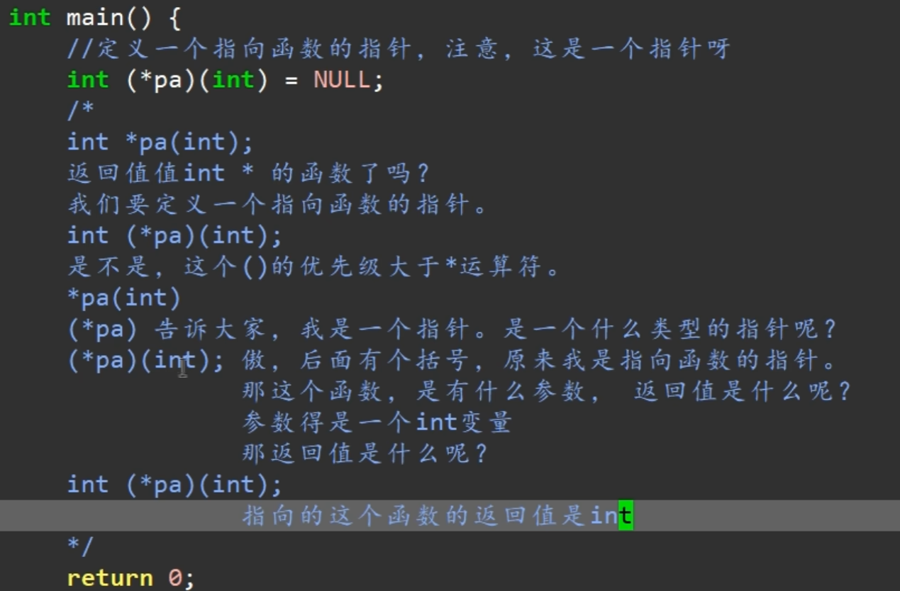
