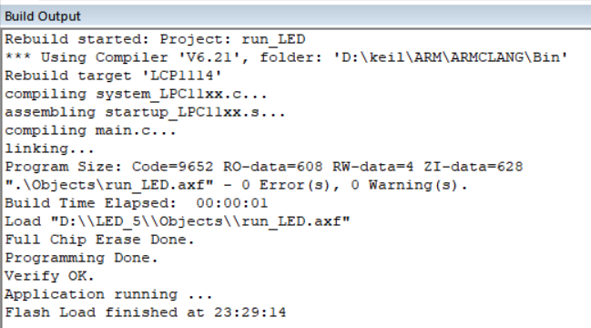
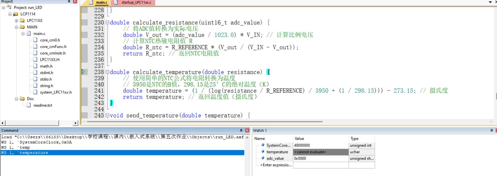

# 一.完整程序文本（带注释）

```c
///************************************************************************************** 

//在Keil MDK 4.74上编写一段程序：

//（1）初始化LPC1114微控制器UART串行口，设置波特率为115200，

//数据位：8，停止位：1；校验位：奇校验；中断使能，发送使能，等待接收数据；

//（2）AD转换器初始化为软件控制模式（CR中的BURST位为0，硬件触发[1]），

//开启AD中断，设置AD7为模拟输入引脚（AD7引脚连接一个10K的NTC负温度系数热敏电阻，见LPC1114 DevKit V5.4电路图）；

//（3）利用32位定时器0的MAT0定时1s匹配启动AD转换，

//在AD中断服务子程序中读取AD转换的值（AD7通道），

//并通过UART接口将移位转换后的值（10位，两个字节）发送到PC，利用串口调试助手接收数据。

//（4）改变NTC的温度（思考如何改变NTC的温度？注意不要用湿手触摸电路板），

//观察结果的变化。

//（5）附加题：在主程序中将转换结果换算成温度值，串口发送温度值到PC[2]。（可选做）

//要求：写出主程序、初始化子程序和中断服务子程序，并进行完整注释；

//建立工程项目，编译通过后并在LPC1114 DevKit口袋开发板上调试运行。

//作业提交方式：直接输入完整程序文本（带注释），并插入编译通过的图片和调试运行结果的小视频。

//提示：[1]软件控制模式的硬件触发可以选择32位定时器0或者16位定时器0的匹配输出方式触发，

// 这并不需要设置定时器匹配输出功能在器件引脚上出现。

//   [2]温度值要根据电路图和NTC的规格书中的表进行计算，需要用到线性插值法，

// 转换后的温度值为浮点数，发送到串口之前要进行拆字或者进行字符转换。

//**************************************************************************************/

\#include <LPC11xx.h>

\#include <stdio.h>

\#include <string.h>

\#include <math.h> // 引入数学库以使用log函数

\#define Vot_In_Ref 3.3       // 供电电压，假设为3.3V

\#define Resistor_Ref 10000.0  // 已知参考电阻值，假设为10kΩ

uint16_t adc_value = 0; // 从ADC7 读取的原始值

double Resistor = 0;      // 从ADC7 读取的转换后NTC电阻值

double temperature;

void UART_Init()

{

 LPC_SYSCON->SYSAHBCLKCTRL |= (1UL << 16); //IO配置块时钟使能

 LPC_IOCON->PIO1_6=(1UL<<0); //RXD

 LPC_IOCON->PIO1_7=(1UL<<0); //TXD

// 初始化LPC1114微控制器UART串行口，设置波特率为115200，

 LPC_SYSCON->SYSAHBCLKCTRL |= (1UL << 12); // UART时钟使能

 LPC_SYSCON->SYSAHBCLKDIV = 4; //12MHz

//数据位：8，停止位：1；校验位：奇校验；00

 //LPC_UART->LCR = 0x0b;

 LPC_UART->LCR = 0x8B;

 LPC_UART->DLL=4; //UART 的波特率为 115384。

 LPC_UART->DLM=0; //该速率与原来指定的 115200

 LPC_UART->FDR=0x85; //之间存在 0.16%的相对误差。

 LPC_UART->LCR = 0x0B; 

// 中断使能，发送使能，等待接收数据；

 LPC_UART->IER |=0x02;

 NVIC_EnableIRQ(UART_IRQn);

}

//UART发送数据

void UARTSend(uint8_t *BufferPtr, uint32_t Length) {

  while (Length != 0) {

​    while (!(LPC_UART->LSR & (1 << 5))); // 等待直到发送数据寄存器空

​    LPC_UART->THR = *BufferPtr;

​    BufferPtr++;

​    Length--;

  }

}

void ADC_7_Init(){

 LPC_SYSCON->PDRUNCFG &= ~(1UL<<4);

 LPC_SYSCON->SYSAHBCLKCTRL |= (1UL << 13); // ADC时钟使能

 LPC_SYSCON->SYSAHBCLKCTRL |= (1UL << 16); //IO配置块时钟使能

 LPC_SYSCON->SYSAHBCLKCTRL |= (1UL << 6); //GPIO配置块时钟使能

 LPC_IOCON->PIO1_11 = (1UL << 1) ; //ADC模拟输入(amode为0),(func01)

 LPC_GPIO1->DIR &= ~(1UL<<11); //GPIO配置输入

// AD转换器初始化为软件控制模式（CR中的BURST位为0，硬件触发[1]），

 LPC_ADC->CR |= (1UL<<7) //AD7

 | (23UL<<8) //24分频

 | (0UL << 16) //软件控制模式

 | (0UL << 24); //关闭转换

//开启AD中断，设置AD7为模拟输入引脚(PIO1_11)

 LPC_ADC->INTEN |= (1UL<<7) ;//开启AD7中断

 NVIC_EnableIRQ(ADC_IRQn);

//（AD7引脚连接一个10K的NTC负温度系数热敏电阻，

//见LPC1114 DevKit V5.4电路图）；

}

void TMR32B0_Init(void)

{

// （3）利用32位定时器0的MAT0定时1s匹配启动AD转换，

 LPC_SYSCON->SYSAHBCLKCTRL |= (1UL << 9); // 32位定时器0时钟使能

 LPC_TMR32B0->IR=0x1F;

 LPC_TMR32B0->PR = 0; //不分频 

 LPC_TMR32B0->MCR = 3; //设置MR0匹配后,重置定时器和产生中断；

 LPC_TMR32B0->MR0 = SystemCoreClock;//定时1s

 // 启动定时器

 LPC_TMR32B0->TCR = 0x01; //启动定时器

 NVIC_EnableIRQ(TIMER_32_0_IRQn);

}

void TIMER32_0_IRQHandler(void) {

 //在AD中断服务子程序中读取AD转换的值（AD7通道），//并通过UART接口将移位转换后的值（10位，两个字节）发送到PC，利用串口调试助手接收数据。

  if (LPC_TMR32B0->IR & 0x01) { // 检查MR0中断标志

​    LPC_ADC->CR |= (1 << 24); // 启动ADC转换

​    LPC_TMR32B0->IR = 0x01; // 清除MR0中断标志

  }

}

void send_temperature(double temperature) {

 // 计算电阻值 Resistor

 double V_out = (adc_value / 1023.0) * Vot_In_Ref; // 计算比例电压

   Resistor = Resistor_Ref * (V_out / (Vot_In_Ref - V_out)); 

 // 使用简单的NTC公式将电阻转换为温度

  // 3950是NTC的B值，298.15是25°C的绝对温度（K）

 temperature = (1 / (log(Resistor / Resistor_Ref) / 3950 + (1 / 298.15))) - 273.15; // 摄氏度

  char temp_str[16]; // 用于存储温度字符串

  sprintf(temp_str, "T=%.2f°\n", temperature); // 将温度值格式化为字符串

  UARTSend((uint8_t *)temp_str, strlen(temp_str)); // 发送温度字符串

}

void ADC_IRQHandler(void) {

  if (LPC_ADC->STAT & (1 << 7)) { // 检查AD7是否有转换完成

​    while ((LPC_ADC->DR[7] & 0x80000000) == 0);

​    adc_value = LPC_ADC->DR[7]; // 读取ADC7寄存器的值

​    adc_value = (adc_value >> 6) & 0x3FF; // 提取10位AD结果

​    // 通过串口发送温度值

​    send_temperature(temperature); // 发送温度值到串口

  }

}

int main()

{

 SystemInit();

 UART_Init();

 ADC_7_Init();

 TMR32B0_Init();      //初始化

 while(1){

 };             

}
```

# 二.代码解析

这段代码实现了一个LPC1114微控制器的应用，主要流程如下：

### 主流程概述：
1. **初始化UART串口通信**，以便与PC进行数据通信。
2. **初始化ADC**，用于采集模拟信号并转换为数字信号。模拟输入通道是`AD7`，用于连接NTC负温度系数热敏电阻。
3. **初始化32位定时器0**，定时1秒触发ADC转换。
4. **处理ADC中断**，在ADC转换完成时读取`AD7`的值，并通过UART将温度值发送到PC端。

### 具体的代码流程：
1. **`main`函数流程**：
   - 系统初始化`SystemInit()`。
   - 调用`UART_Init()`初始化串口，用于后续与PC串口调试助手通信。
   - 调用`ADC_7_Init()`配置AD转换器并设置`AD7`作为输入引脚。
   - 调用`TMR32B0_Init()`配置32位定时器，每隔1秒触发一次ADC转换。
   - 主循环`while(1)`持续运行，等待中断触发。

2. **UART初始化（`UART_Init`）**：
   - 打开LPC1114的UART时钟和IO配置时钟，配置串口的TXD和RXD引脚。
   - 设置波特率为115200，数据位为8位，停止位为1位，奇校验。 
   - 使能UART的发送中断，确保可以通过UART向PC发送数据。

3. **ADC初始化（`ADC_7_Init`）**：
   - 启用ADC的时钟，配置`PIO1_11`为ADC7通道的模拟输入引脚（连接热敏电阻）。
   - 配置ADC为软件控制模式（`BURST`位为0），并使能ADC7通道的中断功能。

4. **32位定时器初始化（`TMR32B0_Init`）**：
   - 启用定时器的时钟，并配置定时器0为1秒定时模式。每隔1秒，定时器会触发一个匹配中断（MAT0），该中断用来启动ADC转换。
   - 启动定时器并使能其中断。

5. **定时器中断处理（`TIMER32_0_IRQHandler`）**：
   - 每次定时器触发中断时，启动一次ADC转换（通过设置`LPC_ADC->CR`的`START`位）。

6. **ADC中断处理（`ADC_IRQHandler`）**：
   - 在ADC转换完成后，检查是否是`AD7`通道的数据完成。
   - 从`LPC_ADC->DR[7]`寄存器中读取AD7通道的10位转换结果。
   - 通过`send_temperature`函数将NTC电阻对应的温度值通过UART发送给PC。

7. **计算温度并发送（`send_temperature`）**：
   - 根据ADC的值计算NTC电阻对应的温度。使用的是NTC热敏电阻的阻值-温度转换公式。
   - 计算得到的温度值被格式化为字符串并通过UART发送到PC端。

### 重点分析：
1. **ADC转换**：每隔1秒，定时器触发ADC转换，采集热敏电阻上的电压信号。然后通过`ADC_IRQHandler`处理器中断获取AD转换结果。
2. **温度计算**：根据ADC采样值，首先计算热敏电阻的电阻值，再利用NTC的B值公式将电阻值转换为温度。温度计算采用了自然对数（`log`）函数。
3. **串口通信**：温度值被格式化后通过UART串口发送到PC。PC可以通过串口调试助手接收并显示温度值。

### 未完成的部分：
- **实际改变NTC温度**：代码中未处理如何实际改变热敏电阻的温度，这需要通过外部的加热或冷却手段（例如加热元件或冰袋）。
- **温度值换算与发送**：在代码中计算温度值，并通过`send_temperature`函数发送到PC。

# 三.编译通过的图片

![7}_DI3H4`]YKSS[XLR9YU)5.png](https://canvas.hainanu.edu.cn/users/59483/files/578776/preview?verifier=2KX7zYjiFgV2EVaeoVMLxuKYiIydF5ukJm2AnpSH) 

 

# 四.调试截图

 

#  五.作业感悟

