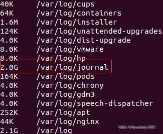
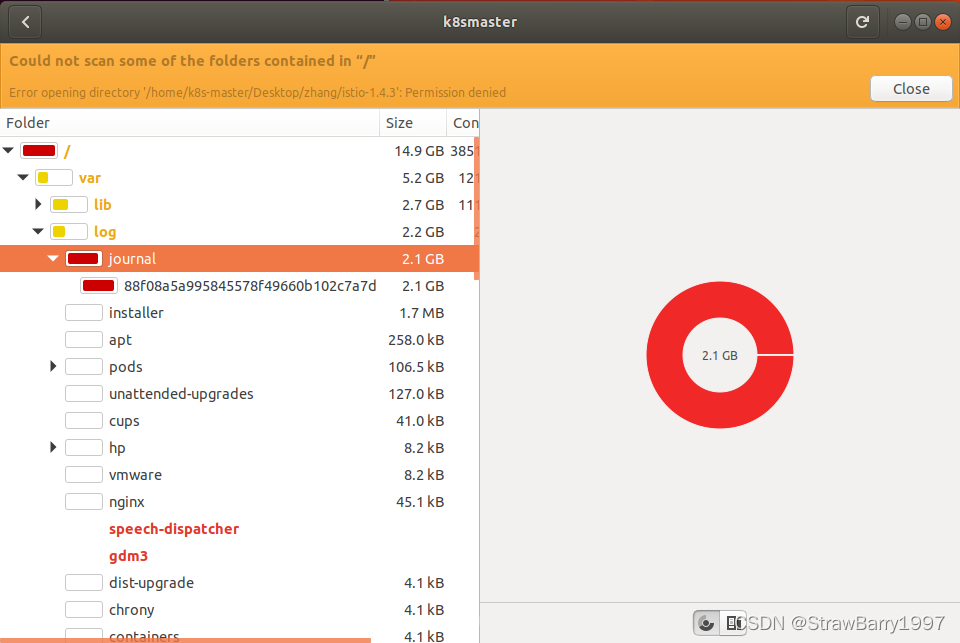
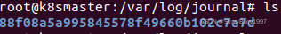
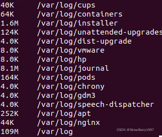
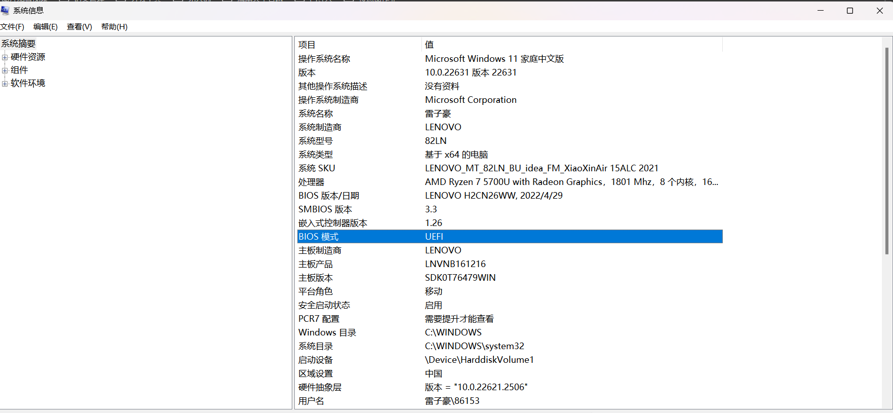

# 扩展一：Ubuntu日志清理/var/log/journal



## Ubuntu日志清理/var/log/journal

Ubuntu虚拟机空间不足时，可以通过清除系统日志/var/log/journal来释放空间。



查看/var/log中个文件大小

sudo du --max-depth=1 -h /var/log

/var/log/journal文件夹大小有2G


cd /var/log/journal

 

直接删除，暂时解决

rm -rf /var/log/journal/88f08a5a995845578f49660b102c7a7d

再次查看



**1）只保留近一周的日志**

journalctl --vacuum-time=1w

**2）只保留 500MB 的日志**

journalctl --vacuum-size=500M


# 扩展二：ipconfig

在Windows 10命令行中输入`ipconfig`命令可以显示当前网络适配器的配置信息。以下是`ipconfig`命令输出中各个参数的含义及其使用场景的生动形象解释：

1. **IPv4 地址（IPv4 Address）**：
   - **解释**：这是你电脑在网络中的“门牌号”，用于在本地网络中标识你的设备。
   - **场景**：在局域网中，例如在家里连接的Wi-Fi网络或公司内部网络中，其他设备可以通过这个地址与你的电脑通信。

2. **子网掩码（Subnet Mask）**：
   - **解释**：这是一个用来划分网络部分和主机部分的“面具”，帮助路由器判断数据包是发往本地网络还是外部网络。
   - **场景**：如果两个设备的IP地址和子网掩码相同，它们就在同一个子网中，可以直接通信。否则，需要通过路由器或其他网络设备来转发。

3. **默认网关（Default Gateway）**：
   - **解释**：这是你电脑访问外部网络的“出口”，通常是连接到外部互联网的路由器的IP地址。
   - **场景**：当你访问互联网时，你的请求会先发送到默认网关，由它负责把请求转发到互联网并将响应返回给你。

4. **DNS 服务器（DNS Servers）**：
   - **解释**：这是将域名转换为IP地址的“电话簿”服务，使你能够通过域名（如www.example.com）访问网站。
   - **场景**：当你在浏览器中输入一个网站的域名时，DNS服务器将这个域名转换为实际的IP地址，从而连接到对应的服务器。

5. **物理地址（Physical Address 或 MAC Address）**：
   - **解释**：这是网络适配器的唯一“身份证号”，用于局域网中的设备标识。
   - **场景**：在局域网中，路由器使用MAC地址来确定将数据包发送到哪个设备。这在网络管理和安全控制中非常重要，例如设置MAC地址过滤。

6. **链接本地IPv6地址（Link-local IPv6 Address）**：
   - **解释**：这是用于局部网络（如家庭网络或公司局域网）的IPv6地址，不用于互联网通信。
   - **场景**：在没有路由器的情况下，设备可以使用链接本地IPv6地址在同一网络中自动配置并通信。

7. **隧道适配器（Tunnel Adapter）**：
   - **解释**：这些适配器用于在IPv4和IPv6网络之间进行通信，是一种“桥梁”。
   - **场景**：如果你的网络使用IPv4地址，但你需要访问IPv6地址的资源，隧道适配器可以帮助进行这种转换和通信。

### 使用实例
假设你在命令行中输入`ipconfig`后看到如下输出：
```plaintext
Ethernet adapter Ethernet:

   Connection-specific DNS Suffix  . :
   Link-local IPv6 Address . . . . . : fe80::a00:27ff:fe4e:66a1%11
   IPv4 Address. . . . . . . . . . . : 192.168.1.2
   Subnet Mask . . . . . . . . . . . : 255.255.255.0
   Default Gateway . . . . . . . . . : 192.168.1.1

Wireless LAN adapter Wi-Fi:

   Connection-specific DNS Suffix  . :
   Link-local IPv6 Address . . . . . : fe80::a123:b456:c789:d012%13
   IPv4 Address. . . . . . . . . . . : 192.168.1.4
   Subnet Mask . . . . . . . . . . . : 255.255.255.0
   Default Gateway . . . . . . . . . : 192.168.1.1

Ethernet adapter VirtualBox Host-Only Network:

   Connection-specific DNS Suffix  . :
   Link-local IPv6 Address . . . . . : fe80::b00:c77:fe9a:bcde%14
   IPv4 Address. . . . . . . . . . . : 192.168.56.1
   Subnet Mask . . . . . . . . . . . : 255.255.255.0
   Default Gateway . . . . . . . . . :
```

### 解析
1. **Ethernet adapter Ethernet**:
   - **IPv4 Address**：192.168.1.2
     - 这是通过有线以太网连接的设备的IP地址。
   - **Subnet Mask**：255.255.255.0
     - 这是局域网的子网掩码。
   - **Default Gateway**：192.168.1.1
     - 这是路由器的IP地址，用于访问外部网络。

2. **Wireless LAN adapter Wi-Fi**:
   - **IPv4 Address**：192.168.1.4
     - 这是通过Wi-Fi连接的设备的IP地址。
   - **Subnet Mask**：255.255.255.0
     - 这是Wi-Fi网络的子网掩码。
   - **Default Gateway**：192.168.1.1
     - 这是Wi-Fi网络的默认网关。

3. **Ethernet adapter VirtualBox Host-Only Network**:
   - **IPv4 Address**：192.168.56.1
     - 这是VirtualBox虚拟机的虚拟网络接口的IP地址。
   - **Subnet Mask**：255.255.255.0
     - 这是虚拟网络的子网掩码。
   - **Default Gateway**：
     - 这个虚拟网络没有设置默认网关，因为它是一个仅限主机的网络，不需要访问外部网络。

通过`ipconfig`命令，你可以快速了解你的网络配置，解决连接问题，设置局域网，或者为网络调试提供帮助。这是网络管理和故障排除中的一个重要工具。


# 扩展三：配置双系统

自己电脑配置：




## 扩展四、Ubuntu常用命令

```
# Ctrl+Alt+T 打开新的终端
# Ctrl+shift+T 打开新的终端Tab
# Ctrl+shift+n 打开新的同目录的终端

clear # 清屏
clear --help # cmd --help:查看Linux命令的帮助，例如
sudo clear # 以管理员权限运行命令：sudo
history # 查看终端输入的所有历史命令

# 根目录：/，家目录：/home/zrad, ~
# cd ~ 回家，cd 打开文件夹
cd ~
cd Desktop
cd ..  # 返回上一级

pwd # 查看当前路径

# mkdir *** 创建文件夹
mkdir test_sh
cd /home/zard/test_sh
mkdir test test2
# 创建多级文件夹
mkdir -p test2/test3/test4

# 将文本写进tmp文件（覆盖）
echo "Ctrl+Alt+T 打开终端" > tmp
# 将文本写进tmp文件（追加）
echo "Ctrl+shift+T分开终端" >> tmp

cd test
# touch ****.*** 创建文件（如果存在只会更新创建时间）
touch test1.txt
mkdir test

ls  # ls 查看当前目录下所有文件及文件夹
ls -l # ls -l 查看当前目录下所有文件及文件夹并显示详细信息（字节为单位）
ls -a  # ls -a 查看当前目录下所有文件及文件夹(包括隐藏的)
ls -lh # ls -lh 查看当前目录下所有文件及文件夹并显示详细信息(单位kMGT)
# ll==ls -laf
ll
ls -lah
# ls ***:罗列路径下的所有文件及文件夹
ls /home/zard/test_sh

# tree：显示当前文件树结构 sudo apt-get install tree
tree

echo "rm **.**:移除文件"
echo "rm -r ***:移除文件夹"
echo "rm -f *** -r:移除文件夹及其下的所有文件"

cd /home/zard/test_sh/test/
touch test2.txt
echo "mv **.**/*** ***:移动文件夹/文件至***"
mv /home/zard/test_sh/test2 /home/zard/test_sh/test/test
mv /home/zard/test_sh/test/test2.txt /home/zard/test_sh/test/test

echo "cp **.**/*** ***:复制----------------"
cp /home/zard/test_sh/test2 /home/zard/test_sh/test/test -r
cp /home/zard/test_sh/test/test1.txt /home/zard/test_sh/test/test

# 压缩/解压缩文件
mkdir testcom
touch testcom testcom2
cd testcom && touch testcom testcom2
cd ..
tree
# c代表压缩，z代表使用gzip，v代表显示压缩日志，f代表指定压缩包名称，后面是要压缩的文件夹及文件
tar czvf all.tar.gz testcom testcom2 tmp
rm -f testcom testcom2 tmp -r
# x代表解压缩
tar xzvf all.tar.gz
# 解压缩到目录
mkdir all
tar xzvf all.tar.gz -C all
tree

# zip格式
# 安装压缩工具 sudo apt-get install zip uzip
zip -r all2 testcom testcom2 tmp
unzip all2
mkdir all3
unzip all2 -d all3

# LINUX查看进程
ps -elf
# -e：显示系统内的所有进程信息。
# -l：使用长（long）格式显示进程信息。
# -f：使用完整的（full）格式显示进程信息。
# 以全屏交互式的界面显示进程排名，及时跟踪包括CPU、内存等系统资源占用情况，默认情况下每三秒刷新一次，其作用基本类似于Windows系统中的任务管理器：
top
```


一、添加indicator-sysmonitor的下载源
sudo add-apt-repository ppa:fossfreedom/indicator-sysmonitor -y
二、更新apt-get
sudo apt-get update
或者：

```
 sudo add-apt-repository ppa:fossfreedom/indicator-sysmonitor && sudo apt update
```

三、安装indicator-sysmonito

```
sudo apt-get install indicator-sysmonitor
```

四、启动

这时候通知栏默认会显示cpu和内存的实时数据


配置：点一下通知栏内容，按如下提示操作


1. 开启开机自启动


2. 配置显示格式：CPU : {cpu} 网速 : {net}


其他配置可以自由发挥~
网速 :   {net}  CPU {cpu}  {cputemp}   |  MEM {mem}  |  SWAP {swap}  |  Net Speed Compact {netcomp}  |  Total Net Speed {totalnet}
网速 :   {net}  | CPU : {cpu}  {cputemp}   |  MEM {mem}  |  SWAP {swap}  |  N SC {netcomp}  |  TNS {totalnet}
