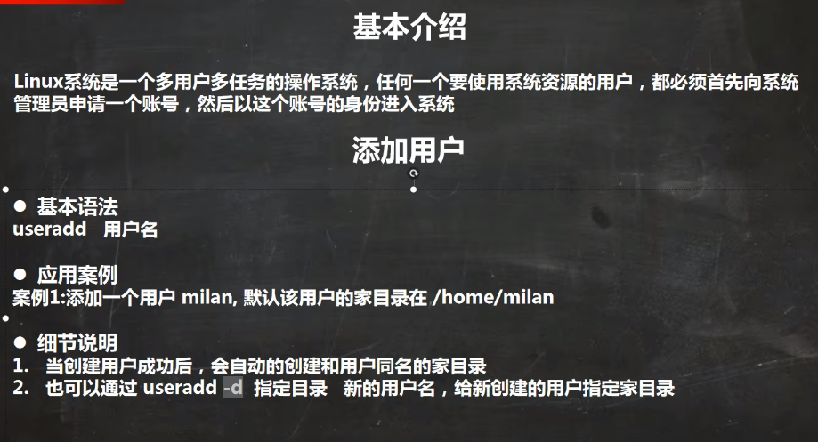
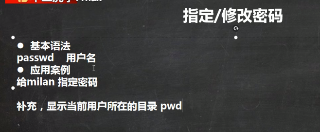
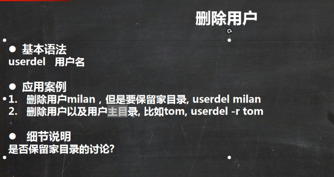
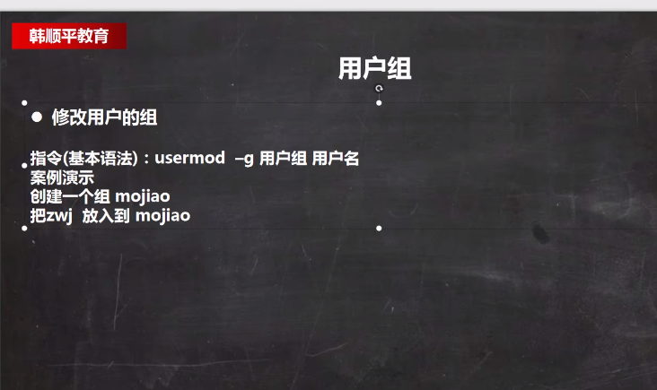
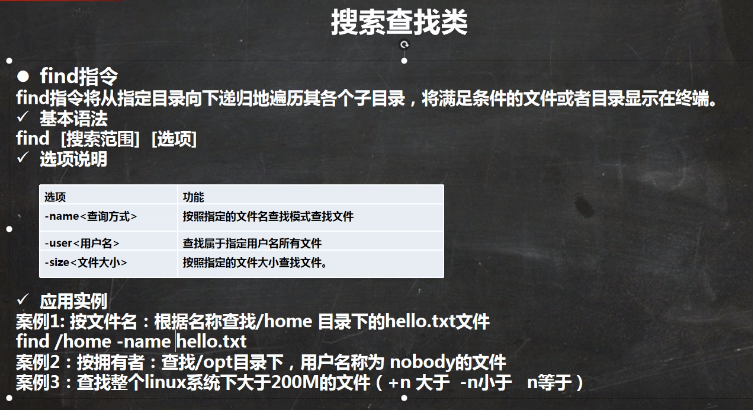

## 命令行快捷键

命令行中的ctrl组合键
Ctrl+c 结束正在运行的程序

Ctrl+d 结束输入或退出shell

Ctrl+s 暂停屏幕输出【锁住终端】

Ctrl+q 恢复屏幕输出【解锁终端】

Ctrl+l 清屏，【是字母L的小写】等同于Clear

当前光标到行首：ctrl+a

当前光标到行尾：ctrl+e

删除当前光标到行首：ctrl+u

删除当前光标到行尾：ctrl+k

Ctrl+y 在光标处粘贴剪切的内容

Ctrl+r 查找历史命令【输入关键字，就能调出以前执行过的命令】

Ctrl+t 调换光标所在处与其之前字符位置，并把光标移到下个字符

Ctrl+x+u 撤销操作

# 大纲


# 三种网络模式


3.主机模式：独 立系统

# 目录结构

 


 

# 关机重启


# 用户管理

## 添加用户



## 更改密码（不输入默认为root密码）



## 删除用户

 

## 切换用户

```
su - 用户名
```

## 返回原来用户

```
logout
```

## 用户组

添加组（groupadd）




## 用户和相关文件


# 运行级别


# 时间日期


# 查找



