## 命令行快捷键

命令行中的ctrl组合键
Ctrl+c 结束正在运行的程序

Ctrl+d 结束输入或退出shell

Ctrl+s 暂停屏幕输出【锁住终端】

Ctrl+q 恢复屏幕输出【解锁终端】

Ctrl+l 清屏，【是字母L的小写】等同于Clear

当前光标到行首：ctrl+a

当前光标到行尾：ctrl+e

删除当前光标到行首：ctrl+u

删除当前光标到行尾：ctrl+k

Ctrl+y 在光标处粘贴剪切的内容

Ctrl+r 查找历史命令【输入关键字，就能调出以前执行过的命令】

Ctrl+t 调换光标所在处与其之前字符位置，并把光标移到下个字符

Ctrl+x+u 撤销操作

**Ctrl+左右方向键 #跳转单词**

# 大纲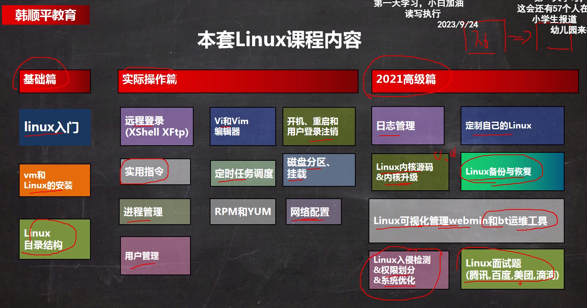

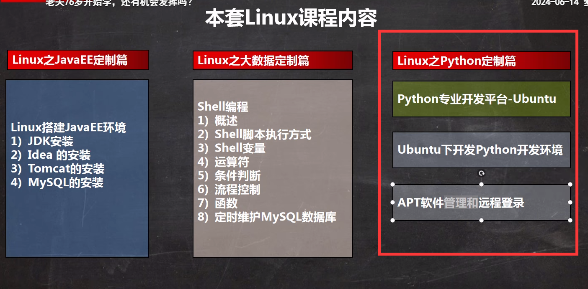

# 三种网络模式

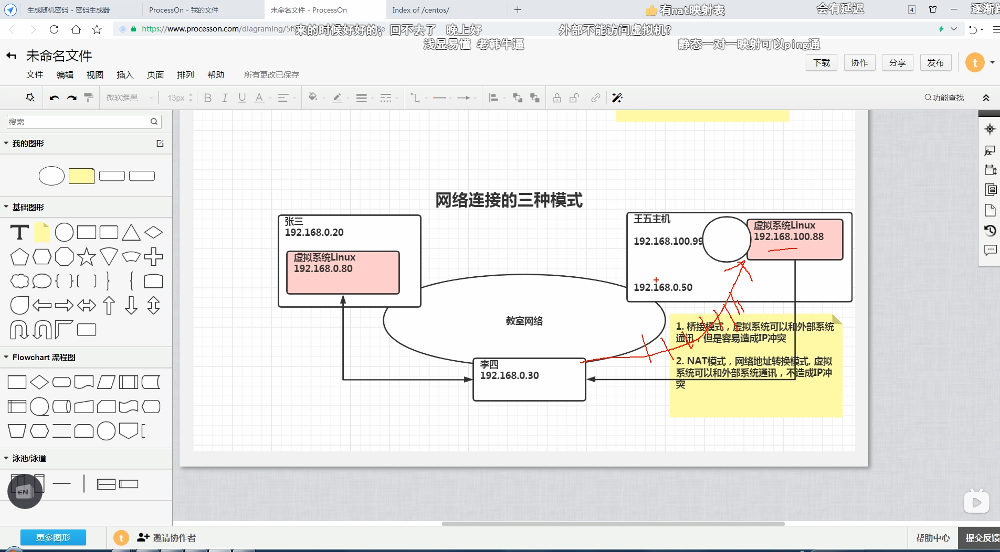

3.主机模式：独 立系统

# 目录结构

 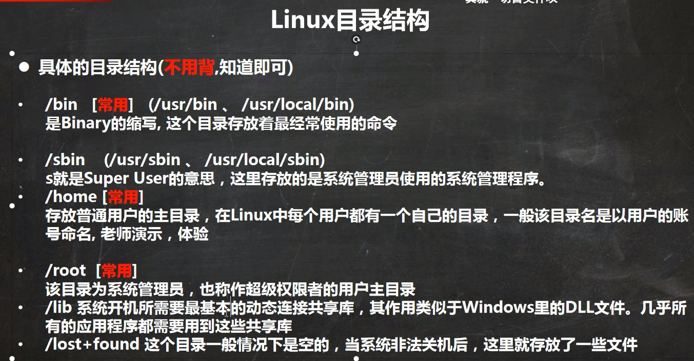

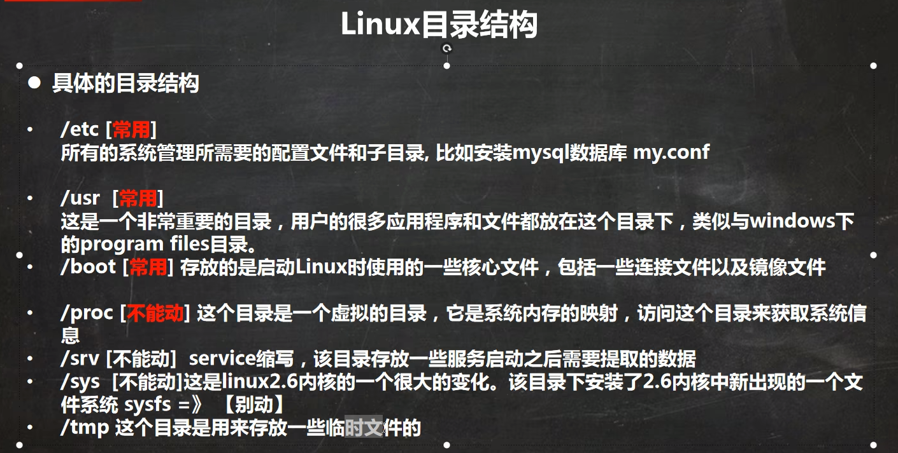

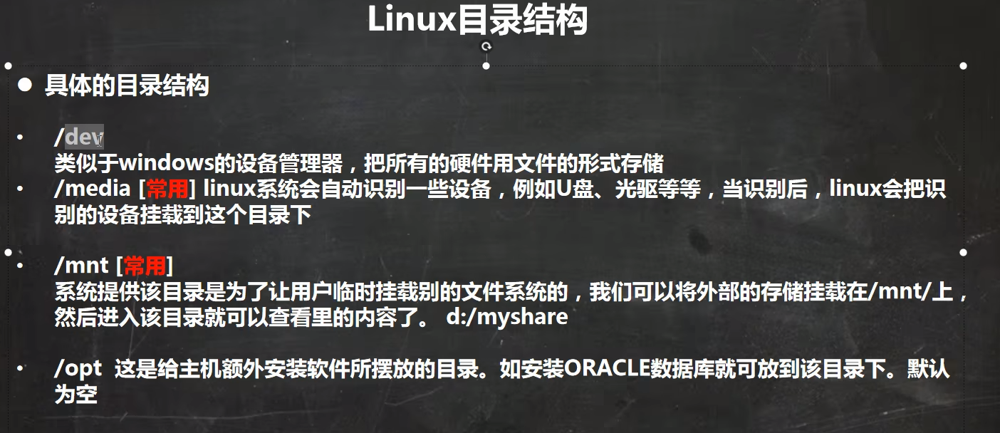

 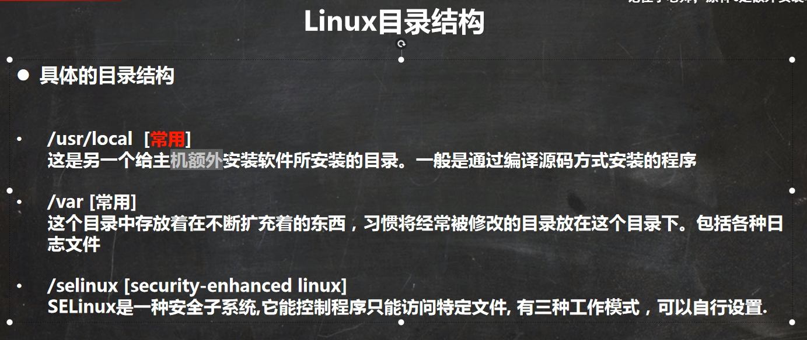

# 关机重启

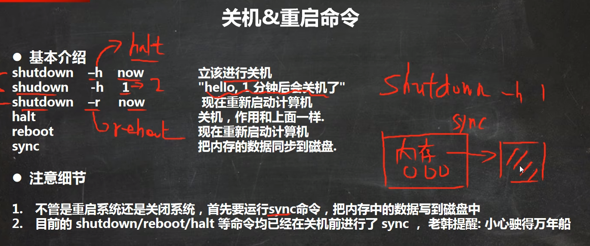

# 用户管理

## 添加用户

```
useradd (-d) 用户名
```

## 更改密码（不输入默认为root密码）

```
passwd 用户名
```

## 删除用户

```
userdel 用户名 （保留家目录）
userdel -r 用户名 （全删掉）
```

## 切换用户

```
su - 用户名
```

## 返回原来用户

```
logout
```

## 用户组

添加组（groupadd）

```
useradd -g 用户组 用户名
```

改变组

```
usermod -g 用户组 用户名
```

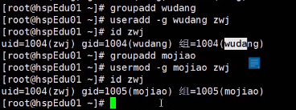

## 用户和相关文件

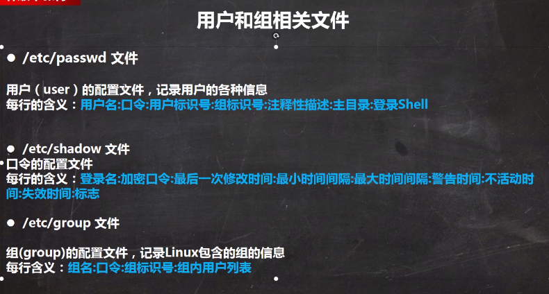

# 运行级别

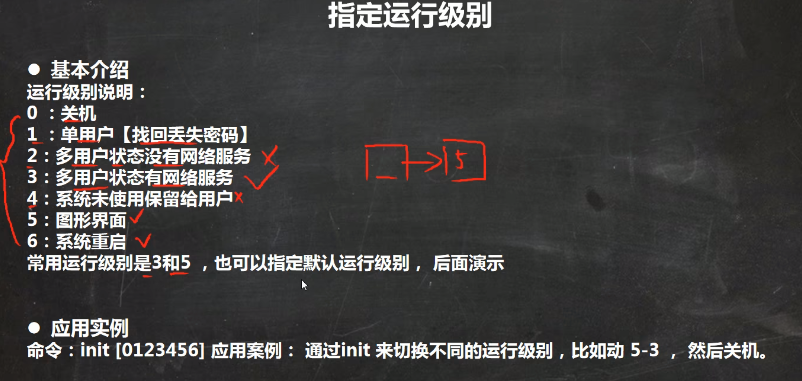

# 时间日期

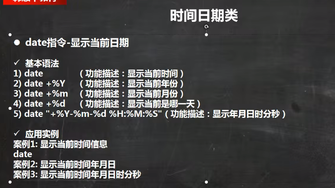

# 查找文件find

```
find path -option [ -print ] [ -exec -ok command ] {} \;
```

## 参数

```
常用参数说明 :
-perm xxx：权限为 xxx的文件或目录
-user： 按照文件属主来查找文件。
-size n : n单位,b:512位元组的区块,c:字元数,k:kilo bytes,w:二个位元组
-mount, -xdev : 只检查和指定目录在同一个文件系统下的文件，避免列出其它文件系统中的文件
-amin n : 在过去 n 分钟内被读取过
-anewer file : 比文件 file 更晚被读取过的文件
-atime n : 在过去n天内被读取过的文件
-cmin n : 在过去 n 分钟内被修改过
-cnewer file :比文件 file 更新的文件
-ctime n : 在过去n天内被修改过的文件
-empty : 空的文件
-gid n or -group name : gid 是 n 或是 group 名称是 name
-ipath p, -path p : 路径名称符合 p 的文件，ipath 会忽略大小写
-name name, -iname name : 文件名称符合 name 的文件。iname 会忽略大小写
-type 查找某一类型的文件：
    b - 块设备文件
    d - 目录
    c - 字符设备文件
    p - 管道文件
    l - 符号链接文件
    f - 普通文件
-exec 命令名{} \ (注意：“}”和“\”之间有空格)
```

## 例子

```
显示当前目录中大于20字节并以.c结尾的文件名
find . -name "*.c" -size +20c 

将目前目录其其下子目录中所有一般文件列出
find . -type f

将目前目录及其子目录下所有最近 20 天内更新过的文件列出
find . -ctime -20

查找/var/log目录中更改时间在7日以前的普通文件，并在删除之前询问它们：
find /var/log -type f -mtime +7 -ok rm {} \;

查找前目录中文件属主具有读、写权限，并且文件所属组的用户和其他用户具有读权限的文件：
find . -type f -perm 644 -exec ls -l {} \;

查找系统中所有文件长度为0的普通文件，并列出它们的完整路径：
find / -type f -size 0 -exec ls -l {} \;

从根目录查找类型为符号链接的文件，并将其删除：
find / -type l -exec rm -rf {} \

从当前目录查找用户tom的所有文件并显示在屏幕上
find . -user tom

在当前目录中查找所有文件以.doc结尾，且更改时间在3天以上的文件，找到后删除，并且给出删除提示
find . -name *.doc  -mtime +3 -ok rm {} \;

在当前目录下查找所有链接文件，并且以长格式显示文件的基本信息
find . -type l -exec ls -l {} \;

在当前目录下查找文件名有一个小写字母、一个大写字母、两个数字组成，且扩展名为.doc的文件
find . -name '[a-z][A-Z][0-9][0-9].doc'
```


# 查找历史记录history

显示n个

```
history -n 
```

执行第n个

```
！n
```

显示行号

```
num
```

**查找匹配的（CTRL R）**

```
输入  然后 enter执行
```

**.!+字符串 代表搜索历史命令最近一个以xxxx字符开头的命令**

```
[root@localhost ~]# cd /etc/sysconfig/network-scripts/
[root@localhost ~]# !cd
cd /etc/sysconfig/network-scripts/
```


