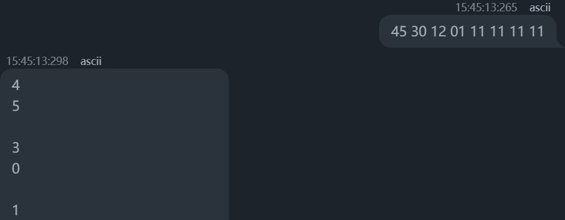
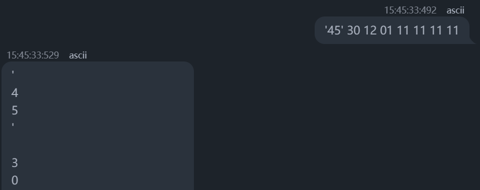
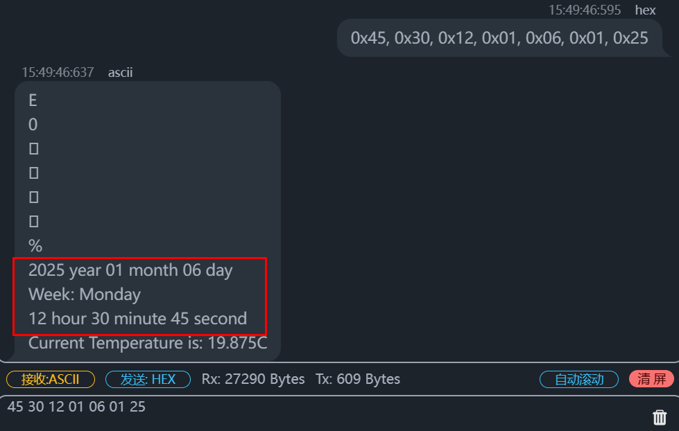
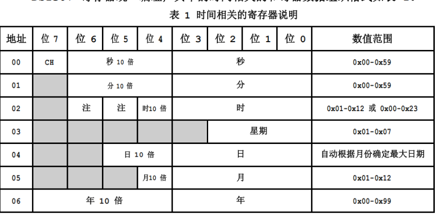
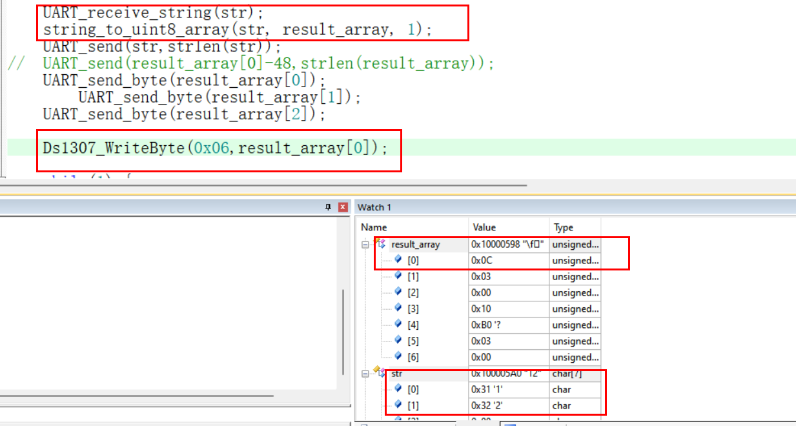
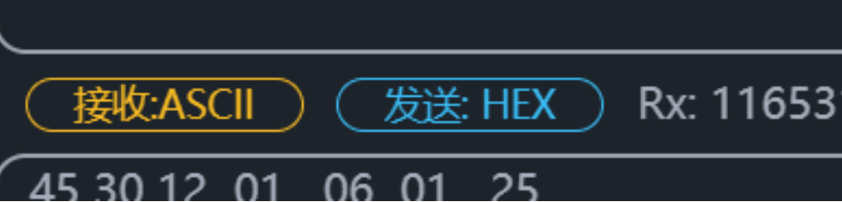
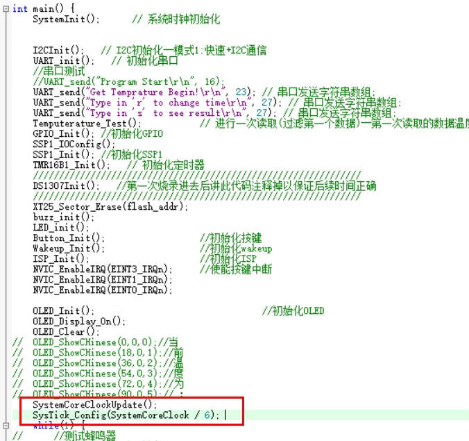
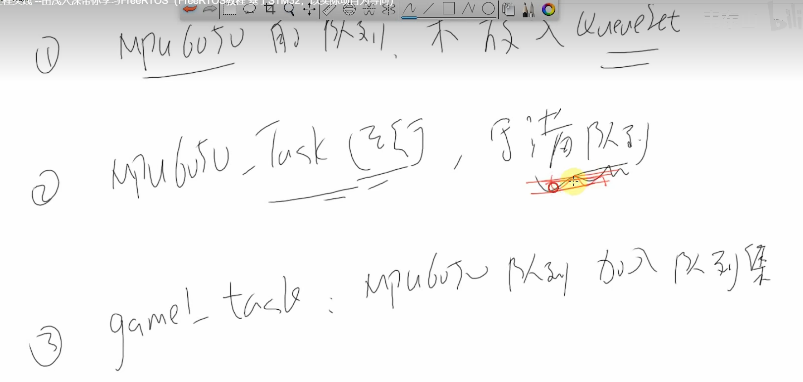
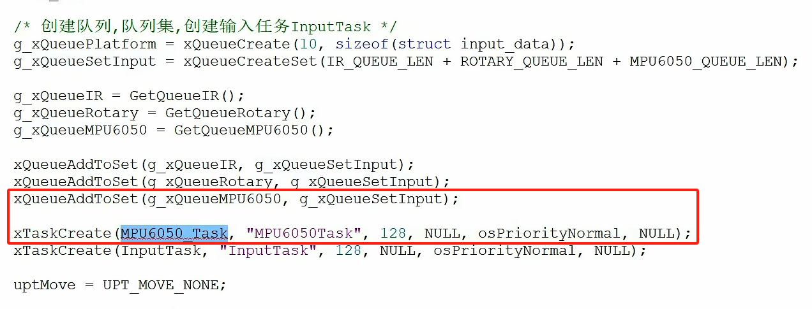

# 串口（STM32-HAL库-printf函数重定向（USART应用实例））

-   [一、STM32CubeMX配置串口](https://blog.csdn.net/qq_45772333/article/details/113530716#STM32CubeMX_16)
-   [二、代码修改](https://blog.csdn.net/qq_45772333/article/details/113530716#_19)
-   -   [1.引入printf重定向代码块](https://blog.csdn.net/qq_45772333/article/details/113530716#1printf_20)
    -   [2.添加#include](https://blog.csdn.net/qq_45772333/article/details/113530716#2includestdioh_54)

___

## 前言

为了便于调试，我们可以利用printf打印出调试的信息，在STM32应用中，我们就可以利用printf函数通过串口打印信息到串口调试助手上

___

## 一、STM32CubeMX配置串口

配置好时钟树后配置串口：  


## 二、代码修改

### 1.引入printf重定向代码块

代码如下：

```c
/* USER CODE BEGIN 0 */
#include <stdio.h>

 #ifdef __GNUC__
     #define PUTCHAR_PROTOTYPE int __io_putchar(int ch)
 #else
     #define PUTCHAR_PROTOTYPE int fputc(int ch, FILE *f)
 #endif /* __GNUC__*/
 
 /******************************************************************
     *@brief  Retargets the C library printf  function to the USART.
     *@param  None
     *@retval None
 ******************************************************************/
 PUTCHAR_PROTOTYPE
 {
     HAL_UART_Transmit(&huart1, (uint8_t *)&ch,1,0xFFFF);
     return ch;
 }
/* USER CODE END 0 */
```

这段代码最适合加在CubeMX自动生成后的usart.c文件的 / \* USER CODE BEGIN 0 \* / 和 / \* USER CODE END 0 \* / 中间

### 2.添加#include<stdio.h>

比较全局的办法就是将#include<stdio.h>直接加入main.h中，因为Cube生成文件大部分都是包含了main.h的，所以除了自建文件几乎都可以全局包含到stdio.h，而且自建文件也可以直接包含main.h，我的习惯是把工程用的共性的概率高的头文件都放在main.h里面，具体位置如下：

```c
//main.h /* Private includes ----------------------------------------------------------*/
/* USER CODE BEGIN Includes */
#include<stdio.h> 
/* USER CODE END Includes */
```

main.c内测试的代码：

```c
while (1) { /* USER CODE END WHILE */ printf("串口打印测试\n"); HAL_Delay(1000); /* USER CODE BEGIN 3 */ }
```

在自建文件使用printf函数时记得#include<stdio.h>


## 三、对于串口的发送与接收

函数声明：

```c
//串口接收字节数据（
uint8_t UART_receive(void)；
// 函数：接收字符串
#define MAX_STRING_LENGTH 100
void UART_receive_string(char *str)；

 // 串口发送字节数据 
void UART_send_byte(uint8_t byte) ；
// 串口发送数组数据
void UART_send(uint8_t *Buffer, uint32_t Length)；
//发送 一个字节
void UART_Send_Bit(uint8_t data)；

// 将字符串数组转为 uint8_t 数组
void string_to_uint8_array(const char *str, uint8_t *result_array, uint32_t array_size)；
```

函数定义：

```c
//串口接收字节数据（
uint8_t UART_receive(void) { 
	while(!(LPC_UART->LSR & (1<<0))); //等待接收到数据
	return(LPC_UART->RBR); //读出数据
} 
// 函数：接收字符串
#define MAX_STRING_LENGTH 100
void UART_receive_string(char *str) {
    uint8_t received_char;
    uint32_t index = 0;

    // 清空字符串
    memset(str, 0, MAX_STRING_LENGTH);
    // 循环接收字符直到遇到换行符或超出最大长度
    while (1) {
        received_char = UART_receive();  // 接收一个字节

        // 如果接收到换行符或回车符，停止接收
        if (received_char == '\n' || received_char == '\r') {
            break;
        }

        // 如果接收到的字符不为空，保存到字符串中
        if (index < MAX_STRING_LENGTH - 1) {
            str[index++] = received_char;  // 存储字符到字符串
        }
    }
    // 确保字符串以 null 结尾
    str[index] = '\0';
}

 // 串口发送字节数据 
void UART_send_byte(uint8_t byte) { 
	while ( !(LPC_UART->LSR & (1<<5)) ); //等待发送完
	LPC_UART->THR = byte;
}
// 串口发送数组数据
void UART_send(uint8_t *Buffer, uint32_t Length) {  
	while(Length != 0) {  
	while ( !(LPC_UART->LSR & (1<<5)) );      //等待发送完
	LPC_UART->THR = *Buffer;
	Buffer++;
	Length--;
	}
}
//发送 一个字节
void UART_Send_Bit(uint8_t data){
       LPC_UART->THR= data;
      while((LPC_UART->LSR&0X40)==0);//等待数据发送完成
}

// 将字符串数组转为 uint8_t 数组
void string_to_uint8_array(const char *str, uint8_t *result_array, uint32_t array_size) {
    char temp_str[MAX_STRING_LENGTH];
    uint32_t index = 0;
	uint32_t i=0;
    uint32_t result_index = 0;

    // 清空临时字符串
    memset(temp_str, 0, MAX_STRING_LENGTH);

    for (i = 0; i < strlen(str); i++) {
        // 如果遇到分隔符（比如逗号 ','），转换当前片段为数字
        if (str[i] == ',' || str[i] == ' ' || str[i] == '\n') {
            if (strlen(temp_str) > 0 && result_index < array_size) {
                result_array[result_index++] = (uint8_t)atoi(temp_str);  // 转换为 uint8_t 数字
                memset(temp_str, 0, MAX_STRING_LENGTH);  // 清空临时字符串
            }
        } else {
            // 添加字符到临时字符串
            temp_str[strlen(temp_str)] = str[i];
        }
    }

    // 转换最后一个片段
    if (strlen(temp_str) > 0 && result_index < array_size) {
        result_array[result_index++] = (uint8_t)atoi(temp_str);
    }
}
```

函数调用

```c
uint8_t received_data;	
uint8_t dest_data[7];
UART_send(&received_data,strlen(&received_data));
UART_send("sec	min	 shi  week day mon  year\r\n", strlen("sec	min	 shi  week day mon  year\r\n")); // 串口发送字符串数组;
UART_send(dest_data, 7);

UART_Send_Bit('\n'); // 换行
```


## 使用场景1：无法一次将一行的字符接收

问题描述：使用UART_receive（）函数只能接收一个字节，所以要重新写一个函数来接收字符串

问题分析：UART接收过来的是uint8_t类型，相当于一个char，无法接收发送的一整个信息(串口将其视为一个字符串)。需要重新写一个函数来接受字符串。我将用函数接收UART_receive（）到的打印出来得：

1.用ascii码发送（失败）（使用UART_receive（）函数只能接收一个字节，所以要重新写一个函数来接收字符串）



解决方法:编写一个接收字符串的函数

```c
#define MAX_STRING_LENGTH 100
void UART_receive_string(char *str) {
.....//见上
}
```



2.用hex码发送（成功）



## **使用场景2：用串口接收一字节数（uint8_t)，然后以16进制输出（即DS1307_WriteByte(0x01,time)中的time为16进制）**



问题描述：例子串口输入12

1.使用1号代码无法成功（用uart串口接收的数据无法成功显示），但是直接对数据进行赋值就行（令b[0]=1,b[1]=2)就可实现写入正确的数值。

```c
//1号
uint8_t a[2]:
for(int i= 0;i<2;i++){
    a[i]=received_data();
    b[i]=(int)a[i]
}
time=(b[0<<4]) | b[1];
DS1307_WriteByte(0x01,time);
```

2.DS1307_WriteByte(0x01,time);的time格式应该为0x12而不应该为ox0c。故要进行移位操作（将十进制转为0x十进制）。即0x12=（ 1<<4 ） | 2。（由芯片手册可知）

原因分析:

1,串口接收到的是ascll码，需要转化为正常的数值，对ascll码进行 -‘0’或者-48 即可.



2.写进时钟的数据格式不对，


解决方法：

```c
//2号 成功
uint8_t a[2]:
uint8_t time[7]:
for(int j=0;j<7;j++){
    for(int i= 0;i<2;i++){
        a[i]=received_data()-'0';
        //或者  a[i]=received_data()-48;
    }
    time[j]=(a[0<<4]) | a[1];
}
DS1307_WriteByte(0x00,time[6]);//秒
DS1307_WriteByte(0x01,time[5]);//分
DS1307_WriteByte(0x02,time[4]);//时
DS1307_WriteByte(0x03,time[3]);//星期
DS1307_WriteByte(0x04,time[2]);//日
DS1307_WriteByte(0x05,time[1]);//月
DS1307_WriteByte(0x06,time[0]);//年
```

## 

# 时钟


# 中断


# 定时器


## 从模式：


## 输入捕获：


## **场景1systick**：其中断函数要放在最后声明才行，一开始声明无法进入中断函数执行代码

问题描述：定义在systick中断里的OLED灯并没有按照代码要求显示

问题分析：可能SystemCoreClockUpdate();SysTick_Config(SystemCoreClock / 6);中的控制systick中断开启的变量被后面的函数修改清0，导致无法进入systick中断 

解决办法：systick其中断函数要放在最后声明才行，一开始声明无法进入中断函数执行代码



# IIC

## 问题1．OLED不亮

问题描述：IIC初始化，OLED也初始化后，OLED无法显示

问题分析：DS1307时钟芯片和LM75B温度传感器都使用硬件IIC，OLED使用的是软件模拟IIC，并且它们都是用的一个接口PIO0.4和PIO0.5。

解决方法：统一一个通信方式都用软件模拟IIC或者硬件IIC。我选择都使用硬件IIC。


# 项目

## 项目问题一：计数的时间差最好多少（PERIOD）

actual_speed得到当前速度，

```
actual_speed = ((float)g_nMotor2Pulse*1000.0*60.0)/(ENCODER_TOTAL_RESOLUTION*REDUCTION_RATIO*PERIOD);
	 宏定义：
ENCODER_TOTAL_RESOLUTION=13
REDUCTION_RATIO=20
PERIOD为你前后运行函数GetMotorPulse()；的时间周期
```

全局变量
long g_lMotorPulseSigma =0;//变量用于计算总路程。变量存放从调用函数到现在的总脉冲，使用后记得及时清零
long g_lMotor2PulseSigma=0;
short g_nMotorPulse=0,//变量用于计算速度
short g_nMotor2Pulse=0;

```
void GetMotorPulse(void)//
{
	g_nMotorPulse = (short)(__HAL_TIM_GET_COUNTER(&htim3));//
	__HAL_TIM_SET_COUNTER(&htim3,0);
	
	g_nMotor2Pulse = (short)(__HAL_TIM_GET_COUNTER(&htim1));	
	__HAL_TIM_SET_COUNTER(&htim1,0);
	
	g_lMotorPulseSigma += g_nMotorPulse;
	g_lMotor2PulseSigma += g_nMotor2Pulse;
}
```


# FreeRtos

## 问题一：（8-3-3）MPU6050的数据读不到



因为，一开始就创建任务，在写入队列集之前，MPU6050的队列已经写满，而没有读出。

所以后来理应一边写入MPU6050队列，一边放入队列集（会被读出）的程序，由于MPU6050队列已满无法写入，导致队列集中MPU6050的数据读不到。

解决方法：将任务创建写晚一点。在将MPU6050队列写入队列集后，创建MPU6050任务




# 关于OLED函数的调用（driver_oled)

函数有：x --> x列坐标(0~15)      y --> y行坐标(0~7)

```c
void OLED_Init(void);
void OLED_SetPosition(uint8_t page, uint8_t col);
void OLED_Clear(void);
void OLED_PutChar(uint8_t x, uint8_t y, char c);
int OLED_PrintString(uint8_t x, uint8_t y, const char *str);
void OLED_ClearLine(uint8_t x, uint8_t y);
int OLED_PrintHex(uint8_t x, uint8_t y, uint32_t val, uint8_t pre);
int OLED_PrintSignedVal(uint8_t x, uint8_t y, int32_t val);
void * OLED_GetFrameBuffer(uint32_t *pXres, uint32_t *pYres, uint32_t *pBpp);
void OLED_Flush(void);
void OLED_ClearFrameBuffer(void);
void OLED_Test(void);
```


# 代码

