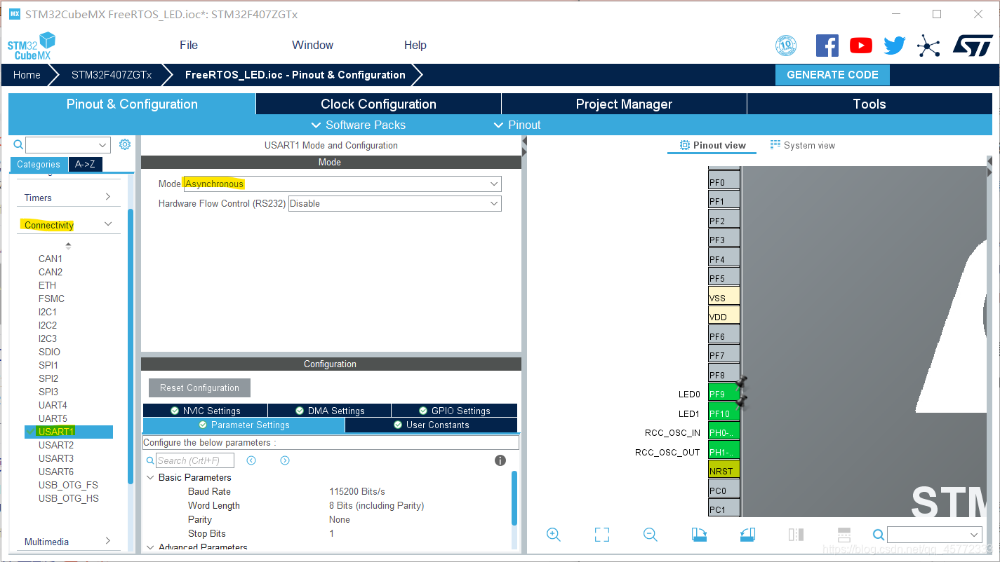
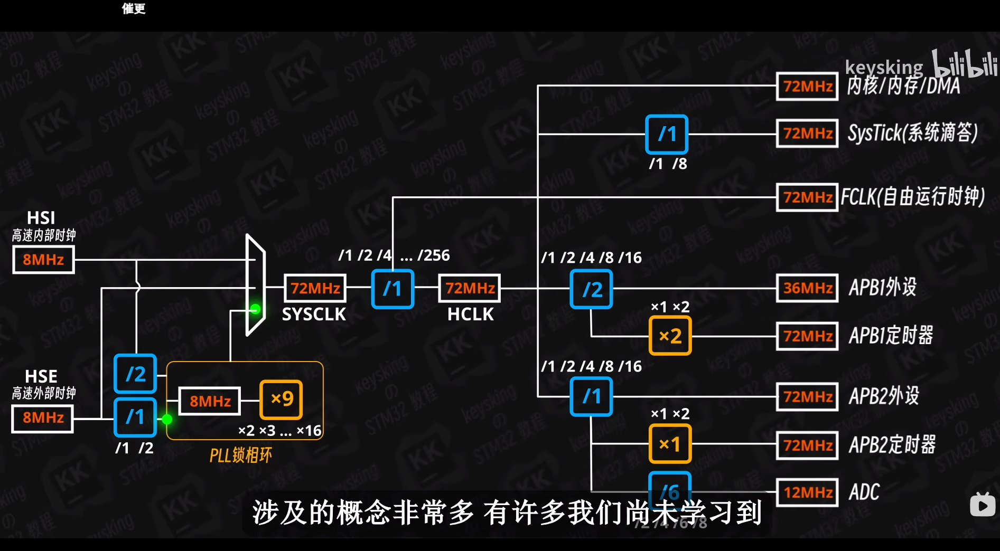
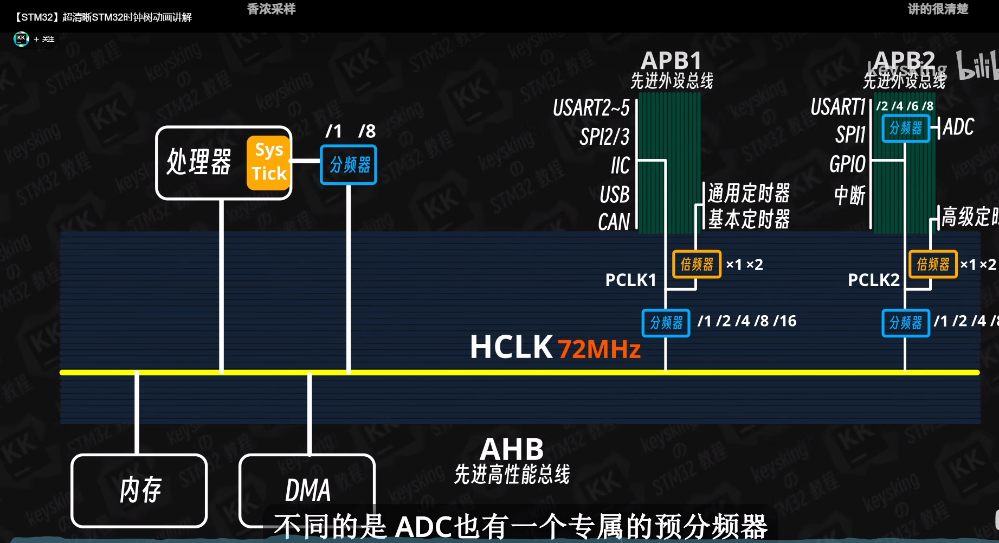
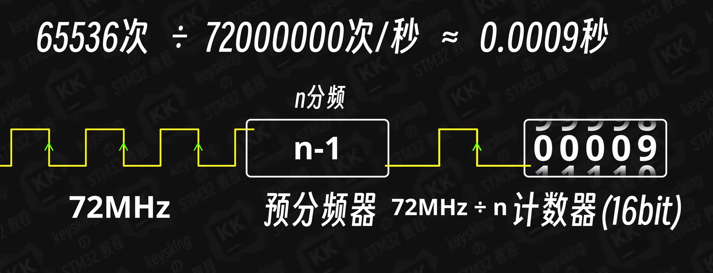
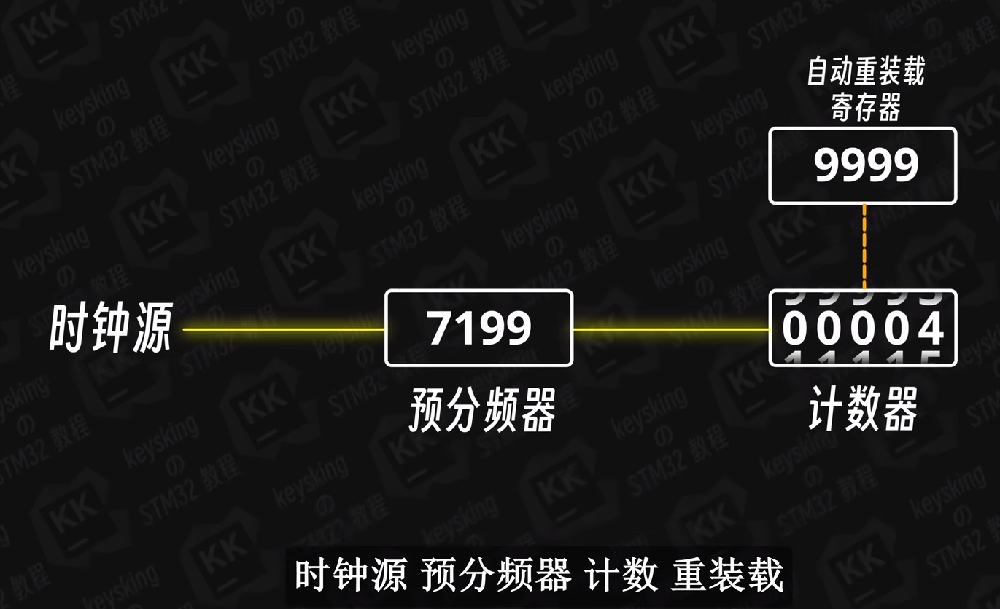
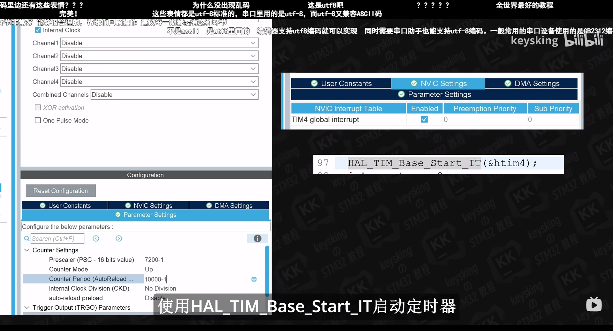
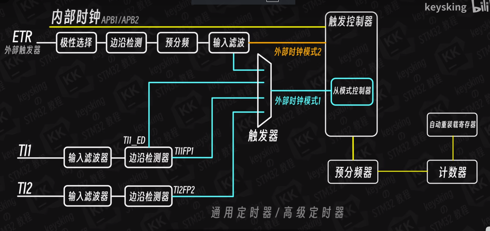
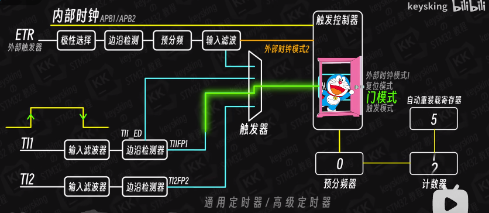
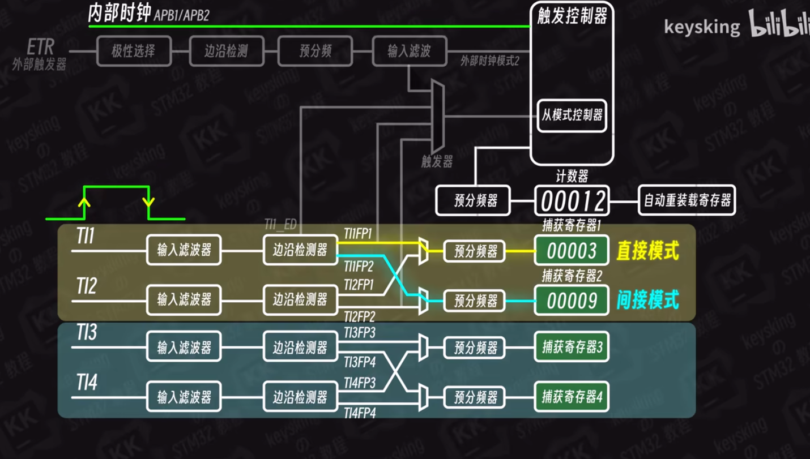
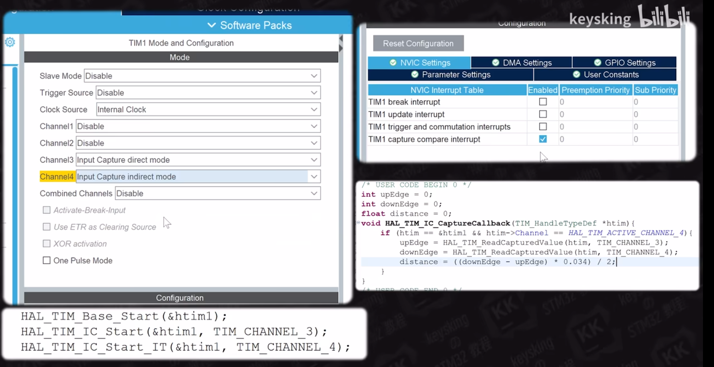

# 串口（STM32-HAL库-printf函数重定向（USART应用实例））

-   [一、STM32CubeMX配置串口](https://blog.csdn.net/qq_45772333/article/details/113530716#STM32CubeMX_16)
-   [二、代码修改](https://blog.csdn.net/qq_45772333/article/details/113530716#_19)
-   -   [1.引入printf重定向代码块](https://blog.csdn.net/qq_45772333/article/details/113530716#1printf_20)
    -   [2.添加#include](https://blog.csdn.net/qq_45772333/article/details/113530716#2includestdioh_54)

___

## 前言

为了便于调试，我们可以利用printf打印出调试的信息，在STM32应用中，我们就可以利用printf函数通过串口打印信息到串口调试助手上

___

## 一、STM32CubeMX配置串口

配置好时钟树后配置串口：  


## 二、代码修改

### 1.引入printf重定向代码块

代码如下：

```c
/* USER CODE BEGIN 0 */
#include <stdio.h>

 #ifdef __GNUC__
     #define PUTCHAR_PROTOTYPE int __io_putchar(int ch)
 #else
     #define PUTCHAR_PROTOTYPE int fputc(int ch, FILE *f)
 #endif /* __GNUC__*/
 
 /******************************************************************
     *@brief  Retargets the C library printf  function to the USART.
     *@param  None
     *@retval None
 ******************************************************************/
 PUTCHAR_PROTOTYPE
 {
     HAL_UART_Transmit(&huart1, (uint8_t *)&ch,1,0xFFFF);
     return ch;
 }
/* USER CODE END 0 */
```

这段代码最适合加在CubeMX自动生成后的usart.c文件的 / \* USER CODE BEGIN 0 \* / 和 / \* USER CODE END 0 \* / 中间

### 2.添加#include<stdio.h>

比较全局的办法就是将#include<stdio.h>直接加入main.h中，因为Cube生成文件大部分都是包含了main.h的，所以除了自建文件几乎都可以全局包含到stdio.h，而且自建文件也可以直接包含main.h，我的习惯是把工程用的共性的概率高的头文件都放在main.h里面，具体位置如下：

```c
//main.h /* Private includes ----------------------------------------------------------*/
/* USER CODE BEGIN Includes */
#include<stdio.h> 
/* USER CODE END Includes */
```

main.c内测试的代码：

```c
while (1) { /* USER CODE END WHILE */ printf("串口打印测试\n"); HAL_Delay(1000); /* USER CODE BEGIN 3 */ }
```

在自建文件使用printf函数时记得#include<stdio.h>


# 时钟



# 中断


# 定时器










## 从模式：



## 输入捕获：






# 问题一：计数的时间差最好多少（PERIOD）

actual_speed得到当前速度，

```
actual_speed = ((float)g_nMotor2Pulse*1000.0*60.0)/(ENCODER_TOTAL_RESOLUTION*REDUCTION_RATIO*PERIOD);
	 宏定义：
ENCODER_TOTAL_RESOLUTION=13
REDUCTION_RATIO=20
PERIOD为你前后运行函数GetMotorPulse()；的时间周期
```

全局变量
long g_lMotorPulseSigma =0;//变量用于计算总路程。变量存放从调用函数到现在的总脉冲，使用后记得及时清零
long g_lMotor2PulseSigma=0;
short g_nMotorPulse=0,//变量用于计算速度
short g_nMotor2Pulse=0;

```
void GetMotorPulse(void)//
{
	g_nMotorPulse = (short)(__HAL_TIM_GET_COUNTER(&htim3));//
	__HAL_TIM_SET_COUNTER(&htim3,0);
	
	g_nMotor2Pulse = (short)(__HAL_TIM_GET_COUNTER(&htim1));	
	__HAL_TIM_SET_COUNTER(&htim1,0);
	
	g_lMotorPulseSigma += g_nMotorPulse;
	g_lMotor2PulseSigma += g_nMotor2Pulse;
}
```

