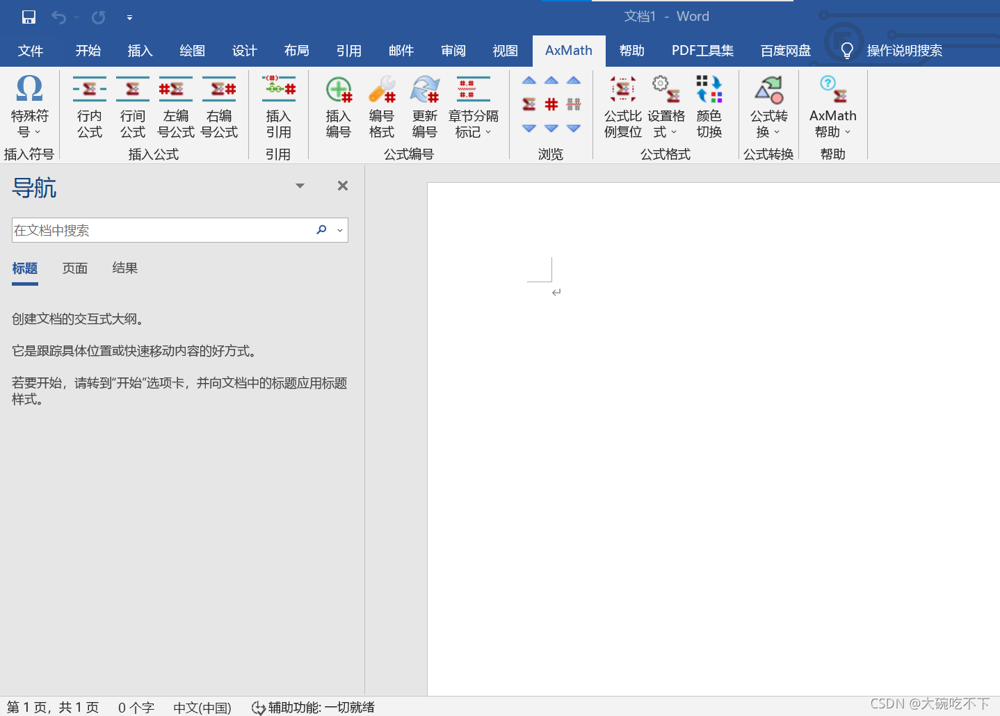

# 一：word里用letex公式

## 公式编译器AxMath安装包及在word中使用的教程_axmath怎么在word里用

AxMath安装包：  
百度网盘链接：[https://pan.baidu.com/s/1cMIqsVzo5s6BgJIgi\_WrBg](https://pan.baidu.com/s/1cMIqsVzo5s6BgJIgi_WrBg)  
提取码：591h

其安装步骤很简单，直接双击解压缩后的应用程序即可，压缩包里有那啥可以免费使用的方法和安装步骤。

下面讲解在word中如何使用AxMath：  
①选择【开始】—【更多】—【选项】  
  
②点击【加载项】，然后将下面标红的地方该成【word加载项】  

③然后点击【转到】  
  
④点击【添加】找到安装的AxMath，然后确定即可  
  
⑤然后在word就可以看见AxMath了，便可以使用啦  
