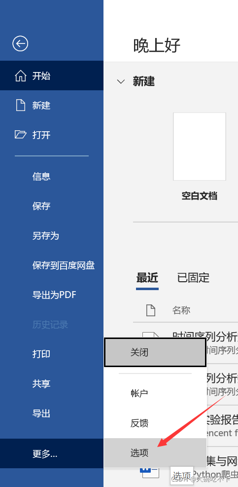
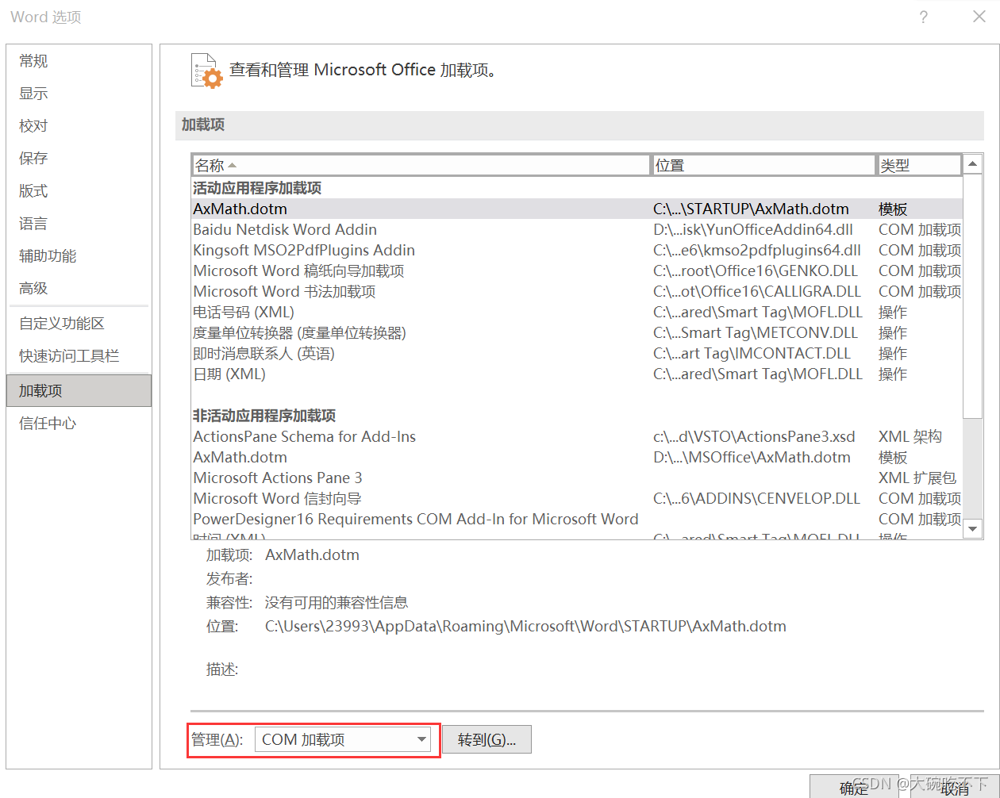
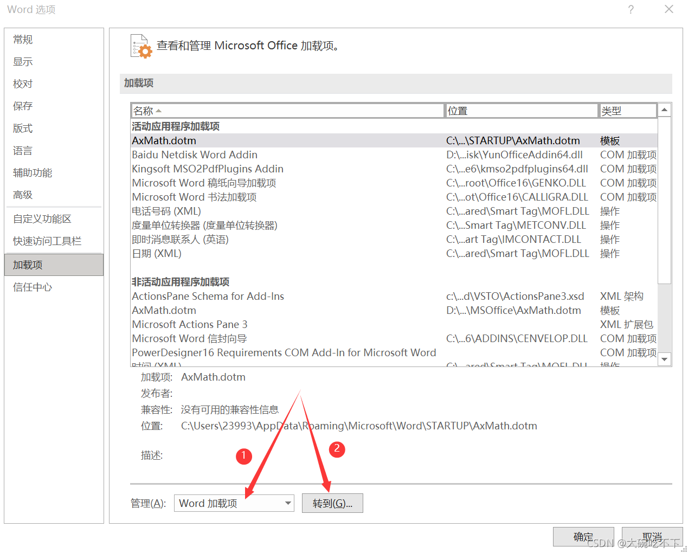
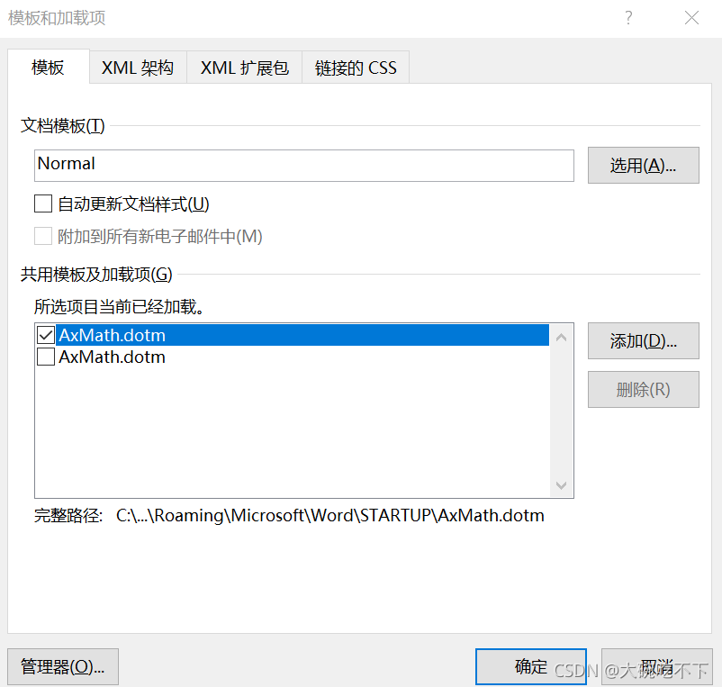

# 一：word里用letex公式

## 公式编译器AxMath安装包及在word中使用的教程_axmath怎么在word里用

AxMath安装包：  
百度网盘链接：[https://pan.baidu.com/s/1cMIqsVzo5s6BgJIgi\_WrBg](https://pan.baidu.com/s/1cMIqsVzo5s6BgJIgi_WrBg)  
提取码：591h

其安装步骤很简单，直接双击解压缩后的应用程序即可，压缩包里有那啥可以免费使用的方法和安装步骤。

下面讲解在word中如何使用AxMath：  
①选择【开始】—【更多】—【选项】  
  
②点击【加载项】，然后将下面标红的地方该成【word加载项】  


③然后点击【转到】  
  
④点击【添加】找到安装的AxMath，然后确定即可  
  
⑤然后在word就可以看见AxMath了，便可以使用啦  


# 二\. Typora安装（linux）

> 参考自[Linux免费安装Typora](https://blog.csdn.net/weixin_42905141/article/details/124071137)
>
> 描述：经常需要记录一些问题，非常喜欢Typora这款Markdown编辑器，可以选择去官网下载最新版本并购买激活，博主这里使用的是老版本免费的Typora，够用了，安装流程按照上文走就行，这里主要介绍下主题和个人的一些设置

##  1 vim安装

vim安装指令如下：

```shell
sudo apt-get update sudo apt-get install vim
```

##  2 Typora安装

将安装包下载好后，cd到安装包目录下进行安装，指令如下：

```shell
cd Downloads tar xzvf Typora-linux-x64.tar.gz cd bin sudo cp -ar Typora-linux-x64 /opt cd /opt/Typora-linux-x64/ #启动 ./Typora
```

为了在任意位置启动，我们设置下环境变量

```shell
sudo vim ~/.bashrc
```

打开.bashrc配置文件，添加：

```shell
#Typora环境变量 export PATH=$PATH:/opt/Typora-linux-x64
```

source一下，让配置生效

```shell
source ~/.bashrc
```

OK了，可以在任意位置启动typora

```shell
./Typora
```

**添加桌面快捷方式**

```shell
cd /usr/share/applications sudo vim typora.desktop
```

添加以下内容：

```shell
[Desktop Entry] Name=Typora Comment=Typora Exec=/opt/Typora-linux-x64/Typora Icon=/opt/Typora-linux-x64/resources/app/asserts/icon/icon_256x256.png Terminal=false Type=Application Categories=Developer;
```

重启电脑就ok了

**右键打开**

```shell
sudo gedit ~/.config/mimeapps.list
```

添加如下内容：

```shell
text/markdown=typora.desktop
```


# 三.双系统之间快速访问对方文件

目前在一块硬盘上装有`linux`系统和`windows`系统。双系统目前的分工是：`linux` 负责程序的开发，如 `Python， LaTeX，C++，Arduino`等，`windows`负责 `office` 等操作，如`word，excel，QQ`和腾讯会议等。

但在这期间遇到了一些麻烦，如写毕业论文的时候，在`linux`下写好的程序，需要在`windows`中使用`word`将程序添加到附录中。我一般的方法是将代码传到 `github`，利用 `github` 作为双系统之间文件交互的桥梁。退出`linux`，进入`windows`，打开`github`，粘贴代码到`word`中。如果需要修改代码，就要退出`windows`，进入`linux`，再来一个循环。

每次退出系统都需要重启电脑，实在是麻烦。今天无法忍受，决定研究下双系统如何快速访问对方的文件，即`linux`如何快速访问`windows`中的文件，`windows`如何快速访问`linux`中的文件。

## [](https://muyuuuu.github.io/2020/07/03/linux-windows-files-exchange/#%E6%8C%82%E8%BD%BD "挂载")挂载

**挂载**（mount）是指由操作系统使一个存储设备，诸如硬盘上的计算机文件和目录可供用户计算机文件系统访问的过程。这里有两个重点：第一是要有存储设备，第二个是计算机的文件系统能访问存储设备中的文件。

通俗而言，在`windows`系统下，将U盘插入`USB`接口，电脑打开U盘，这就叫挂载。在`linux`下，将存储设备接入到一个存在的目录上（目录不能为空），因为`linux`操作系统将所有的设备都看作文件，我们要访问存储设备中的文件，必须将文件所在的分区挂载到一个已存在的目录上，然后通过访问这个目录来访问存储设备。

## [](https://muyuuuu.github.io/2020/07/03/linux-windows-files-exchange/#linux%E8%AE%BF%E9%97%AEwindows%E6%96%87%E4%BB%B6 "linux访问windows文件")linux访问windows文件

既然知道了挂载的操作，那么就行动起来。首先通过`fdisk -l`来查看硬盘信息：

根据实际情况，我知道`/dev/nvme0n1p3`对应`windows`的`C`盘，`/dev/nvme0n1p4`对应`windows`的`D`盘，而我想看的数据在`C`盘，所以我们要挂载`/dev/nvme0n1p3`。

1.  首先创建挂载目录：`sudo mkdir /mnt/windows`；
    
2.  之后开始挂载：`mount /dev/nvme0n1p3 /mnt/windows`；
    
3.  然后 `cd /mnt/windows`，此时我们发现文件已经过来了，然后`cd Users/lanling/Desktop`就能查看`windows`桌面中的文件，需要拷贝仅需`cp`命令拷贝到某个路径即可，再也不用来回重启了。也印证了我所使用的计算机文件系统能访问`windows`中的文件。
4.  需要注意的是，在使用完毕后需要解除挂载，命令为：`umount /mnt/windows`，另外不要在`/mnt/windows`文件夹下进行解除挂载，会提示错误，在其他位置解除挂载就可以了。

## [](https://muyuuuu.github.io/2020/07/03/linux-windows-files-exchange/#windows%E8%AE%BF%E9%97%AElinux%E6%96%87%E4%BB%B6 "windows访问linux文件")windows访问linux文件

众所周知`windows`的命令行比较弱（本人不想安装`wsl`之类），所以决定下载个软件，搜寻了一番，还真有：名字叫做[Linux File Systems for Windows by Paragon Software](https://www.paragon-software.com/home/linuxfs-windows/)，软件使用就很简单了，打开，挂载，这里提示挂载到`E`盘。

然后去资源管理器中打开`E`盘，会看到`linux`中的各种文件，之后的操作就很轻松了。但是这个软件收费，且，会开机自己启动，还找不到设置的地方，感觉很流氓。

在相同易用程度下，我找到了个免费、不流氓的软件，叫[Diskinternals Linux Reader](https://www.diskinternals.com/linux-reader/)。操作极度简单，就不截图演示了。选择盘符，双击进去，找到自己想访问的文件，右键，保存到桌面即可。


# 四 .Github

到达文件的存放目录下

```
chmod +x GitHubDesktop-linux-x86_64-3.4.2-linux1.AppImage 
```

然后

```
./GitHubDesktop-linux-x86_64-3.4.2-linux1.AppImage 
```

添加邮箱

```
git config --global user.email "leizihao2004@gmail.com"
git config --global user.name "lei-zihao"
```

