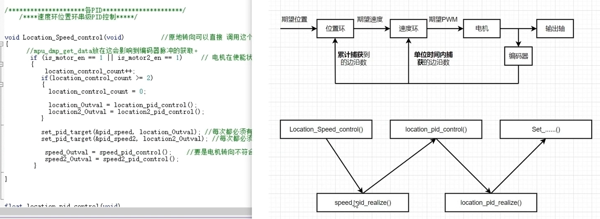
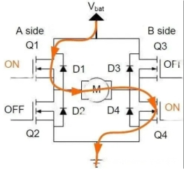
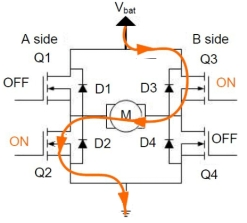
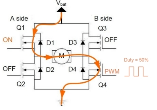
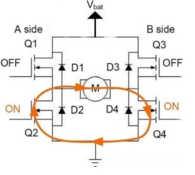

# 比赛一：robocup比赛记录

我们用纯视觉定位的方案对这次打robocup比赛来说很困难的（主要是因为飘）。现在可以保底拿到21分（当时远程连接卡住了，浪费了挺多时间，好多功能还没测试完）。但是在了解到他们现场比赛基本上都改用mid360激光雷达加光流后，我们打算再冲一下得分，不热难搞。
目前情况：
1、我们在现场调vins的时候数据是发散的，他始终没有收敛到一个固定的值。而在海大会收敛到一个值。因为现场的特征点太少，光线太暗。
2、去年的分数低是因为去年他们用的大部分都是视觉定位t265，大部分都炸机因为之前robocup比赛都是线上，自己布置场地，可以多放二维码来增加特征点，所以t265杀疯了。但是去年第一年改线下，线下光线不好，纹理不清，大部分都飘了，导致大部分队伍t265炸机了。所以去年的分数会偏低。而今年有去年参赛经验的队伍都改用mid360雷达加光流方案了（去年的前几名都是用这个的）
3、刚刚调试的时候，有位老师说他今天观察了大部分队伍，用纯视觉的基本上都炸了一下。我们运气好，没有太飘，可能是因为我们桨叶没装桨叶保护，怕伤害到别人，和无人机炸机，所以调试时飞的比较保险稳妥。
4、我们这次比赛打算冲一下分数吧。现在可以保底拿到21分。但是在了解到他们改用mid360加光流后，我们打算再冲一下得分。
未来打算：

补

1、因为目前比赛还没看到有做纯视觉的（（因为现场环境可能不太友好），未来比赛可能也要加个激光雷达，使用navigation功能包来建图定位。
2、无人机的避障功能可能得另选方案部署并应用
3、加个螺旋桨保护罩


1、视觉这个方案对于打比赛来说很有点吃亏（更适合理论研究和仿真），还是要换mid360激光雷达。
2、学习到一种快速修改变量的方法（写个配置文件，launch时导入）和sh文件编写
遇到的问题：
1、比赛当天飞控参数莫名变化。第一次起飞还好，第二次无法起飞（原因是加速度计飘了，要重新校准）。
2、遥控器多次断连。怀疑遥控器天线的原因。

3·对这个比赛来说，调试时可以凌晨来偷偷和国防科技大学、西北工业大学的一起偷偷调试（但对视觉的有影响，灯光原因）

# 比赛二：人工智能智能大赛


# 比赛三：揭榜挂帅

1. 操作步骤:

1. 启动仿真程序:  

```
roslaunch px4 zhihang2024.launch
```

​	2.运行通信脚本：

```
cd ~/XTDrone/communication/

python vtol_communication.py standard_vtol 0
```

​	3.启动发布位置代码：

```
cd ~/XTDrone/zhihang2024

python standard_vtol_position.py
```

​	4.启动需要救援的船只发布角度代码：

```
cd ~/XTDrone/zhihang2024

python Pub_yaw.py
```

​	5.启动发布雷暴区中心点的代码：

```
cd ~/XTDrone/zhihang2024

python Pub_thunderstorm.py
```

6.控制代码

```
cd ~/XTDrone/control/keyboard
python vtol_keyboard_control0717.py standard_vtol 1 vel
```

7.yolo

```
conda init
conda activate yolo 
roslaunch yolov5_ros yolov5_simulation.launch 
```

选手不得改动上述代码，仅能通过订阅/zhihang/standard_vtol/angel话题来获得角度信息。其中position下的x为角度信息，采用弧度制。

8.rosbag

```
cd ~/XTDrone/zhihang2024
rosbag record -O score1 /standard_vtol_0/mavros/state /gazebo/model_states /xtdrone/standard_vtol_0/cmd /ship /arrive /zhihang/thunderstorm
```

同时，选手可以通过订阅/zhihang/thunderstorm话题来获得雷暴中心点的信息，其中position下的x为雷暴中心点x，position下的y为雷暴中心点y。（单位：米）

```
#anaconda3
export PATH=~/anaconda3/bin:$PATH

# >>> conda initialize >>>
# !! Contents within this block are managed by 'conda init' !!
__conda_setup="$('/home/sz/anaconda3/bin/conda' 'shell.bash' 'hook' 2> /dev/null)"
if [ $? -eq 0 ]; then
    eval "$__conda_setup"
else
    if [ -f "/home/sz/anaconda3/etc/profile.d/conda.sh" ]; then
        . "/home/sz/anaconda3/etc/profile.d/conda.sh"
    else
        export PATH="/home/sz/anaconda3/bin:$PATH"
    fi
fi
unset __conda_setup
# <<< conda initialize <<<
```


## 问题一：针对图像只露出一点进行目标物体完整中心点推断

当目标物体在图像中只露出一部分时，可以利用检测框的大小和目标物体的固定长宽比来推测目标物体的完整中心点。我们的思路是：

1. **初始检测**：

   - 在初始帧中检测目标物体及其边界框。假设此时目标物体的边界框是完整的，可以计算其实际尺寸和中心点。

2. **边界框转换到现实世界坐标系**：

   - 将初始检测到的边界框从图像坐标系转换到现实世界坐标系。
   - 可以使用卡尔曼滤波来提高边界框中心点位置和尺寸的稳定性。

3. **边界框从现实世界坐标系转换到图像坐标系估算完整物体的尺寸和位置：**

   - 在着陆过程中，随着Z轴的减小，图像中的物体变大，边界框可能只显示出部分物体。利用之前识别到的物体大小和固定的长宽比，可以推测出完整物体的尺寸。
   - 通过比较当前帧中检测到的部分边界框尺寸和之前记录的完整物体尺寸，计算出完整物体的中心点位置。：

4. **误差修正**：

   - 将转换到相机坐标系下的误差加上去，修正中心点位置。

   - 使用卡尔曼滤波进一步平滑和稳定中心点的位置。

     

# 比赛四：电赛

1.中断和定时器

【【STM32】动画讲解轻松学会STM32的PWM】 https://www.bilibili.com/video/BV1Yx4y1x7xY/?share_source=copy_web&vd_source=f110e94fed68db054ab140d9a0605ed1

2.pid控制原理和应用

【从不懂到会用！PID从理论到实践~】 https://www.bilibili.com/video/BV1B54y1V7hp/?share_source=copy_web&vd_source=f110e94fed68db054ab140d9a0605ed1

## 3.开源代码框架的大概和pid控制部分的理解（正在看）

【【干货教程】单片机项目速成-电赛智能送药小车 STM32HAL库CubeMX+串级PID控制+OpenMV数字识别】 https://www.bilibili.com/video/BV1UL411V7XK/?p=11&share_source=copy_web&vd_source=f110e94fed68db054ab140d9a0605ed1

### pid写到定时器中tim2的中断里

```
{"p":10,"i":5,"d":0,"a":10}
预分频：7200-1
自动重载： 200-1
周期： 20ms
```

```
long g_lMotorPulseSigma =0;//µç»ú25msÄÚÀÛ¼ÆÂö³å×ܺÍ
long g_lMotor2PulseSigma=0;
short g_nMotorPulse=0,g_nMotor2Pulse=0;//È«¾Ö±äÁ¿£¬ ±£´æµç»úÂö³åÊýÖµ

void HAL_TIM_PeriodElapsedCallback(TIM_HandleTypeDef *htim)    
{
	if(htim == (&htim2))  
	{

		  GetMotorPulse();  
						
			
		  Motor_journey_cm  = ( g_lMotorPulseSigma /(REDUCTION_RATIO*ENCODER_TOTAL_RESOLUTION))  * (2*WheelR*3.1416);
		  Motor2_journey_cm	= ( g_lMotor2PulseSigma /(REDUCTION_RATIO*ENCODER_TOTAL_RESOLUTION)) * (2*WheelR*3.1416);
					    
          MotorOutput( MotorPWM, Motor2PWM);
     }					
}	
```

```
void GetMotorPulse(void)//
{
	g_nMotorPulse = (short)(__HAL_TIM_GET_COUNTER(&htim3));//
	__HAL_TIM_SET_COUNTER(&htim3,0);
	
	g_nMotor2Pulse = (short)(__HAL_TIM_GET_COUNTER(&htim1));	
	__HAL_TIM_SET_COUNTER(&htim1,0);
	
	g_lMotorPulseSigma += g_nMotorPulse;
	g_lMotor2PulseSigma += g_nMotor2Pulse;
}
```


### control.c里有控制函数

串级pid控制（location_peed_control）

```c
speed_Outval//全局变量（串级pid控制的输出）
void Location_Speed_control(void)        
{
			 if (is_motor_en == 1 || is_motor2_en == 1)     
			 {
				  location_control_count++;
				  if(location_control_count >= 2)//外环位置控制的速率小于内环（内环运行三次，外环运行一次）
					{
						location_control_count = 0; 
						
						location_Outval = location_pid_control();//外环位置控制，变量给到location_Outval
						location2_Outval = location2_pid_control();
					}
					
					set_pid_target(&pid_speed, location_Outval); //外环输出给内环输入
					set_pid_target(&pid_speed2, location2_Outval); 
				 
          			speed_Outval = speed_pid_control();  //内环速度控制，变量给到speed_Outval  
					speed2_Outval = speed2_pid_control();  
				}
}
```



4.红外传感器循迹（正在看）

【STM32智能小车V3-STM32入门教程-openmv与STM32循迹小车-stm32f103c8t6-电赛 嵌入式学习 PID控制算法 编码器电机  跟随】 https://www.bilibili.com/video/BV16x4y1M7EN/?p=28&share_source=copy_web&vd_source=f110e94fed68db054ab140d9a0605ed1

5.电机转动接线和将定时器tim1的**通道三设为pwm的输出**连接到驱动模块的pwm1，通过调节占空比来控制电机的转速。通过tim1的**12通道连接到编码器**的两个编码接口来计数脉冲数量，一圈脉冲的计算公式为=减速比* 线程数 * 设置的边沿数。eg：20 * 13 * 4=1024个脉冲数。

```
减速比：看商家

线程数 ：看商家

设置的边沿数:自己设置（双边沿计数：4，单边沿计数：2）
```

定时器1的34通道：（pwm波控制输出）

```
预分频：72-1
自动重载： 1000-1
周期： 1ms
```

定时器2和3：（编码脉冲）

```
预分频：0
自动重载： 65535
```


## 哔哩哔哩代码

```
MotorSpeed_Update();函数获取当前速度；
motorPidSetSpeed(0,1.5);用来设置pid的目标值并使能电机的转动到目标值；
xunji（）函数来进行红外循迹；请用中文给出
```

### 问题一：使用MSPM0G3507读取不了引脚高低电平

背景描述：在使用红外循迹模块时将引脚配置成输入模式，使用DL_GPIO_readPins（）函数无法来获得高低电平值。

原因分析：因为M0的读取是32位中每一位如果是高电平，则该位置1，所以不能用==1来判断，将其取反全部等于0作为判断高电平的方法。

解决方法：使用if判断来给变量设置电平，不可直接使用DL_GPIO_readPins（）函数来获得电平值。

```c
if(DL_GPIO_readPins(HW_OUT_1_PORT,HW_OUT_1_PIN_14_PIN)) g_ucaHW_Read[0] =1;
		else g_ucaHW_Read[0] =0;
if(DL_GPIO_readPins(HW_OUT_5_PORT,HW_OUT_5_PIN_2_PIN)) g_ucaHW_Read[1] =1;
		else g_ucaHW_Read[1] =0;
if(DL_GPIO_readPins(HW_OUT_2_PORT,HW_OUT_2_PIN_15_PIN)) g_ucaHW_Read[2] =1;
		else g_ucaHW_Read[2] =0;
if(DL_GPIO_readPins(HW_OUT_3_PORT,HW_OUT_3_PIN_16_PIN)) g_ucaHW_Read[3] =1;
		else g_ucaHW_Read[3] =0;
if(DL_GPIO_readPins(HW_OUT_6_PORT,HW_OUT_6_PIN_3_PIN)) g_ucaHW_Read[4] =1;
		else g_ucaHW_Read[4] =0;
if(DL_GPIO_readPins(HW_OUT_4_PORT,HW_OUT_4_PIN_17_PIN)) g_ucaHW_Read[5] =1;
		else g_ucaHW_Read[5] =0;
```

### 问题二：电机无法转动

背景描述：运行AIN1_SET;AIN2_RESET;

DL_TimerG_setCaptureCompareValue(PWM_INST,Motor2,GPIO_PWM_C1_IDX);设置pwm占空比，但是电机无法转动。运行AIN1_SET;AIN2_RESET;BIN1_SET;BIN2_RESET；DL_TimerG_setCaptureCompareValue(PWM_INST,Motor2,GPIO_PWM_C1_IDX);设置pwm占空比，电机转动。

AIN1_SET;BIN2_RESET；DL_TimerG_setCaptureCompareValue(PWM_INST,Motor2,GPIO_PWM_C1_IDX);设置pwm占空比，电机转动。

原因分析： H桥驱动方式：

**正转**

打开Q1和Q4

关闭Q2和Q3

此时假设电机正转，电流依次经过Q1、M、Q4 ，如下图中红色线条所示。

 

**反转**

关闭Q1和Q4

打开Q2和Q3

此时电机反转，电流依次经过Q2、M、Q3 ，如下图中红色线条所示



**调速**

关闭Q2和Q3

打开Q1 ，Q4上给它输入50%占空比的PWM波形

这样就达到了降低转速的效果，如果需要增加转速，则将输入PWM的占空比设置为100%，电流方向如下图中红色线条所示。

 

**停止状态**

 

解决办法：检查电路，将引脚定义改为正确值。将宏定义改过来。

 

### 问题三：MPU6050存在的问题：零点漂移/温度漂移，导致陀螺仪积分存在累积误差

背景描述：在使用MPU6050模块时，处理后的数据会出现pitch和roll数据稳定准确，但是yaw轴的数据一直在飘，数据一直在变化。

原因分析：零点漂移/温度漂移，导致陀螺仪积分存在累积误差

解决方法：1.手动消除静差，相减或者设置死区，但是都会存在一定的累积误差，不可取。

2.数据融合（卡尔曼滤波）
