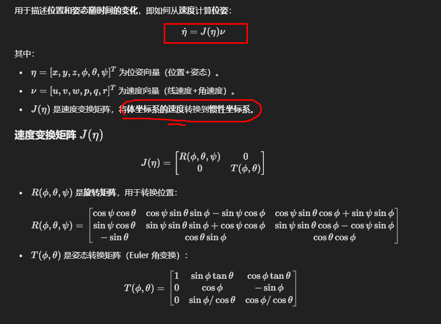
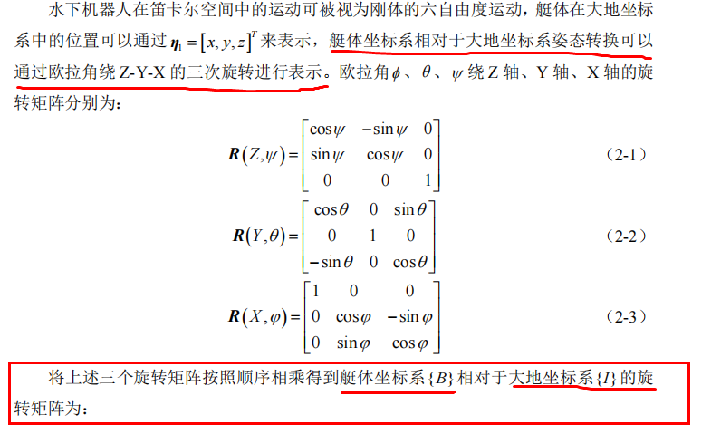
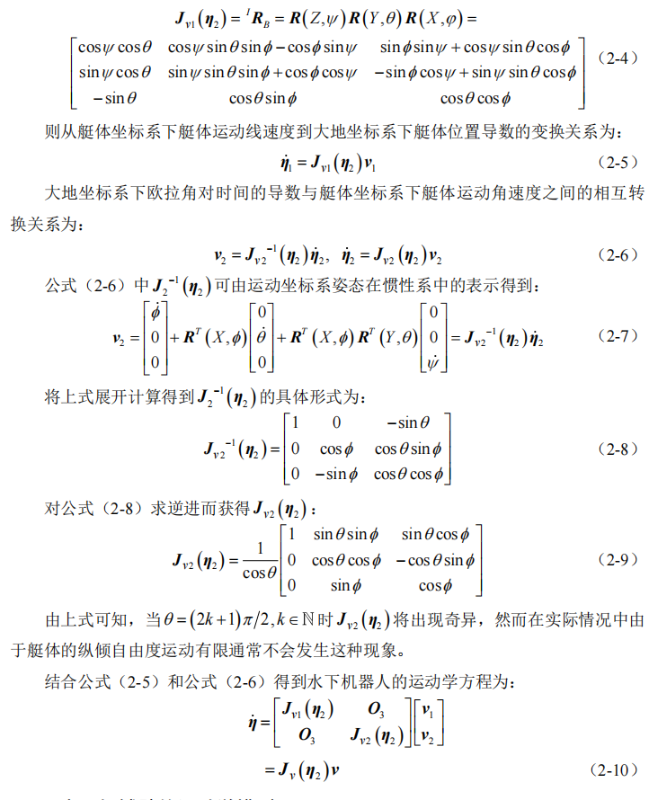
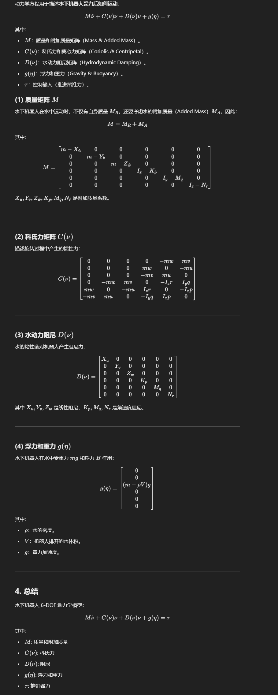
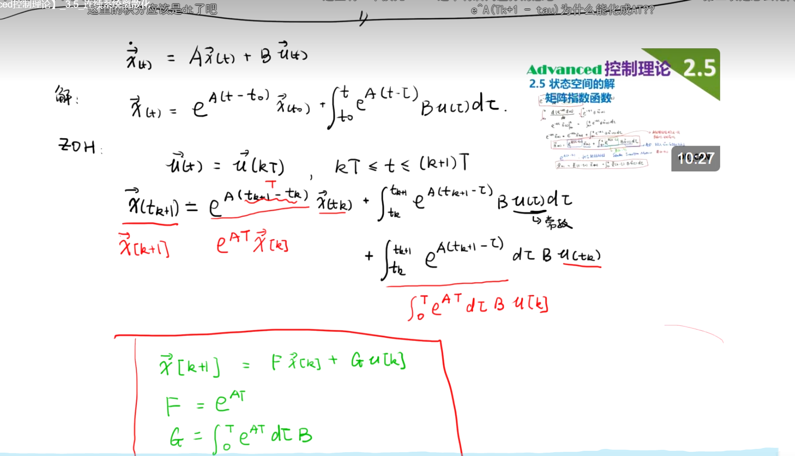
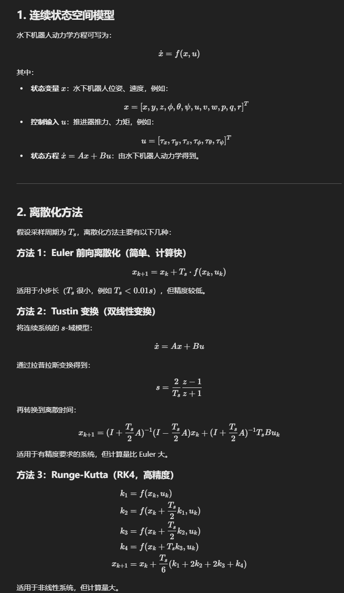

# 运动学方程（用于描述**位置和姿态随时间的变化**，即如何从**速度**计算**位姿**）

Q：

1.旋转矩阵 **R(ϕ,θ,ψ)**/**J~V1~（g2）**和姿态转换矩阵**T(ϕ,θ)**/**J~V2~（g2）**（Euler 角变换）是什么？

# 动力学方程（描述**水下机器人受力后如何运动**）

Q：

1.用离散化方法（Euler 或 RK4）将连续方程转换为离散时间形式？（常用**Euler**）

# MPC

###  **MPC 中为何使用增量模型**

1. **消除静态误差**：MPC 控制器通常需要确保系统能准确跟踪参考轨迹，使用增量形式可以有效消除稳态误差。
2. **防止突变**：控制输入的变化受物理限制，增量形式可以直接施加限制，确保控制变化平滑。
3. **适配物理模型**：对于具有强非线性或执行器约束的系统（如 BlueROV2 的推进器），增量控制形式更符合实际。