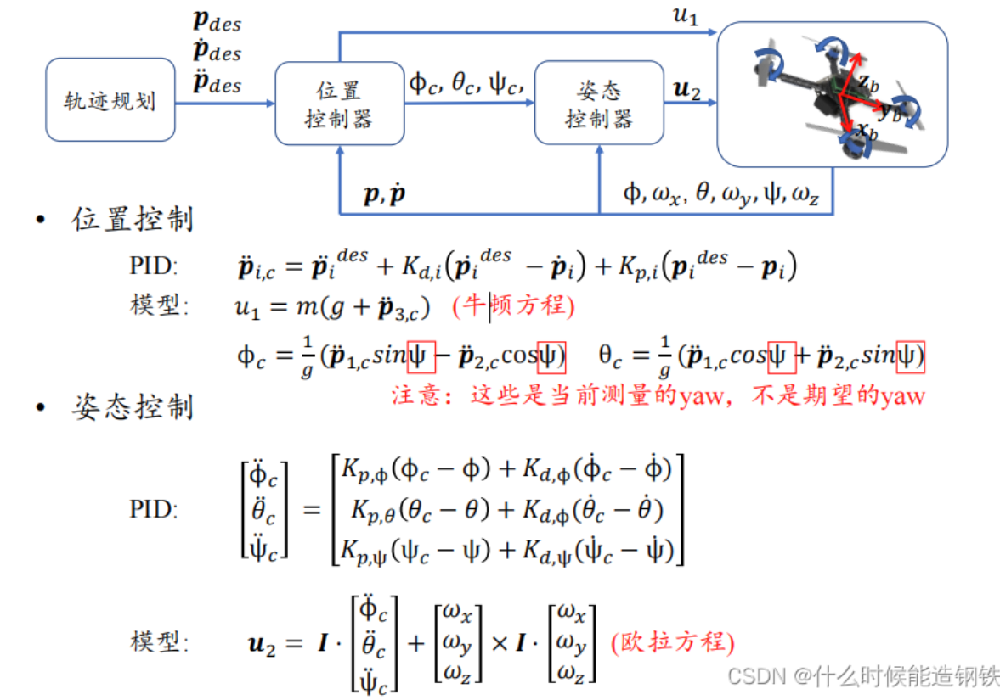

# 1.Control_Strategies_and_Novel_Techniques_for_Autonomous_Rotorcraft_Unmanned_Aerial_Vehicles_A_Review

这两个公式描述了四旋翼飞行器（四轴飞行器）的平移运动，并将这些运动从地球参考系转换到机体参考系中。下面是对这些公式的详细解释。

### 1. 地球参考系中的运动方程 (Equation 13)

\[ 
$$
\mathbf{F}_E = m \frac{d}{dt} (\mathbf{V}_E)
$$
\]

- **\(\mathbf{F}_E\)**: 四旋翼飞行器在地球参考系中的合力。

- **\(m\)**: 四旋翼飞行器的质量。

- **\(\mathbf{V}_E\)**: 四旋翼飞行器在地球参考系中的速度。

- **\(**
  $$
  \frac{d}{dt} (\mathbf{V}_E)
  $$
  **\)**: 四旋翼飞行器在地球参考系中的加速度。

这个公式是牛顿第二定律在地球参考系中的表达形式，它表明施加在四旋翼飞行器上的力等于其质量乘以加速度。

### 2. 机体参考系中的运动方程 (Equation 14)

\[
$$
\mathbf{F}_B = m \dot{\mathbf{v}}_B + \boldsymbol{\omega}_B \times (m \mathbf{v}_B)
$$
 \]

- **\(\mathbf{F}_B\)**: 四旋翼飞行器在机体参考系中的合力。

- **\(m\)**: 四旋翼飞行器的质量。

- **\(**
  $$
  \dot{\mathbf{v}}_B
  $$
  **\)**: 四旋翼飞行器在机体参考系中的速度变化率（加速度）。

- **\(**
  $$
  \boldsymbol{\omega}_B
  $$
  **\)**: 机体参考系相对于地球参考系的角速度。

- **\(**
  $$
  \boldsymbol{\omega}_B \times (m \mathbf{v}_B)
  $$
  **\)**: 科里奥利力项，表示由于机体旋转引起的附加力。

### 方程的意义

#### 1. 从地球参考系到机体参考系的转换
将平移运动方程从地球参考系转换到机体参考系是因为在许多控制和导航应用中，描述和计算飞行器在机体参考系中的运动更加方便。机体参考系固定在飞行器上，随着飞行器一起移动和旋转。

#### 2. 科里奥利项(**科里奥利方程通过角速度矢量 ω 将两个不同坐标系的矢量导数联系起来，用于描述身体固定坐标系相对于地球固定坐标系的角旋转**)
当转换到机体参考系时，需要考虑飞行器的旋转运动，这会引入额外的科里奥利力项。这是由于机体参考系本身是一个非惯性参考系，随飞行器旋转而变化。因此，除了考虑线性加速度外，还需要考虑由于旋转引起的附加力（即科里奥利力）。

### 方程的作用
- **地球参考系中的运动方程 (Equation 13)**: 提供了飞行器在地球参考系中的力和运动关系，这是理解飞行器总体运动的基础。
- **机体参考系中的运动方程 (Equation 14)**: 提供了飞行器在自身机体参考系中的力和运动关系，使得在控制和导航中更方便地处理和计算。

通过这些方程，可以将飞行器的动力学从地球参考系转换到机体参考系，并考虑到由于旋转运动引起的附加力，从而更准确地描述和控制飞行器的运动。


# 高飞老师

1.状态机代码整体框架

```c++
void PX4CtrlFSM::process()
{

	ros::Time now_time = ros::Time::now();
	Controller_Output_t u;
	Desired_State_t des(odom_data);
	bool rotor_low_speed_during_land = false;

	// STEP1: state machine runs  
	//且给出每个状态的期望位姿 des 。用于后续控制	
    switch (state){
    }

    // STEP2: estimate thrust model
	if (state == AUTO_HOVER || state == CMD_CTRL)
	{
		// 用来计算thr2acc_ 和 P_ ，后续用于给 calculateControl（）函数 由加速度来计算推力
		controller.estimateThrustModel(imu_data.a,param);
	}

	// STEP3: solve and update new control commands
	if (rotor_low_speed_during_land) // used at the start of auto takeoff
	{
		//赋值给 只给竖直方向的推力
		motors_idling(imu_data, u);
	}
	else
	{
		//输入期望位姿 用位置控制器计算推力
		debug_msg = controller.calculateControl(des, odom_data, imu_data, u);
		//用于debug
		debug_msg.header.stamp = now_time;
		debug_pub.publish(debug_msg);
	}

	// STEP4: publish control commands to mavros
	if (param.use_bodyrate_ctrl)
	{
		publish_bodyrate_ctrl(u, now_time);
	}
	else
	{
		publish_attitude_ctrl(u, now_time);
	}

	// STEP5: Detect if the drone has landed
	land_detector(state, des, odom_data);
	// cout << takeoff_land.landed << " ";
	// fflush(stdout);

	// STEP6: Clear flags beyound their lifetime
	rc_data.enter_hover_mode = false;
	rc_data.enter_command_mode = false;
	rc_data.toggle_reboot = false;
	takeoff_land_data.triggered = false;
}
```

2.控制器的部分（只用了位置控制）



```c++
/* debug一块可不看
  compute u.thrust and u.q, controller gains and other parameters are in param_ 
*/
quadrotor_msgs::Px4ctrlDebug
LinearControl::calculateControl(const Desired_State_t &des,
    const Odom_Data_t &odom,
    const Imu_Data_t &imu, 
    Controller_Output_t &u)
{
  /* WRITE YOUR CODE HERE */
      //compute disired acceleration
      Eigen::Vector3d des_acc(0.0, 0.0, 0.0);
      Eigen::Vector3d Kp,Kv;
      Kp << param_.gain.Kp0, param_.gain.Kp1, param_.gain.Kp2;
      Kv << param_.gain.Kv0, param_.gain.Kv1, param_.gain.Kv2;
      des_acc = des.a + Kv.asDiagonal() * (des.v - odom.v) + Kp.asDiagonal() * (des.p - odom.p);
      des_acc += Eigen::Vector3d(0,0,param_.gra);
         
          //computeDesiredCollectiveThrustSignal（）具体实现
          //作用：用于将竖直方向的加速度转化为推力
          // double LinearControl::computeDesiredCollectiveThrustSignal(const Eigen::Vector3d &des_acc)
          // {
          //   double throttle_percentage(0.0);
    
          //   /* compute throttle, thr2acc has been estimated before */第二步计算出来
          //   throttle_percentage = des_acc(2) / thr2acc_;

          //   return throttle_percentage;
          // }
      u.thrust = computeDesiredCollectiveThrustSignal(des_acc);

      double roll,pitch,yaw,yaw_imu;
      double yaw_odom = fromQuaternion2yaw(odom.q);
      double sin = std::sin(yaw_odom);
      double cos = std::cos(yaw_odom);
      roll = (des_acc(0) * sin - des_acc(1) * cos )/ param_.gra;
      pitch = (des_acc(0) * cos + des_acc(1) * sin )/ param_.gra;
      // yaw = fromQuaternion2yaw(des.q);
      yaw_imu = fromQuaternion2yaw(imu.q);
      // Eigen::Quaterniond q = Eigen::AngleAxisd(yaw,Eigen::Vector3d::UnitZ())
      //   * Eigen::AngleAxisd(roll,Eigen::Vector3d::UnitX())
      //   * Eigen::AngleAxisd(pitch,Eigen::Vector3d::UnitY());
      Eigen::Quaterniond q = Eigen::AngleAxisd(des.yaw,Eigen::Vector3d::UnitZ())
        * Eigen::AngleAxisd(pitch,Eigen::Vector3d::UnitY())
        * Eigen::AngleAxisd(roll,Eigen::Vector3d::UnitX());
      u.q = imu.q * odom.q.inverse() * q;


  /* WRITE YOUR CODE HERE */

  //used for debug
  // debug_msg_.des_p_x = des.p(0);
  // debug_msg_.des_p_y = des.p(1);
  // debug_msg_.des_p_z = des.p(2);
  
  debug_msg_.des_v_x = des.v(0);
  debug_msg_.des_v_y = des.v(1);
  debug_msg_.des_v_z = des.v(2);
  
  debug_msg_.des_a_x = des_acc(0);
  debug_msg_.des_a_y = des_acc(1);
  debug_msg_.des_a_z = des_acc(2);
  
  debug_msg_.des_q_x = u.q.x();
  debug_msg_.des_q_y = u.q.y();
  debug_msg_.des_q_z = u.q.z();
  debug_msg_.des_q_w = u.q.w();
  
  debug_msg_.des_thr = u.thrust;
  
  // Used for thrust-accel mapping estimation
  timed_thrust_.push(std::pair<ros::Time, double>(ros::Time::now(), u.thrust));
  while (timed_thrust_.size() > 100)
  {
    timed_thrust_.pop();
  }
  return debug_msg_;
}
```

```c++
核心控制代码

      //compute disired acceleration
      Eigen::Vector3d des_acc(0.0, 0.0, 0.0);
      Eigen::Vector3d Kp,Kv;
      Kp << param_.gain.Kp0, param_.gain.Kp1, param_.gain.Kp2;
      Kv << param_.gain.Kv0, param_.gain.Kv1, param_.gain.Kv2;
      des_acc = des.a + Kv.asDiagonal() * (des.v - odom.v) + Kp.asDiagonal() * (des.p - odom.p);
      des_acc += Eigen::Vector3d(0,0,param_.gra);
         
          //computeDesiredCollectiveThrustSignal（）具体实现
          //作用：用于将竖直方向的加速度转化为推力
          // double LinearControl::computeDesiredCollectiveThrustSignal(const Eigen::Vector3d &des_acc)
          // {
          //   double throttle_percentage(0.0);
    
          //   /* compute throttle, thr2acc has been estimated before */第二步计算出来
          //   throttle_percentage = des_acc(2) / thr2acc_;

          //   return throttle_percentage;
          // }
      u.thrust = computeDesiredCollectiveThrustSignal(des_acc);

      double roll,pitch,yaw,yaw_imu;
		//yaw_odom是当前测量值
      double yaw_odom = fromQuaternion2yaw(odom.q);
      double sin = std::sin(yaw_odom);
      double cos = std::cos(yaw_odom);
      roll = (des_acc(0) * sin - des_acc(1) * cos )/ param_.gra;
      pitch = (des_acc(0) * cos + des_acc(1) * sin )/ param_.gra;
      // yaw = fromQuaternion2yaw(des.q);
      yaw_imu = fromQuaternion2yaw(imu.q);
      // Eigen::Quaterniond q = Eigen::AngleAxisd(yaw,Eigen::Vector3d::UnitZ())
      //   * Eigen::AngleAxisd(roll,Eigen::Vector3d::UnitX())
      //   * Eigen::AngleAxisd(pitch,Eigen::Vector3d::UnitY());
      Eigen::Quaterniond q = Eigen::AngleAxisd(des.yaw,Eigen::Vector3d::UnitZ())
        * Eigen::AngleAxisd(pitch,Eigen::Vector3d::UnitY())
        * Eigen::AngleAxisd(roll,Eigen::Vector3d::UnitX());
      u.q = imu.q * odom.q.inverse() * q;

```

```c++
    u.q = imu.q * odom.q.inverse() * q;
```

举例直观理解

- 假设此刻里程计认为飞机姿态是 A（`odom.q`），但 IMU 认为姿态更准是 B（`imu.q`）。  
- 你计算出了“在 A 基础上，需要再转 q” 才能达到轨迹想要的姿态 C（即 C = A × q）。  
- 但你要从真实姿态 B 出发去达到 C，就要先“撤销 A”（用 A⁻¹），再“应用 B”，最后再“应用增量 q”：  
  
  \[
    u.q = B \times A^{-1} \times q
  \]  

- 这样，飞控接收到的 `u.q` 就是从真实姿态 B 直接到目标姿态 C 的变换。  

---

为什么要这么做？

- **纠正里程计偏差**：里程计（视觉、滤波）有延时／漂移，用 IMU 的实时姿态 `imu.q` 作为基准更稳定。  
- **叠加期望增量**：`q` 本身是相对增量（“从 A 到 C”），必须先把它从 A 坐标系转换到 IMU 坐标系，才能正确叠加。  
- 最终得到的 `u.q` 就是飞控所需的“绝对四元数”姿态指令，保证飞机按期望的 roll/pitch/yaw 调整。
