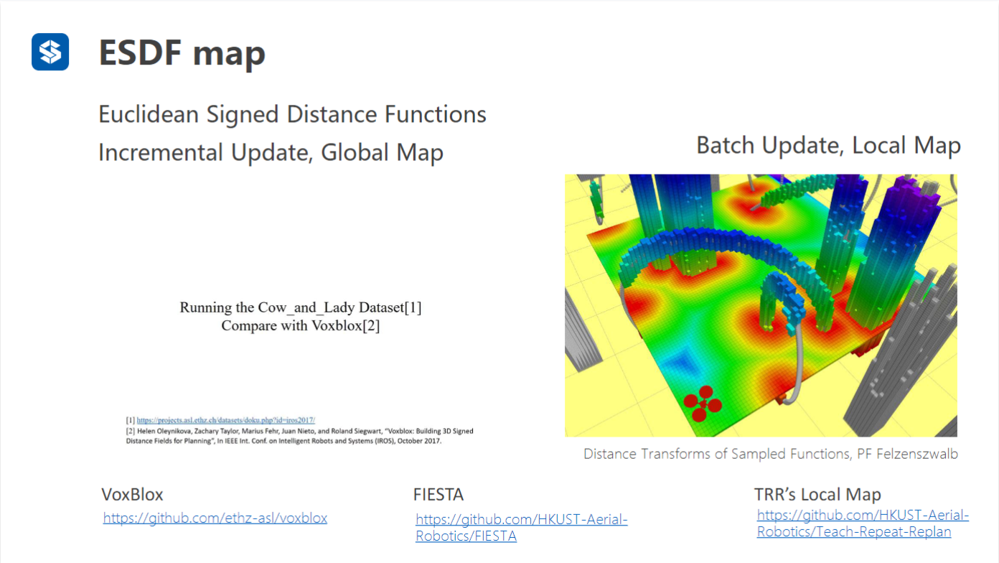

地图格式

1.栅格地图

2.八叉树地图

3.点云地图

4.TSDF地图

5.ESDF地图

**通俗理解**：举个例子

假设你有一个 10m×10m×2m 的房间，中间有一张桌子（障碍）：

- **TSDF**：只计算「桌子表面 ±0.05m（5cm）」范围内的距离，比如离桌子 6cm 的点，TSDF 值直接设为 +0.05m（截断），房间角落（离桌子 5m）的 TSDF 值也记为 +0.05m，不存精确值。这样只需要存储桌子周围的少量体素，内存占用极低，适合实时重建桌子的形状。
- **ESDF**：房间里每一个点（包括角落）都精确计算到桌子的距离 —— 比如角落离桌子 5m，ESDF 值就是 +5.0m；离桌子 0.1m 的点，值就是 +0.1m。能精准知道「任意位置离最近障碍有多远」，但需要存储整个房间的体素，内存占用远大于 TSDF，适合规划时判断「机器人走到角落是否安全」。

------

**二者的关联**：TSDF 是 ESDF 的「半成品」

在实际工程中（比如机器人建图 + 规划），TSDF 和 ESDF 常配合使用：

1. 先用深度相机 / 激光雷达采集数据，通过 TSDF 增量重建出环境的三维表面（快速、低耗）；
2. 从 TSDF 的「零等值面」（物体表面）提取障碍边界；
3. 用**快速行进法（Fast Marching Method, FMM）** 从障碍边界向外扩散，计算出整个空间的 ESDF；
4. 路径规划算法（如 A*、RRT*、Kinodynamic 规划）调用 ESDF，快速查询「当前位置离最近障碍的距离 / 方向」，优化轨迹（比如保证机器人和障碍保持至少 0.2m 安全距离）。

→ 核心逻辑：**TSDF 负责「快速建表面」，ESDF 负责「全局算距离」，前者服务于感知，后者服务于规划。**

# **路径规划**

1.A*算法

