<<<<<<< Updated upstream

# 问题1：安装ros1

## 自动安装ros：wget http://fishros.com/install -O fishros && . fishros。但是ros1安装不了？
  

[[

## 解决方法：

### 安装18.4版本的ubuntu，因为22.4不支持ros1

可以此种方法安装镜像源

https://img-blog.csdnimg.cn/20201002105940856.png?x-oss-process=image/watermark,type_ZmFuZ3poZW5naGVpdGk,shadow_10,text_aHR0cHM6Ly9ibG9nLmNzZG4ubmV0L3dlaXhpbl80NTkxMjI5MQ==,size_16,color_FFFFFF,t_70#pic_center

https://img-blog.csdnimg.cn/20201002105943284.png?x-oss-process=image/watermark,type_ZmFuZ3poZW5naGVpdGk,shadow_10,text_aHR0cHM6Ly9ibG9nLmNzZG4ubmV0L3dlaXhpbl80NTkxMjI5MQ==,size_16,color_FFFFFF,t_70#pic_center

https://img-blog.csdnimg.cn/20201002105945958.png?x-oss-process=image/watermark,type_ZmFuZ3poZW5naGVpdGk,shadow_10,text_aHR0cHM6Ly9ibG9nLmNzZG4ubmV0L3dlaXhpbl80NTkxMjI5MQ==,size_16,color_FFFFFF,t_70#pic_center


# 问题2：无法定位软件包+无法解析域名

## 问题描述：

### 1、无法定位软件包  

[](https://postimg.cc/H88rWwnN)

### 2、无法解析域名

[
[](https://postimg.cc/vxR5Rwrt)

## 

## 原因：

### 软件源的问题，要更新软件源

## 解决方法：
### 1、更新镜像源

```
sudo apt-get update
sudo apt-get upgrade
```
### 2、若还是不行，就换镜像源：

 在软件和更新里——下载自——其他——选服务器（清华，阿里）

鱼香ros的一键安装

```
wget http://fishros.com/install -O fishros && . fishros
```


# 问题3：无法跑鱼香ros的launch文件

[](https://postimg.cc/pymhBHCB)


## 问题描述：

### ERROR:cannot launch node of type

## 原因：

### 没有配置好环境（只是把learning_launch功能包文件复制到my_ws工作空间中，还要把其他功能包复制过来）

## 解决方法：

### 1、先复制功能包

[](https://postimg.cc/0zYJJ0nR)


### 2、编译工作空间

[](https://postimg.cc/pmJpdXVP)


### 3、配置环境+运行launch文件

[](https://postimg.cc/JGJs959D)


# 问题4：

=======
# 问题1：安装ros1

## 自动安装ros：wget http://fishros.com/install -O fishros && . fishros。但是ros1安装不了？
  

[[

## 解决方法：

### 安装18.4版本的ubuntu，因为22.4不支持ros1

可以此种方法安装镜像源

https://img-blog.csdnimg.cn/20201002105940856.png?x-oss-process=image/watermark,type_ZmFuZ3poZW5naGVpdGk,shadow_10,text_aHR0cHM6Ly9ibG9nLmNzZG4ubmV0L3dlaXhpbl80NTkxMjI5MQ==,size_16,color_FFFFFF,t_70#pic_center

https://img-blog.csdnimg.cn/20201002105943284.png?x-oss-process=image/watermark,type_ZmFuZ3poZW5naGVpdGk,shadow_10,text_aHR0cHM6Ly9ibG9nLmNzZG4ubmV0L3dlaXhpbl80NTkxMjI5MQ==,size_16,color_FFFFFF,t_70#pic_center

https://img-blog.csdnimg.cn/20201002105945958.png?x-oss-process=image/watermark,type_ZmFuZ3poZW5naGVpdGk,shadow_10,text_aHR0cHM6Ly9ibG9nLmNzZG4ubmV0L3dlaXhpbl80NTkxMjI5MQ==,size_16,color_FFFFFF,t_70#pic_center


# 问题2：无法定位软件包+无法解析域名

## 问题描述：

### 1、无法定位软件包  

[](https://postimg.cc/H88rWwnN)

### 2、无法解析域名

[
[](https://postimg.cc/vxR5Rwrt)

## 


## 原因：

### 软件源的问题，要更新软件源

## 解决方法：
### 1、更新镜像源

```
sudo apt-get updaate
sudo apt-get upgrade
```
### 2、若还是不行，就换镜像源：

 在软件和更新里——下载自——其他——选服务器（清华，阿里）


# 问题3：无法跑鱼香ros的launch文件

[](https://postimg.cc/pymhBHCB)


## 问题描述：

### ERROR:cannot launch node of type

## 原因：

### 没有配置好环境（只是把learning_launch功能包文件复制到my_ws工作空间中，还要把其他功能包复制过来）

## 解决方法：

### 1、先复制功能包

[](https://postimg.cc/0zYJJ0nR)


### 2、编译工作空间

[](https://postimg.cc/pmJpdXVP)


### 3、配置环境+运行launch文件

[](https://postimg.cc/JGJs959D)


# 问题4：无法安装PX4源代码

## 问题描述：无法克隆

```
无法克隆 'https://github.com/PX4/PX4-FlightGear-Bridge.git' 到子模组路径 '/home/jeremy/PX4-Autopilot/Tools/flightgear_bridge'
克隆 'Tools/flightgear_bridge' 失败。按计划重试
```

## 解决办法：

### 1、可以先将PX4文件克隆下来，不去克隆子项目，运行下面指令

```
git clone https://github.com.cnpmjs.org/PX4/PX4-Autopilot.git
```

### 2、然后切换到PX4文件夹，继续克隆子项目,执行下面指令

```
cd PX4-Autopilot
git submodule update --init --recursive
```

### 3、如果还是出现失败也没关系，继续执行

```
git submodule update --recursive`
```

### 直到不出现失败提示为止。（这时是在继续克隆你之前没成功的子项目，注意：此时没有init)


# 问题4：bash文件运行

## 问题描述：mirrors.aliyun.com 无法解析


## 解决方法：

### 一：已知可行：

#### 1、运行

```
sudo gedit /etc/resolv.conf 
```

#### 2、修改文件参数（更改里面的nameserver）

```
nameserver 8.8.8.8 
nameserver 8.8.4.4
nameserver 223.5.5.5
nameserver 223.6.6.6
```

### 二:待定：

#### 更换软件源


# 问题五：bash文件运行过程

## 问题描述：retrying......Could not find a version that satisfies the requirement

## 

## 解决方法：

### 循环操作直至依赖全部安装好


## 问题分析

### 1检查pip的版本（升级版本）

```
python -m pip install --upgrade pip
```

### 2更换一个pip源或换软件源

#### 1、这时考虑换一个pip源

```
pip install pymysql -i https://pypi.tuna.tsinghua.edu.cn/simple/
```

#### 2、换软件源

### 3用镜像安装库（考虑是网速的原因，这时采用国内的镜像源来加速）

```
pip install 包名-i http://pypi.douban.com/simple/ --trusted-host pypi.douban.com
```

```text
阿里源 http://mirrors.aliyun.com/pypi/simple/

中国科技大学 https://pypi.mirrors.ustc.edu.cn/simple/ 

清华大学 https://pypi.tuna.tsinghua.edu.cn/simple/
```

直接运行下面的代码

```
bash ./PX4-Autopilot/Tools/setup/ubuntu.sh
```

是将安装相对完整的PX4固件环境需要下载的依赖包多，因为网络原因造成的报错更多**。此外，不管运行哪一个命令，其实大概率都会【遇到一堆红色的报错】，解决方法其实也很简单，即 【**确定导致报错的依赖包名，网上检索安装这个依赖包的方法】**。我们只需要将导致报错的依赖包都安装好了，运行.sh文件时就能会跳过他们。

## PS:如果安装好sympy库后，仍然不行。则按照以下方法把文件里的sympy>=1.10.1改为sympy


# 问题六：PX4配置（太难了（哭脸））

## 问题描述：AttributeError: module 'em' has no attribute 'RAW_OPT'


### 可能是因为使用旧的解决方案卸载em并安装empy。这还不够，因为从11月30日开始的最新版本的empy(4.0)似乎引起了AttributeError的新问题:` module `对象没有属性` RAW_OPT `，所以我安装了一个旧版本的empy `AttributeError: 'module' object has no attribute 'RAW_OPT'`（版本太新）

## 解决方案：

### 卸载新版本，安装一个旧版本的

```
pip3 uninatall empy
pip3 install empy==3.3.2
```

### 若仍然失败则更新软件源并重新编译（我的是这种）

```
sudo apt-get update
sudo apt-get upgrade
sudo make clean
```


# 问题八：roslaunch文件时，文件的仿真环境出现Resource not found: px4

## 问题描述：运行launch文件时Resource not found: px4


## 解决方案：按照px4官方文档

分析：这意味着 PX4 SITL 未包含在路径中。要解决此问题，请在 `.bashrc` 文件末尾添加以下行：

```sh
source ~/PX4-Autopilot/Tools/simulation/gazebo/setup_gazebo.bash ~/PX4-Autopilot ~/PX4-Autopilot/build/px4_sitl_default
export ROS_PACKAGE_PATH=$ROS_PACKAGE_PATH:~/PX4-Autopilot
export ROS_PACKAGE_PATH=$ROS_PACKAGE_PATH:~/PX4-Autopilot/Tools/simulation/gazebo-classic/sitl_gazebo-classic
export GAZEBO_PLUGIN_PATH=$GAZEBO_PLUGIN_PATH:/usr/lib/x86_64-linux-gnu/gazebo-9/plugins
```

现在在终端中，转到主目录并运行以下命令以将上述更改应用于当前终端：

```sh
source .bashrc
```


# 问题九：opencv安装过程出现问题

### 问题描述：

### modules/java_bindings_generator/CMakeFiles/gen_opencv_java_source.dir/build.make:357: recipe for target 'CMakeFiles/dephelper/gen_opencv_java_source' failed

make[2]: *** [CMakeFiles/dephelper/gen_opencv_java_source] Error 1
CMakeFiles/Makefile2:1527: recipe for target 'modules/java_bindings_generator/CMakeFiles/gen_opencv_java_source.dir/all' failed
make[1]: *** [modules/java_bindings_generator/CMakeFiles/gen_opencv_java_source.dir/all] Error 2
Makefile:162: recipe for target 'all' failed
make: *** [all] Error 2


## 解决方法：将下载改为Download。因为不支持中文


# 问题10：1、无法launch节点；2、无法发现

## 问题描述：ERROR: cannot launch node of type [rviz/rviz]: rviz


## 解决方法：下载rviz

```
sudo apt-get install ros-melodic-rviz
```

## 同理：如下问题都是这样

1、https://img-blog.csdnimg.cn/20200310100359556.png?x-oss-process=image/watermark,type_ZmFuZ3poZW5naGVpdGk,shadow_10,text_aHR0cHM6Ly9ibG9nLmNzZG4ubmV0L3dlaXhpbl80MjU5MTUyOQ==,size_16,color_FFFFFF,t_70


```
sudo apt-get install ros-melodic-robot-state-publisher
```

2、https://img-blog.csdnimg.cn/20200310104146178.png


解决方法：

```
sudo apt-get install ros-melodic-joint-state-publisher-gui
```


# 问题11：安装opencv时

## 问题描述：

Traceback (most recent call last):  File "/home/ros1/下载/opencv-3.4.1/modules/java/generator/../generator/gen_java.py", line 1093, in <module>    copy_java_files(java_files_dir, target_path)  File "/home/ros1/下载/opencv-3.4.1/modules/java/generator/../generator/gen_java.py", line 1032, in copy_java_files    src = checkFileRemap(java_file)  File "/home/ros1/下载/opencv-3.4.1/modules/java/generator/../generator/gen_java.py", line 25, in checkFileRemap    assert path[-3:] != '.in', path AssertionError: /home/ros1/下载/opencv-3.4.1/modules/java/generator/src/java/org/opencv/osgi/OpenCVNativeLoader.java.in modules/java_bindings_generator/CMakeFiles/gen_opencv_java_source.dir/build.make:357: recipe for target 'CMakeFiles/dephelper/gen_opencv_java_source' failed make[2]: *** [CMakeFiles/dephelper/gen_opencv_java_source] Error 1 CMakeFiles/Makefile2:1652: recipe for target 'modules/java_bindings_generator/CMakeFiles/gen_opencv_java_source.dir/all' failed make[1]: *** [modules/java_bindings_generator/CMakeFiles/gen_opencv_java_source.dir/all] Error 2 Makefile:162: recipe for target 'all' failed make: *** [all] Error 2

## 原因分析：因为文件夹的名字为中文下载

## 解决方法：将文件夹的名字改为英文“Download”


# 问题12：无法launch一个文件

## 问题描述：RLException: [indoor1.launch] is neither a launch file in package [px4] nor is [px4] a launch file name
The traceback for the exception was written to the log file


## 解决方法：删除重名文件

首先locate这个文件，看重复的文件在什么地方


# 问题13：工作空间编译不了

## 问题描述：

### 改完工作空间下的功能包的名字，然后编译不了了

## 解决方法：

### 1.删除 `build` 和 `devel` 文件夹，以确保在新的配置下重新构建。

### 2**修改 `CMakeLists.txt` 和 `package.xml`**：

- 确保你的 `CMakeLists.txt` 文件中的项目名称与你的功能包名称一致。
- 在 `CMakeLists.txt` 中搜索并替换旧的功能包名称，确保所有引用都已更新为新的名称。
- 在 `package.xml` 文件中更新功能包名称。

### 3**重新构建功能包**：

- 在你的工作空间中运行 `catkin_make` 或 `catkin build` 以重新构建功能包。
- 如果使用的是 `catkin_tools`，则运行 `catkin clean` 以清理旧的构建文件，然后再次运行 `catkin build`。


# 问题14：无法启动仿真launch文件

## 问题描述：

## 问题分析：

因为跑仿真时代码的话题变为 

```
发布者订阅者为
/iris_0/mavros/state
/iris_0/mavros/local_position/pose
客户端服务端为
iris_0/mavros/cmd/arming
iris_0/mavros/set_mode
```

可能是launch文件写错了，所以检查一下节点能不能启动（rosrun my_control_lzh pose_control_sim.cpp）


## 问题解决：

将话题名字改为仿真的话题

检查launch文件，添加CMakelist文件

## 推广：

#### 若为别人的代码则有可能是没下载功能包

https://img-blog.csdnimg.cn/20210717080225949.png


```
sudo apt-get install ros-melodic（ros版本名）-包名
```

#### 1.先加权限

```
sudo chmod +x 
```

#### 2.再加上环境变量

```
source ~/.bashrc
```

## 其他原因：

CMakelist文件的依赖项没调好：

1.忘在find_package中加入roscpp了

2.添加add_excutive( 可执行文件名字  文件路径)

3.没加入add_libraries(可执行文件名字 )


# 问题十五：编译问题

## 问题描述：在工作空间无法编译c++文件


## 我的已有操作：

1、CMakelist文件添加find_package()中添加geometry_msgs依赖项

2、CMakelist文件添加可执行文件和库

add_executable(pose_control_sim src/pose_control_sim.cpp)
target_link_libraries(pose_control_sim
  ${catkin_LIBRARIES}
)

3、CMakelist文件添加catkin_package中的依赖项geometry_msgs


因为


## 问题分析：程序编写错误，不能够在main函数外赋值。可以在main函数外定义全局变量，但得在main函数内赋值


## 解决方法：

将赋值放到函数内部


# 问题十六：首飞无人机时的问题记录

## 一.QGC里一直显示Not ready

### 原因分析：

### 1.通过查看日志信息知道：在飞行途中遥控器的模式切换突然没了。推测为遥控器接收机有问题。遥控器信号不稳

### 2.GPS信号不好，接线松了。

​			拔电重启

​			GPS的安全开关没打开也会导致无法解锁，有的是集成再GPS上，有的是单独的一个小按钮，慢闪就是没打开的状态，长按一下变成双闪，就是打开状态们就可以解锁了。

### 3.拔CD内存卡时，一定要注意先断电，再拔内存卡，然后上电。不然GPS无信号。无法进入定点模式（要用GPS信号）（自稳模式不用GPS，可用于室内飞行，一般穿越机为这样的模式）。

### 解决方案：换一个5pin的接线，重新连接。

## 二.起飞时仅拨动推力杆，无人机会左右飘。每次重新校准传感器时都会换个方向飘。

### 原因分析：

#### 1.QGC校准电调时没校准好

#### 2.电调安装位置并未按照PX4官网要求1324.而为1234.导致飞行时底层飞控分配的推力不符合预期。

## 三.炸机

### 原因分析：

#### 1.电池电量过低。最后垂直下落

#### 2.按键设置不合理。用模式切换时，手的姿势不对，误触了arm按键。导致无人机掉落。

.JPG)

.JPG)


# 问题十七：虚拟机无WiFi

## 文章目录

- - [方法一：网络连接状态排查](https://blog.csdn.net/dong__ge/article/details/123581117#_14)
  - [方法二：主机网络服务查询](https://blog.csdn.net/dong__ge/article/details/123581117#_40)
  - [其他解决方法](https://blog.csdn.net/dong__ge/article/details/123581117#_54)

早上刚到公司，打开电脑，远程连接虚拟机，突然发现 `SSH`连接失败！

What，什么情况，打开[虚拟机](https://so.csdn.net/so/search?q=%E8%99%9A%E6%8B%9F%E6%9C%BA&spm=1001.2101.3001.7020)，网络连接的按钮都没了？还报了一堆异常！

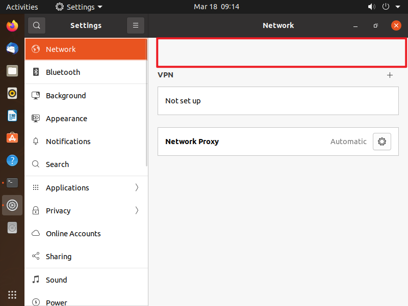

内心一阵恐慌，这种虚拟机突然崩溃的时候，虽然不经常遇到，一旦碰上，着实烦人。

**基本上，这种情况大多都会遇到，同样导致这样问题可能有很多，在这里记录一下两种解决方案，同时并分享一些其他相同问题的解决方法！**

### 方法一：网络连接状态排查

出现该问题，第一步进行网络状态排查，通常也是最有效的方法之一。

进入 `Ctrl+Alt+T`打开终端，输入以下命令，查看网络状态信息。

```bash
sudo vim /var/lib/NetworkManager/NetworkManager.state
```

可以看到，网络状态信息 `NetworkingEnabled=false`，

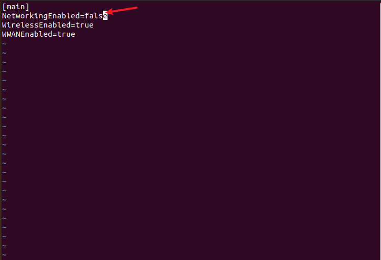

不知道怎么就被搞成了 `false`，要:q

想修改成 `true`，需要以下步骤：

- **关闭网络服务**：`sudo service network-manager stop`
- **设置网络状态**：`sudo vim /var/lib/NetworkManager/NetworkManager.state`，设置为 `true`
- **打开网络服务**：`sudo service network-manager start`

此时，就看到了网络连接成功的标识。

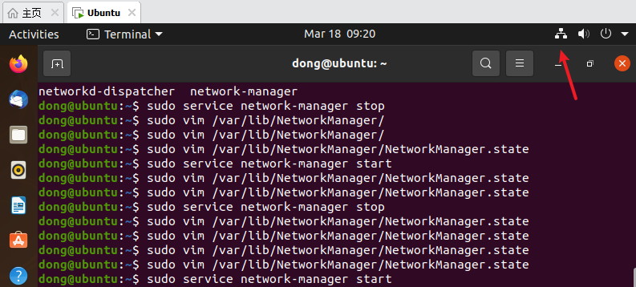

### 方法二：主机网络服务查询

还有另外一个原因，一般是自己的主机把服务给关掉了，或者是因为**电脑管家把这些软件给升级了**，然后把**虚拟机的网路服务给停止**了。

右击 `我的电脑`，然后找到 `管理`\->`服务`，**确保下面虚拟机的网络服务是否打开**，然后虚拟机就有网了。

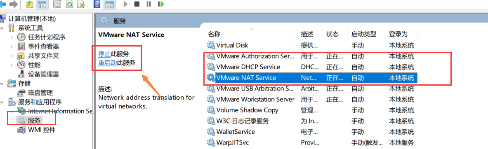

> 如果你的还没有解决，可以参考以下文章。

### 其他解决方法

[【VMware】虚拟机中Ubuntu无法连接网络的有效解决办法](https://blog.csdn.net/u013554213/article/details/79408084)

[VMware 虚拟机里连不上网的五种解决方案](https://blog.csdn.net/qq_36408196/article/details/103390303)

[VMware 虚拟机无法连接网络解决办法](https://blog.csdn.net/m0_37259197/article/details/78221016)


# 问题十八：舵机调试

### 1.代码控制不了（未解决）

### 问题描述：有信号输出了，但是是一上电就开始转动（按照正常情况他应该是不动的）

### 原因分析：推测可能是之前代码给他初始化，而后面的代码要用spinones才能调用一次

### 解决思路：试试代码控制量初始化为1，能不能反向转动。

### 2.遥控器控制（必须arm）（已解决）

### 问题描述：用遥控器可以控制IO PWM OUT端口（并不是FMU PWM OUT）。要在arm模式下。自己在QGC中映射一个通道

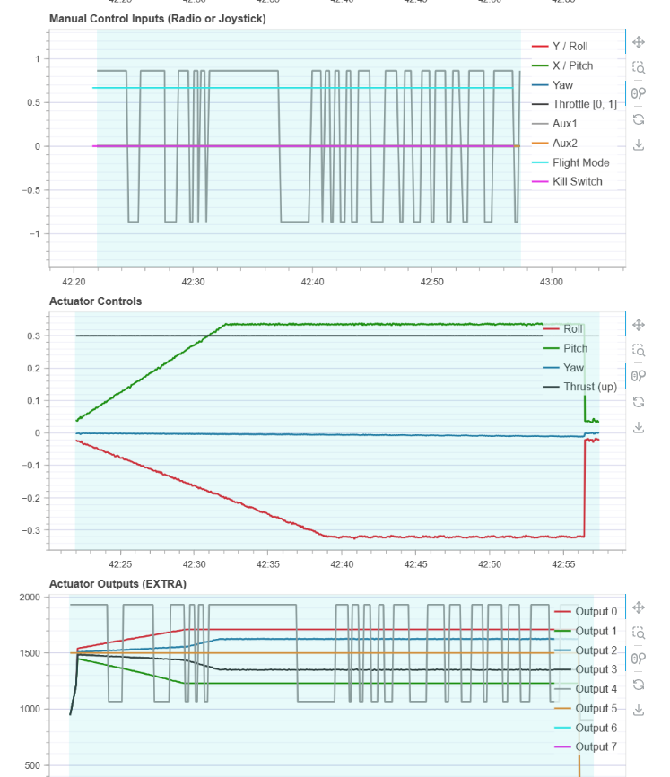


# 问题十九：用vins来定点(位置模式）飞行

## 问题描述：无法切入offboard模式，无法进入位置模式

### 进入位置模式

1.提供位姿代码
先让/mavros/local_position/pose的值和/mavros/vision_pose/pose的值基本一样

要自己写一个代码来转化数据即如果用视觉的话要将视觉估计的位姿传给mavros节点。即让飞控可以订阅到/mavros/local_position/pose（有数据）。

解决方法：用vins或者t265来把定位信息传给飞控。订阅视觉的imu数据/vins_estimator/odometry或 并转化为posestamped类型。然后通过/mavros/vision_pose/pose发布pose。

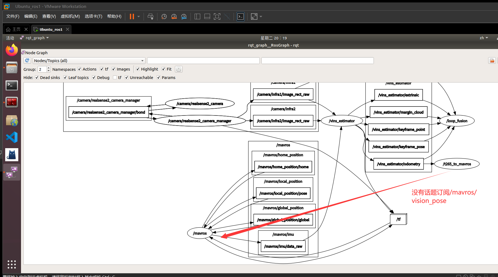

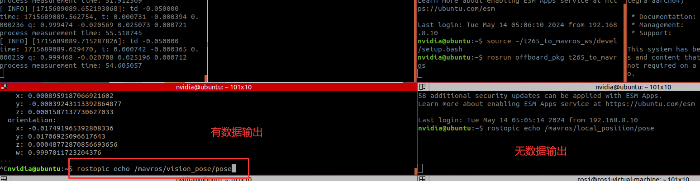

2.需要的功能包

要想用让飞控接收到/mavros/vision_pose/pose发布的pose。还要下载按照功能包

```
sudo apt-get install ros-noetic-mavros-extras
```

这样mavros就看可以接收到/mavros/vision_pose/pose发布的话题了。

### 进入offboard模式（命令和频率）

1.还要发布命令信息才能进入offboard模式

即一般都是要发布其目标点位置命令。但是想要从offboard切换land模式时：1先退出offboard模式，然后land模式。2加一个判断标识变量bool型。当赋值为true时，不发布命令指令（退出offboard模式）。

```c++
int offboard_flag = 0; // 防止切land降落之后又去解锁切offboard
在循环里
if (!offboard_flag) {
        local_pos_pub.publish(pose);
    }
```

2.保证发布目标位姿的频率不低于2hz

即最好不用ros::duritio（10.0）.sleep()。通过添加一个bool类型的hovering变量来控制悬停。

```c++
if ((abs(position[0]) < 0.2 && abs(position[1]) < 0.2 && abs(position[2] - HEIGHT) < 0.2))
{
    if (!hovering)
    {
        ROS_INFO("Hovering at (%f, %f, %f)", pose.pose.position.x, pose.pose.position.y, pose.pose.position.z);
        hovering = true;
        hover_start_time = ros::Time::now();
    }
    else if (ros::Time::now() - hover_start_time > ros::Duration(30.0))
    {
        ROS_INFO("Hover complete. Moving to next position.");
        hovering = false;
        pose.pose.position.x = SIDE;
        pose.pose.position.y = 0;
        pose.pose.position.z = HEIGHT;
        last_request = ros::Time::now();
    }
}
```


### 代码案例:

确保无人机在起飞到 `(0, 0, HEIGHT)` 位置时悬停30秒，之后不再悬停，而是直接移动到 `(SIDE, 0, HEIGHT)`，再移动回到 `(0, 0, HEIGHT)`，最后降落。

```c++
#include <ros/ros.h>
#include <geometry_msgs/PoseStamped.h>
#include <mavros_msgs/CommandBool.h>
#include <mavros_msgs/SetMode.h>
#include <mavros_msgs/State.h>

mavros_msgs::State current_state;
double position[3] = {0, 0, 0};

void state_cb(const mavros_msgs::State::ConstPtr &msg) {
    current_state = *msg;
}

void pos_cb(const geometry_msgs::PoseStamped::ConstPtr &msg) {
    position[0] = msg->pose.position.x;
    position[1] = msg->pose.position.y;
    position[2] = msg->pose.position.z;
}

int main(int argc, char **argv) {
    ros::init(argc, argv, "offb_node");
    ros::NodeHandle nh;
    ros::NodeHandle nh1("~");
    float HEIGHT;
    float SIDE;
    bool AUTO_ARM_OFFBOARD;
    nh1.param<float>("height", HEIGHT, 0.65);
    nh1.param<float>("side", SIDE, 1.5);
    nh1.param<bool>("auto_arm_offboard", AUTO_ARM_OFFBOARD, false);

    ros::Subscriber state_sub = nh.subscribe<mavros_msgs::State>("mavros/state", 10, state_cb);
    ros::Subscriber position_sub = nh.subscribe<geometry_msgs::PoseStamped>("/mavros/local_position/pose", 10, pos_cb);
    ros::Publisher local_pos_pub = nh.advertise<geometry_msgs::PoseStamped>("mavros/setpoint_position/local", 10);
    ros::ServiceClient arming_client = nh.serviceClient<mavros_msgs::CommandBool>("mavros/cmd/arming");
    ros::ServiceClient set_mode_client = nh.serviceClient<mavros_msgs::SetMode>("mavros/set_mode");

    // the setpoint publishing rate MUST be faster than 2Hz
    ros::Rate rate(20.0);

    // wait for FCU connection
    while (ros::ok() && !current_state.connected) {
        ros::spinOnce();
        rate.sleep();
    }

    geometry_msgs::PoseStamped pose;
    pose.pose.position.x = 0;
    pose.pose.position.y = 0;
    pose.pose.position.z = HEIGHT;

    // send a few setpoints before starting
    for (int i = 100; ros::ok() && i > 0; --i) {
        local_pos_pub.publish(pose);
        ros::spinOnce();
        rate.sleep();
    }

    mavros_msgs::SetMode offb_set_mode;
    offb_set_mode.request.custom_mode = "OFFBOARD";

    mavros_msgs::SetMode land_set_mode;
    land_set_mode.request.custom_mode = "AUTO.LAND";

    mavros_msgs::CommandBool arm_cmd;
    arm_cmd.request.value = true;

    int offboard_flag = 0; // 防止切land降落之后又去解锁切offboard
    bool hovering = false;
    bool moved_to_next_position = false;
    bool moved_back_to_start = false;
    ros::Time hover_start_time;

    ros::Time last_request = ros::Time::now();

    while (ros::ok()) {
        if (AUTO_ARM_OFFBOARD) {
            if (current_state.mode != "OFFBOARD" &&
                (ros::Time::now() - last_request > ros::Duration(5.0)) && (offboard_flag == 0)) {
                if (set_mode_client.call(offb_set_mode) &&
                    offb_set_mode.response.mode_sent) {
                    ROS_INFO("Offboard enabled");
                }
                last_request = ros::Time::now();
            } else {
                if (!current_state.armed &&
                    (ros::Time::now() - last_request > ros::Duration(5.0)) && (offboard_flag == 0)) {
                    if (arming_client.call(arm_cmd) &&
                        arm_cmd.response.success) {
                        ROS_INFO("Vehicle armed");
                    }
                    last_request = ros::Time::now(); // 可以通过这个方式保持当前指点持续几秒钟。
                }
            }
        }

        // Hover for 30 seconds after reaching the initial position
        if ((abs(position[0]) < 0.2 && abs(position[1]) < 0.2 && abs(position[2] - HEIGHT) < 0.2) && !hovering && !moved_to_next_position) {
            ROS_INFO("Hovering at (%f, %f, %f)", pose.pose.position.x, pose.pose.position.y, pose.pose.position.z);
            hovering = true;
            hover_start_time = ros::Time::now();
        }

        // Check if hover time is over
        if (hovering && (ros::Time::now() - hover_start_time > ros::Duration(30.0))) {
            ROS_INFO("Hover complete. Moving to next position.");
            hovering = false;
            moved_to_next_position = true;
            pose.pose.position.x = SIDE;
            pose.pose.position.y = 0;
            pose.pose.position.z = HEIGHT;
            last_request = ros::Time::now();
        }

        // Move to the next position
        if (moved_to_next_position && (abs(position[0] - SIDE) < 0.2 && abs(position[1]) < 0.2 && abs(position[2] - HEIGHT) < 0.2)) {
            ROS_INFO("Reached next position. Moving back to start.");
            moved_to_next_position = false;
            moved_back_to_start = true;
            pose.pose.position.x = 0;
            pose.pose.position.y = 0;
            pose.pose.position.z = HEIGHT;
            last_request = ros::Time::now();
        }

        // Move back to the start position
        if (moved_back_to_start && (abs(position[0]) < 0.2 && abs(position[1]) < 0.2 && abs(position[2] - HEIGHT) < 0.2)) {
            ROS_INFO("Back to start position. Initiating landing.");
            moved_back_to_start = false;
            if (set_mode_client.call(land_set_mode) && land_set_mode.response.mode_sent) {
                ROS_INFO("Landing enabled");
                offboard_flag = 1;
            }
        }

        // Publish the position setpoint if not in landing mode
        if (!offboard_flag) {
            local_pos_pub.publish(pose);
        }

        ros::spinOnce();
        rate.sleep();
    }

    return 0;
}
```


# 问题二十：ros功能包所用opencv版本与ros默认opencv版本不一致情况解决方法_ros查看opencv版本

> ## Excerpt
> 下面camke命令中，CMAKE_INSTALL_PREFIX指定了安装路径，OPENCV_EXTRA_MODULES_PATH指定了opencv_contrib的路径，注意确保opencv_contrib和opencv处于同一个文件夹内，下面OPENCV_EXTRA_MODULES_PATH指定的相对路径才有效。将opencv编译生成的build文件路径加入到cv_bridge功能包的CMakeLists.txt里，命令如下，像上面自己编译安装的opecv3.3.1的build文件夹路径就是。_ros查看opencv版本

---
## ros功能包所用[opencv](https://so.csdn.net/so/search?q=opencv&spm=1001.2101.3001.7020)版本与ros默认opencv版本不一致情况解决方法

这种情况包含比如：  
在ubuntu20.04 ros noetic opencv4的环境下部署opencv3的功能包  
在ubuntu20.04 ros foxy opencv4的环境下部署opencv3.4.1的功能包（比如部署[ros2](https://so.csdn.net/so/search?q=ros2&spm=1001.2101.3001.7020)的vins-fusion-gpu时）  
在ubuntu18.04 ros melodic opencv3.3.1的环境下部署opencv3.4.1的功能包（比如部署vins-fusion-gpu时）

解决的关键是使得功能包所调用的cv\_bridge功能包是寻找链接的我们想指定的opencv版本，由于ROS功能包一般都是默认用的装ROS时自动二进制安装的cv\_bridge功能包，导致默认情况下，ROS功能包就都是使用的同一个版本的opencv，也就是这个二进制安装的cv\_bridge功能包所原本找到并链接的opencv，如果我们有功能包需要使用特定版本的opencv，没法使用ros现在默认链接的opencv，此时功能包编译运行便会出现问题，比如opencv4的环境下想用opencv3的功能包，或者opencv3.3.1的环境下想用只能适配于opencv3.4.1的vinsfusiongpu，解决办法就是自己源码编译安装一个cv\_bridge（如果是ROS2注意源码编译安装ROS2版本的cv\_bridge），使得此cv\_bridge使用我们指定版本的opencv，同时使我们的功能包使用我们源码编译安装的这个cv\_bridge，就可以实现功能包找到并编译链接的我们指定版本的opencv了。

这里以在ubuntu20.04 opencv4的环境下部署原本依赖opencv3.3.1的功能包为例

首先源码编译安装opencv3.3.1和opencv\_contrib3.3.1，这里假设功能包也需要opencv\_contrib。  
新建一个文件夹opencv331来专门存放opencv3.3.1和opencv\_contrib3.3.1

```bash
mkdir opencv331

cd opencv331
```

然后运行下面命令下载opencv3.3.1和opencv\_contrib3.3.1

```cobol
git clone -b 3.3.1 https://github.com/opencv/opencv.git

git clone -b 3.3.1 https://github.com/opencv/opencv_contrib
```

接着编译安装  
下面camke命令中，CMAKE\_INSTALL\_PREFIX指定了安装路径，OPENCV\_EXTRA\_MODULES\_PATH指定了opencv\_contrib的路径，注意确保opencv\_contrib和opencv处于同一个文件夹内，下面OPENCV\_EXTRA\_MODULES\_PATH指定的相对路径才有效。

```cobol
cd opencv

mkdir build

cd build

cmake -D CMAKE_BUILD_TYPE=Release -D WITH_CUDA=OFF -D CMAKE_INSTALL_PREFIX=/usr/local -D OPENCV_EXTRA_MODULES_PATH=../../opencv_contrib/modules ..

make -j8

sudo make install
```

此时[ubuntu](https://so.csdn.net/so/search?q=ubuntu&spm=1001.2101.3001.7020)环境里面可以找到opencv4也可以找到opencv3

查找opencv3版本命令可以用

```lua
pkg-config --modversion opencv
```

查找opencv4版本命令可以用

```lua
pkg-config --modversion opencv4
```

此时单纯地把功能包的cmakelists里面的find\_package(OpenCV REQUIRED)改为find\_package(OpenCV 3.3.1 REQUIRED)是不够的，这样虽然可以找到opencv3.3.1，但是编译链接时会依旧链接的opencv4的库文件，因为ubuntu20.04上ros noetic二进制安装的cv\_bridge默认链接的是opencv4，这样编译一般会出现譬如undefined reference to cv::mat::mat()一类带有undefined的报错，出现这种undefined的报错一般是因为找到了头文件，但是链接库的时候没有链接库或者没有找到库导致的，因为头文件一般只有函数的声明，库文件才带有函数的定义实现。

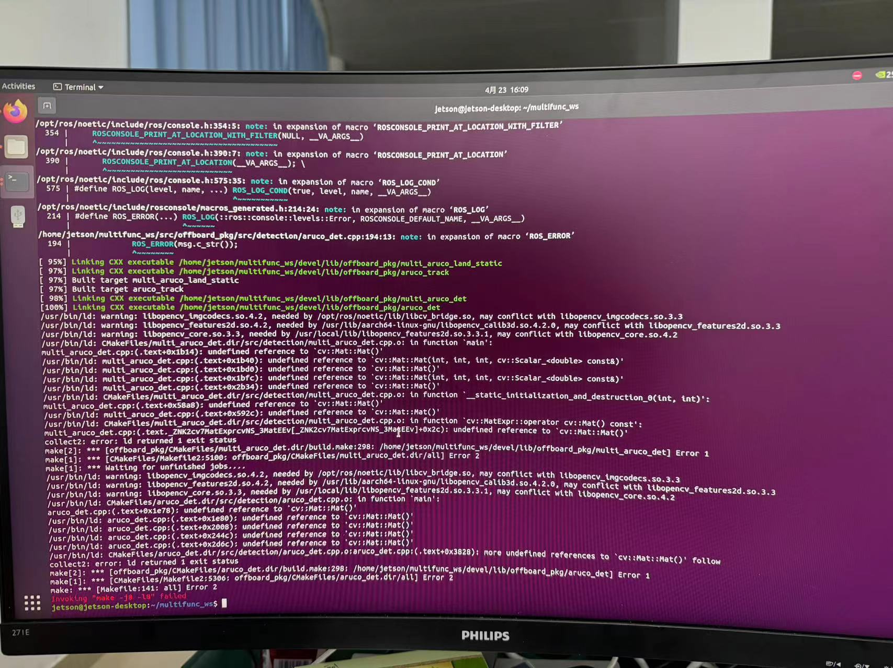

可以cmakelists里面加上这些打印，会发现虽然找到的是opencv3.3.1，但是链接的库还是opencv4的

```erlang
message(STATUS "OpenCV library status:")

message(STATUS " version: ${OpenCV_VERSION}")

message(STATUS " libraries: ${OpenCV_LIBS}")

message(STATUS " include path: ${OpenCV_INCLUDE_DIRS}")

message(STATUS " catkin libraries: ${catkin_LIBRARIES}")
```

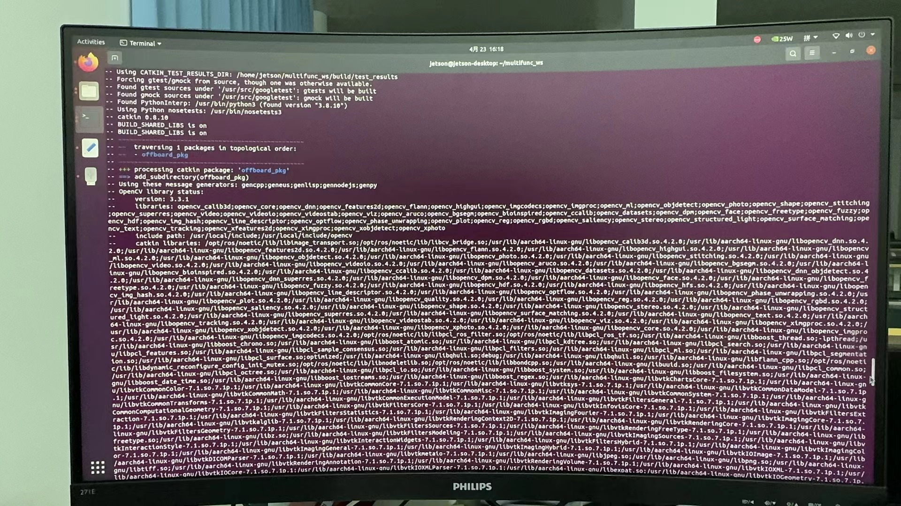

此时需要自己再另外编码编译安装一个cv\_bridge，之前系统二进制安装的cv\_bridge不用卸载，只需要保证自己的功能包找到的cv\_bridge功能包是源码编译安装的cv\_bridge功能包即可。实现这个的操作就是自己功能包的cmakelists里面加上`set(cv_bridge_DIR "your-path/cv_bridge_ws/devel/share/cv_bridge/cmake")` 。

按照下面操作源码编译部署一个cv\_bridge，使得这个cv\_bridge是调用的opencv3.3.1，同时自己这个功能包是找到的这个源码编译的cv\_bridge，而不是系统二进制安装的cv\_bridge就可以了。

ros1下源码编译安装cv\_bridge

```bash
mkdir -p cv_bridge_ws/src

cd cv_bridge_ws/src

git clone https://gitee.com/maxibooksiyi/cv_bridge

cd ..
```

将opencv编译生成的build文件路径加入到cv\_bridge功能包的CMakeLists.txt里，命令如下，像上面自己编译安装的opecv3.3.1的build文件夹路径就是`~/opencv331/opencv/build`

```csharp
set(OpenCV_DIR "your-path/opencv-x.x.x/build")
```

编译

```undefined
catkin_make
```

如果是ros2，则源码编译安装cv\_bridge功能包的步骤是

```cobol
mkdir cv_bridge_ros2_ws/src

cd cv_bridge_ros2_ws

cd src

git clone https://github.com/ros-perception/vision_opencv.git -b foxy
```

把cv\_bridge功能包里的cmakelists（/cv\_bridge\_ros2\_ws/src/vision\_opencv/cv\_bridge/CMakeLists.txt）里这里的OpenCV 4改为OpenCV 3  


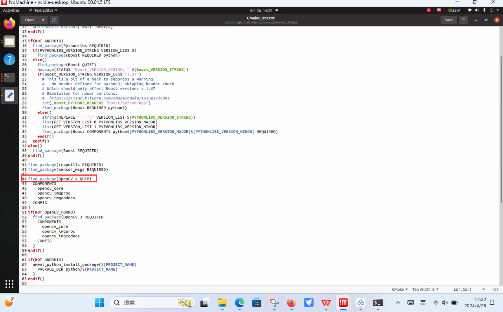

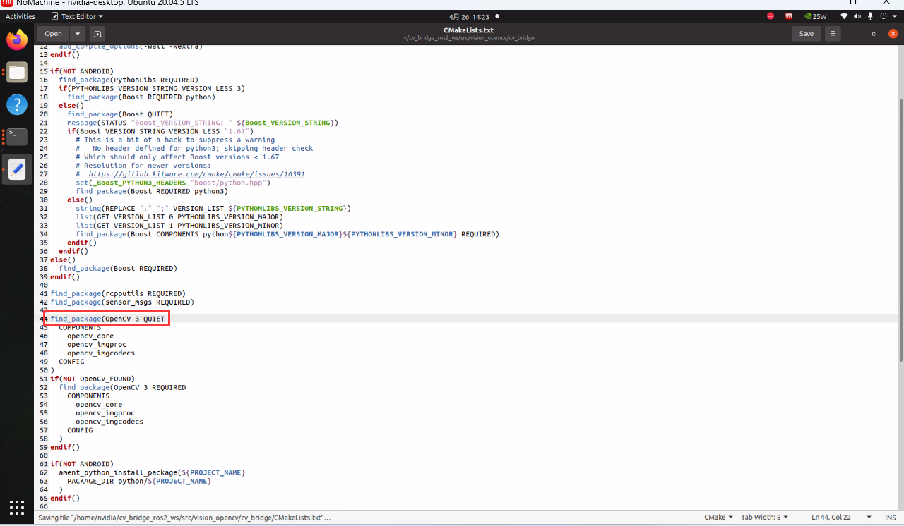


改完后保存编译

```erlang
cd ..

colcon build
```

源码编译部署完cv\_bridge功能包之后，最后将依赖使用指定opencv版本的功能包里的**CMakeLists.txt**文件按照下面命令添加opencv路径以及cv\_bridge路径，位置放在OpenCV和cv\_bridge的find\_package之前即可，这样再编译这个功能包就会链接的是所指定版本的opencv，而不是原来ros默认链接的opencv了。

```csharp
set(OpenCV_DIR "your-path/opencv-x.x.x/build")

set(cv_bridge_DIR "your-path/cv_bridge_ws/devel/share/cv_bridge/cmake")
```

## 代码全部：OpenCv4.6.0和cv\_bridge安装（gpu）

#### 1、opencv安装

移动至指定目录

```
cd ~/IPAC-drone/doc/
sudo mv ./opencv-4.6.0/ /usr/local/
sudo mv ./opencv_contirb-4.6.0/ /usr/local/
cd /usr/local/opencv-4.6.0/
```

确定安装路径，我的是CMAKE\_INSTALL\_PREFIX=/usr/local

开始编译

```
sudo mkdir build &amp;&amp; cd build
sudo cmake -D CMAKE_BUILD_TYPE=RELEASE \
        -D CMAKE_INSTALL_PREFIX=/usr/local \
        -D OPENCV_EXTRA_MODULES_PATH=../../opencv_contrib-4.6.0/modules \
        -D WITH_CUDA=ON \
        -D CUDA_ARCH_BIN=8.7 \
        -D CUDA_ARCH_PTX="" \
        -D ENABLE_FAST_MATH=ON \
        -D CUDA_FAST_MATH=ON \
        -D WITH_CUBLAS=ON \
        -D WITH_LIBV4L=ON \
        -D WITH_GSTREAMER=ON \
        -D WITH_GSTREAMER_0_10=OFF \
        -D WITH_QT=ON \
        -D WITH_OPENGL=ON \
        -D CUDA_NVCC_FLAGS="--expt-relaxed-constexpr" \
        -D WITH_TBB=ON \
        -D CUDA_SDK_ROOT_DIR=/usr/local/cuda-11.4/ \
        ..
sudo make
sudo make install
```

#### 2、cv\_bridge配置

创建cv\_bridge专属的工作空间

```
mkdir cv_bridge_460/src
cd ~/cv_bridge_460/src
```

将cv\_bridge移动到专属工作空间

```
cp ~/IPAC-drone/doc/cv_bridge ~/cv_bridge_460/src
```

编译

```
cd ~/cv_bridge_460/
catkin_make
```
