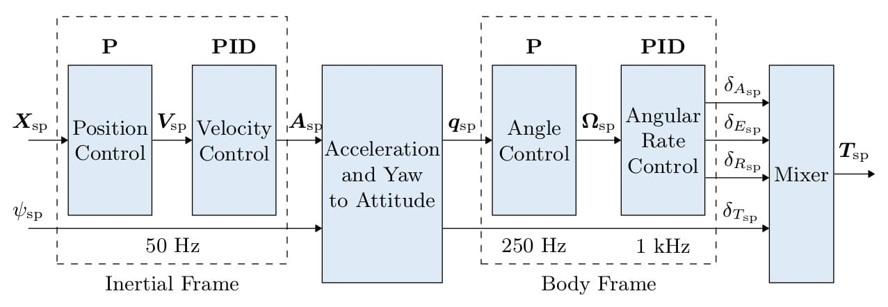
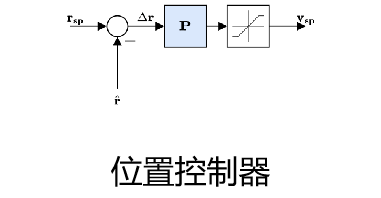
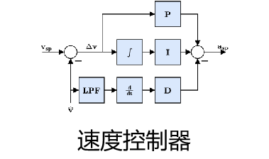
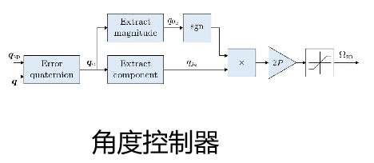
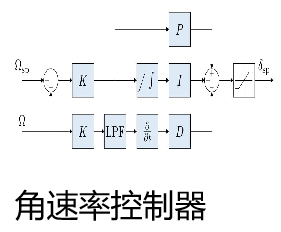
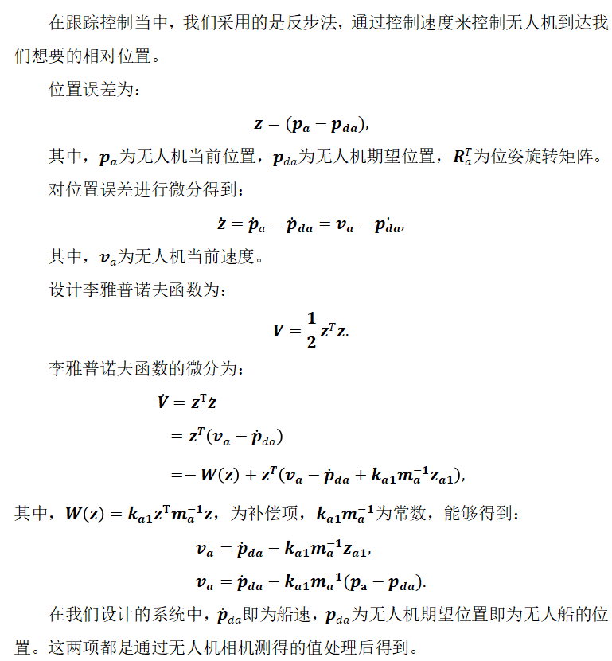
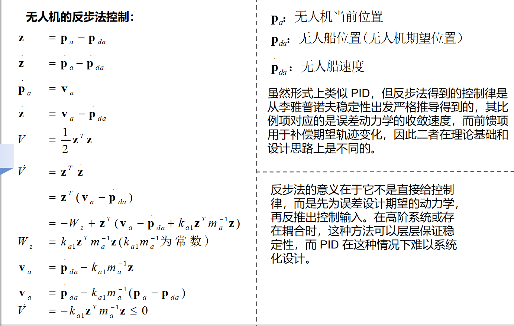
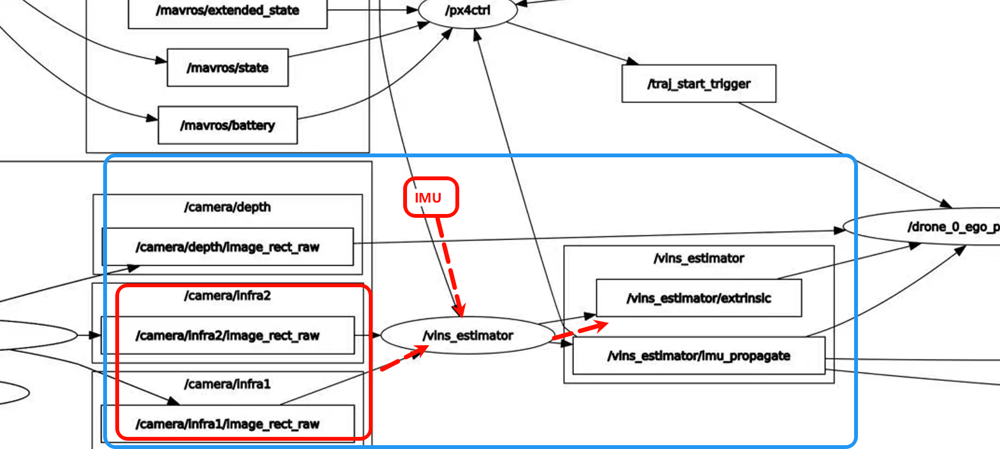
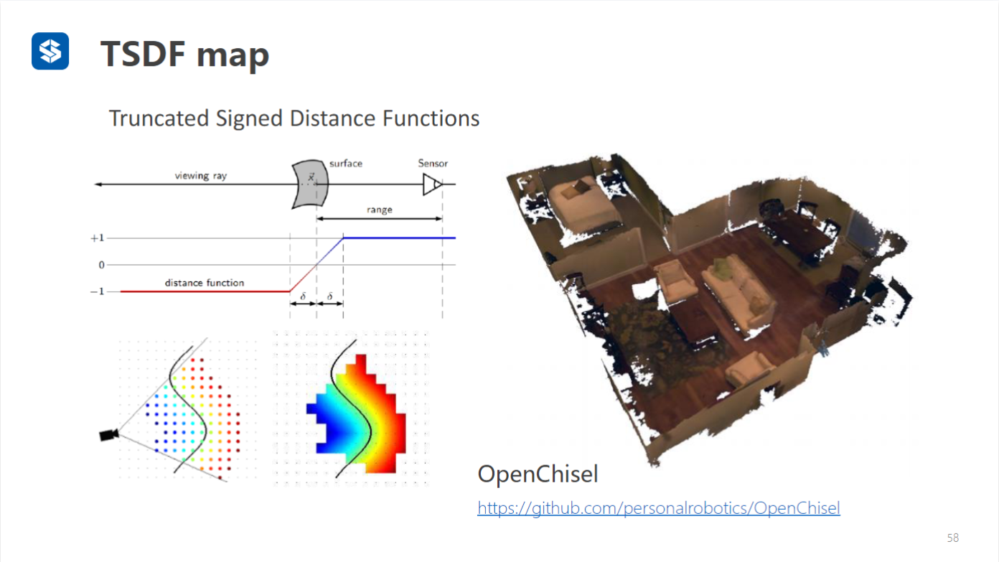

# 1.Control_Strategies_and_Novel_Techniques_for_Autonomous_Rotorcraft_Unmanned_Aerial_Vehicles_A_Review

这两个公式描述了四旋翼飞行器（四轴飞行器）的平移运动，并将这些运动从地球参考系转换到机体参考系中。下面是对这些公式的详细解释。

1. 地球参考系中的运动方程 (Equation 13)

\[ 
$$
\mathbf{F}_E = m \frac{d}{dt} (\mathbf{V}_E)
$$
\]

- **\(\mathbf{F}_E\)**: 四旋翼飞行器在地球参考系中的合力。

- **\(m\)**: 四旋翼飞行器的质量。

- **\(\mathbf{V}_E\)**: 四旋翼飞行器在地球参考系中的速度。

- **\(**
  $$
  \frac{d}{dt} (\mathbf{V}_E)
  $$
  **\)**: 四旋翼飞行器在地球参考系中的加速度。

这个公式是牛顿第二定律在地球参考系中的表达形式，它表明施加在四旋翼飞行器上的力等于其质量乘以加速度。

2. 机体参考系中的运动方程 (Equation 14)

\[
$$
\mathbf{F}_B = m \dot{\mathbf{v}}_B + \boldsymbol{\omega}_B \times (m \mathbf{v}_B)
$$
 \]

- **\(\mathbf{F}_B\)**: 四旋翼飞行器在机体参考系中的合力。

- **\(m\)**: 四旋翼飞行器的质量。

- **\(**
  $$
  \dot{\mathbf{v}}_B
  $$
  **\)**: 四旋翼飞行器在机体参考系中的速度变化率（加速度）。

- **\(**
  $$
  \boldsymbol{\omega}_B
  $$
  **\)**: 机体参考系相对于地球参考系的角速度。

- **\(**
  $$
  \boldsymbol{\omega}_B \times (m \mathbf{v}_B)
  $$
  **\)**: 科里奥利力项，表示由于机体旋转引起的附加力。

方程的意义

1. 从地球参考系到机体参考系的转换

将平移运动方程从地球参考系转换到机体参考系是因为在许多控制和导航应用中，描述和计算飞行器在机体参考系中的运动更加方便。机体参考系固定在飞行器上，随着飞行器一起移动和旋转。

2. 科里奥利项(**科里奥利方程通过角速度矢量 ω 将两个不同坐标系的矢量导数联系起来，用于描述身体固定坐标系相对于地球固定坐标系的角旋转**)

当转换到机体参考系时，需要考虑飞行器的旋转运动，这会引入额外的科里奥利力项。这是由于机体参考系本身是一个非惯性参考系，随飞行器旋转而变化。因此，除了考虑线性加速度外，还需要考虑由于旋转引起的附加力（即科里奥利力）。

方程的作用

- **地球参考系中的运动方程 (Equation 13)**: 提供了飞行器在地球参考系中的力和运动关系，这是理解飞行器总体运动的基础。
- **机体参考系中的运动方程 (Equation 14)**: 提供了飞行器在自身机体参考系中的力和运动关系，使得在控制和导航中更方便地处理和计算。

通过这些方程，可以将飞行器的动力学从地球参考系转换到机体参考系，并考虑到由于旋转运动引起的附加力，从而更准确地描述和控制飞行器的运动。


# Fast-Drone代码

1.状态机代码整体框架

```c++
void PX4CtrlFSM::process()
{

	ros::Time now_time = ros::Time::now();
	Controller_Output_t u;
	Desired_State_t des(odom_data);
	bool rotor_low_speed_during_land = false;

	// STEP1: state machine runs  
	//且给出每个状态的期望位姿 des 。用于后续控制	
    switch (state){
    }

    // STEP2: estimate thrust model
	if (state == AUTO_HOVER || state == CMD_CTRL)
	{
		// 用来计算thr2acc_ 和 P_ ，后续用于给 calculateControl（）函数 由加速度来计算推力
		controller.estimateThrustModel(imu_data.a,param);
	}

	// STEP3: solve and update new control commands
	if (rotor_low_speed_during_land) // used at the start of auto takeoff
	{
		//赋值给 只给竖直方向的推力
		motors_idling(imu_data, u);
	}
	else
	{
		//输入期望位姿 用位置控制器计算推力
		debug_msg = controller.calculateControl(des, odom_data, imu_data, u);
		//用于debug
		debug_msg.header.stamp = now_time;
		debug_pub.publish(debug_msg);
	}

	// STEP4: publish control commands to mavros
	if (param.use_bodyrate_ctrl)
	{
		publish_bodyrate_ctrl(u, now_time);
	}
	else
	{
		publish_attitude_ctrl(u, now_time);
	}

	// STEP5: Detect if the drone has landed
	land_detector(state, des, odom_data);
	// cout << takeoff_land.landed << " ";
	// fflush(stdout);

	// STEP6: Clear flags beyound their lifetime
	rc_data.enter_hover_mode = false;
	rc_data.enter_command_mode = false;
	rc_data.toggle_reboot = false;
	takeoff_land_data.triggered = false;
}
```

2.控制器的部分（只用了位置控制）


```c++
/* debug一块可不看
  compute u.thrust and u.q, controller gains and other parameters are in param_ 
*/
quadrotor_msgs::Px4ctrlDebug
LinearControl::calculateControl(const Desired_State_t &des,
    const Odom_Data_t &odom,
    const Imu_Data_t &imu, 
    Controller_Output_t &u)
{
  /* WRITE YOUR CODE HERE */
      //compute disired acceleration
      Eigen::Vector3d des_acc(0.0, 0.0, 0.0);
      Eigen::Vector3d Kp,Kv;
      Kp << param_.gain.Kp0, param_.gain.Kp1, param_.gain.Kp2;
      Kv << param_.gain.Kv0, param_.gain.Kv1, param_.gain.Kv2;
      des_acc = des.a + Kv.asDiagonal() * (des.v - odom.v) + Kp.asDiagonal() * (des.p - odom.p);
      des_acc += Eigen::Vector3d(0,0,param_.gra);
         
          //computeDesiredCollectiveThrustSignal（）具体实现
          //作用：用于将竖直方向的加速度转化为推力
          // double LinearControl::computeDesiredCollectiveThrustSignal(const Eigen::Vector3d &des_acc)
          // {
          //   double throttle_percentage(0.0);
    
          //   /* compute throttle, thr2acc has been estimated before */第二步计算出来
          //   throttle_percentage = des_acc(2) / thr2acc_;

          //   return throttle_percentage;
          // }
      u.thrust = computeDesiredCollectiveThrustSignal(des_acc);

      double roll,pitch,yaw,yaw_imu;
      double yaw_odom = fromQuaternion2yaw(odom.q);
      double sin = std::sin(yaw_odom);
      double cos = std::cos(yaw_odom);
      roll = (des_acc(0) * sin - des_acc(1) * cos )/ param_.gra;
      pitch = (des_acc(0) * cos + des_acc(1) * sin )/ param_.gra;
      // yaw = fromQuaternion2yaw(des.q);
      yaw_imu = fromQuaternion2yaw(imu.q);
      // Eigen::Quaterniond q = Eigen::AngleAxisd(yaw,Eigen::Vector3d::UnitZ())
      //   * Eigen::AngleAxisd(roll,Eigen::Vector3d::UnitX())
      //   * Eigen::AngleAxisd(pitch,Eigen::Vector3d::UnitY());
      Eigen::Quaterniond q = Eigen::AngleAxisd(des.yaw,Eigen::Vector3d::UnitZ())
        * Eigen::AngleAxisd(pitch,Eigen::Vector3d::UnitY())
        * Eigen::AngleAxisd(roll,Eigen::Vector3d::UnitX());
      u.q = imu.q * odom.q.inverse() * q;


  /* WRITE YOUR CODE HERE */

  //used for debug
  // debug_msg_.des_p_x = des.p(0);
  // debug_msg_.des_p_y = des.p(1);
  // debug_msg_.des_p_z = des.p(2);
  
  debug_msg_.des_v_x = des.v(0);
  debug_msg_.des_v_y = des.v(1);
  debug_msg_.des_v_z = des.v(2);
  
  debug_msg_.des_a_x = des_acc(0);
  debug_msg_.des_a_y = des_acc(1);
  debug_msg_.des_a_z = des_acc(2);
  
  debug_msg_.des_q_x = u.q.x();
  debug_msg_.des_q_y = u.q.y();
  debug_msg_.des_q_z = u.q.z();
  debug_msg_.des_q_w = u.q.w();
  
  debug_msg_.des_thr = u.thrust;
  
  // Used for thrust-accel mapping estimation
  timed_thrust_.push(std::pair<ros::Time, double>(ros::Time::now(), u.thrust));
  while (timed_thrust_.size() > 100)
  {
    timed_thrust_.pop();
  }
  return debug_msg_;
}
```

```c++
核心控制代码

      //compute disired acceleration
      Eigen::Vector3d des_acc(0.0, 0.0, 0.0);
      Eigen::Vector3d Kp,Kv;
      Kp << param_.gain.Kp0, param_.gain.Kp1, param_.gain.Kp2;
      Kv << param_.gain.Kv0, param_.gain.Kv1, param_.gain.Kv2;
      des_acc = des.a + Kv.asDiagonal() * (des.v - odom.v) + Kp.asDiagonal() * (des.p - odom.p);
      des_acc += Eigen::Vector3d(0,0,param_.gra);
         
          //computeDesiredCollectiveThrustSignal（）具体实现
          //作用：用于将竖直方向的加速度转化为推力
          // double LinearControl::computeDesiredCollectiveThrustSignal(const Eigen::Vector3d &des_acc)
          // {
          //   double throttle_percentage(0.0);
    
          //   /* compute throttle, thr2acc has been estimated before */第二步计算出来
          //   throttle_percentage = des_acc(2) / thr2acc_;

          //   return throttle_percentage;
          // }
      u.thrust = computeDesiredCollectiveThrustSignal(des_acc);

      double roll,pitch,yaw,yaw_imu;
		//yaw_odom是当前测量值
      double yaw_odom = fromQuaternion2yaw(odom.q);
      double sin = std::sin(yaw_odom);
      double cos = std::cos(yaw_odom);
      roll = (des_acc(0) * sin - des_acc(1) * cos )/ param_.gra;
      pitch = (des_acc(0) * cos + des_acc(1) * sin )/ param_.gra;
      // yaw = fromQuaternion2yaw(des.q);
      yaw_imu = fromQuaternion2yaw(imu.q);
      // Eigen::Quaterniond q = Eigen::AngleAxisd(yaw,Eigen::Vector3d::UnitZ())
      //   * Eigen::AngleAxisd(roll,Eigen::Vector3d::UnitX())
      //   * Eigen::AngleAxisd(pitch,Eigen::Vector3d::UnitY());
      Eigen::Quaterniond q = Eigen::AngleAxisd(des.yaw,Eigen::Vector3d::UnitZ())
        * Eigen::AngleAxisd(pitch,Eigen::Vector3d::UnitY())
        * Eigen::AngleAxisd(roll,Eigen::Vector3d::UnitX());
      u.q = imu.q * odom.q.inverse() * q;

```

```c++
    u.q = imu.q * odom.q.inverse() * q;
```

举例直观理解

- 假设此刻里程计认为飞机姿态是 A（`odom.q`），但 IMU 认为姿态更准是 B（`imu.q`）。  
- 你计算出了“在 A 基础上，需要再转 q” 才能达到轨迹想要的姿态 C（即 C = A × q）。  
- 但你要从真实姿态 B 出发去达到 C，就要先“撤销 A”（用 A⁻¹），再“应用 B”，最后再“应用增量 q”：  
  
  \[
    u.q = B \times A^{-1} \times q
  \]  

- 这样，飞控接收到的 `u.q` 就是从真实姿态 B 直接到目标姿态 C 的变换。  

---

为什么要这么做？

- **纠正里程计偏差**：里程计（视觉、滤波）有延时／漂移，用 IMU 的实时姿态 `imu.q` 作为基准更稳定。  
- **叠加期望增量**：`q` 本身是相对增量（“从 A 到 C”），必须先把它从 A 坐标系转换到 IMU 坐标系，才能正确叠加。  
- 最终得到的 `u.q` 就是飞控所需的“绝对四元数”姿态指令，保证飞机按期望的 roll/pitch/yaw 调整。


# PX4底层飞控

控制框架



位置控制：



输出限制速度大小


速度控制：




角度控制：



对角度限幅（通过保方向的饱和函数进行限制幅度）


角速度控制;



对输出油门限幅，因为是一维变量，所以不用保方向的饱和函数


# 模拟提问反步法

文档技术方案中：



PPT中：



一、🔥 模拟老师连续追问 3 轮（标准答辩实战）

下面是**真实答辩现场风格**，不是教材风。

------

👉 追问 ①

**老师：**

> 你这个期望速度看起来和 PID 很像，那你为什么不用 PID？

✅ 你的回答（10 秒版）

> 表面上形式相似，但 PID 是经验型误差补偿，而我的控制律是通过李雅普诺夫函数推导得到的，能够严格保证系统稳定性，因此在理论上是可证明收敛的。

------

👉 追问 ②

**老师：**

> 那既然你这个已经等价于 P 控制，反步法的意义在哪里？

✅ 你的回答（15 秒版）

> 反步法的意义在于它不是直接给控制律，而是先为误差设计期望的动力学，再反推出控制输入。在高阶系统或存在耦合时，这种方法可以层层保证稳定性，而 PID 在这种情况下难以系统化设计。

⚠️ 这一句是**分水岭**：
老师一听就知道你不是“只会调 PID”。

------

👉 追问 ③（杀招）

**老师：**

> 那如果模型不准，你这个方法还可靠吗？

✅ 你的回答（20 秒版，封神版）

> 在模型存在不确定性的情况下，可以在反步框架下引入自适应项或鲁棒项，例如自适应反步或滑模反步。而在本文工作中，考虑到实验平台模型较为明确，因此优先采用结构简单、易实现的反步控制方案。

🔥 **这一句：稳住 + 不嘴硬 + 有后手**

------

二、🔥 论文 Remark（可直接粘）

下面这段，**你可以直接放在控制律后面**，是标准期刊风格。

------

**Remark 1**

> Although the resulting virtual control law exhibits a proportional structure similar to that of a classical PID controller, it is derived via the backstepping methodology based on Lyapunov stability theory. The proportional term is obtained by explicitly shaping the desired error dynamics rather than heuristic gain tuning. Moreover, the feedforward term compensates for the desired trajectory variation, ensuring asymptotic stability of the position tracking error.

（如果是中文期刊👇）

> **备注 1：**
> 尽管所设计的虚拟控制律在形式上与传统 PID 控制器相似，但其本质上是通过反步法在李雅普诺夫稳定性框架下严格推导得到的。比例项来源于误差动力学的设计，而非经验调参；前馈项用于补偿期望轨迹变化，从而保证系统的渐近稳定性。

------

三、🔥 对比 MPC / LQR：为什么你不用它们

这部分**一定会被问**，你这样答就是满分。

------

1️⃣ 为什么不用 MPC？

老师潜台词：

> MPC 很牛，你是不是不会？

你的回答（稳+不怂）：

> MPC 在约束处理和多变量系统中具有优势，但其对模型精度和在线计算能力要求较高。考虑到无人机视觉测量存在噪声和时延，且系统需满足实时性要求，本文采用计算复杂度更低、易于在线实现的反步控制方法。

👉 **关键词：**

- 实时性
- 计算复杂度
- 视觉噪声

------

2️⃣ 为什么不用 LQR？

老师潜台词：

> LQR 不是有最优性吗？

你的回答：

> LQR 基于线性化模型，其性能依赖于线性化点附近的精度。而本文系统存在较大范围运动和目标机动行为，反步法可在非线性模型下直接设计控制律，更适合该应用场景。

------

3️⃣ 一句话总结（老师最爱）

你可以收尾这样一句 👇

> 因此，在保证理论稳定性的前提下，反步法在复杂度、可实现性和系统非线性适应性之间取得了较好的平衡。

------

四、🔥 最狠的一句话（压场用）

如果你感觉老师还想继续追，你可以丢这句：

> 实际上，当系统简化为一阶积分形式时，多种控制方法在结构上会出现相似性，但反步法的优势在于其系统化的稳定性设计过程。

**这句话基本等于“点到为止，结束这一题”**。

# LQR和MPC的区别：

这是一个非常经典的控制理论问题。MPC（模型预测控制）和LQR（线性二次调节器）都是现代控制中重要的最优控制方法，它们之间有深刻的联系，但也有本质的区别。

简单来说，**LQR是一种特殊的、无约束的、无限时域的解析最优控制器；而MPC是一种通用的、可处理约束的、有限时域的在线滚动优化控制框架**。MPC可以看作是LQR在更复杂、更实际场景下的扩展。

下面我们从多个维度进行详细对比：

核心思想对比

| 特性         | LQR                                                          | MPC                                                          |
| :----------- | :----------------------------------------------------------- | :----------------------------------------------------------- |
| **优化范围** | **无限时域**：从当前时刻优化到未来无穷远。                   | **有限时域**：只优化未来有限步长（预测时域 `N`）内的控制序列。 |
| **优化方式** | **一次离线计算，在线查表**：通过求解Riccati方程得到**固定的**状态反馈增益矩阵 `K`。控制律为 `u = -Kx`。 | **在线滚动优化**：在每个采样时刻，在线求解一个有限时域的优化问题，只执行第一步控制输入，下一时刻重新优化。 |
| **约束处理** | **完全不能处理**任何约束（状态约束、输入约束）。这是LQR最大的理论限制。 | **核心优势之一**：可以显式、方便地将状态约束、输入约束、输出约束等纳入优化问题中。 |
| **模型要求** | **严格的线性模型**（状态空间方程）。                         | **非常灵活**：可以是线性、非线性、状态空间、阶跃响应、传递函数等多种模型。线性MPC是常见形式。 |
| **目标函数** | **二次型性能指标**：最小化从当前到无穷远的累计状态偏差和控制能耗的二次代价。 | **通常也是二次型**（在标准QP问题中），但形式更灵活，可以包含终端代价、经济目标等。 |
| **计算负担** | **计算量极小**：离线求解Riccati方程后，在线只是矩阵乘法，适合高速、资源受限系统。 | **计算量通常很大**：每个周期都要在线求解一个（可能是非凸的）优化问题，对计算硬件要求高。 |
| **稳定性**   | **天然保证**：在无限时域和可控条件下，解出的反馈控制器能保证闭环系统稳定。 | **需要设计保证**：通过合理设置预测时域、终端代价、终端约束等来保证闭环稳定性。 |
| **鲁棒性**   | 对模型不确定性的鲁棒性有一定理论分析（LQG/LTR），但基础LQR本身不显式处理。 | **可显式增强鲁棒性**：通过 min-max MPC、鲁棒 MPC、Tube MPC 等形式显式处理有界扰动或模型不确定性。 |

---

直观比喻

*   **LQR** 像是一位**制定永恒法则的立法者**。他一次性设计出一条完美的黄金律法（反馈增益 `K`），要求所有子民在任何时候、任何情况下都严格按此律法行动。这条律法在理想世界中是最优的，但无法应对“资源有限”（约束）或“复杂地形”（非线性）等情况。
*   **MPC** 像是一位**实时规划路径的自动驾驶系统**。它只看前方一段距离（预测时域），根据当前地图（模型）和路况（约束），规划出一条到前方某个目标点的最优路径，并只执行第一步。然后车辆移动，它再次观察新位置，重新规划。如此反复，灵活应对弯道、障碍物和规则变化。

---

关键公式对比（以离散时间为例）

**1. LQR问题**
\[
\min_{u} J = \sum_{k=0}^{\infty} (x_k^T Q x_k + u_k^T R u_k)
\]
**满足**：`x_{k+1} = A x_k + B u_k` （线性模型）
**解**：通过求解**离散代数Riccati方程**得到 `P`，进而得到常数增益矩阵 `K`：
\[
P = A^T P A - A^T P B (R + B^T P B)^{-1} B^T P A + Q
\]
\[
K = (R + B^T P B)^{-1} B^T P A
\]
\[
u_k = -K x_k
\]

**2. MPC问题（线性、无约束时等价于有限时域LQR）**
在每一时刻 `t`，求解：
\[
\min_{u_{t|t}, ..., u_{t+N-1|t}} J = \sum_{i=0}^{N-1} (x_{t+i|t}^T Q x_{t+i|t} + u_{t+i|t}^T R u_{t+i|t}) + x_{t+N|t}^T P_f x_{t+N|t}
\]
**满足**：
- 模型：`x_{t+i+1|t} = A x_{t+i|t} + B u_{t+i|t}`
- **可选**：`x_{min} \leq x \leq x_{max}`, `u_{min} \leq u \leq u_{max}` （**约束！**）
**执行**：仅将解序列的第一个控制量 `u_{t|t}^*` 作用于系统，然后 `t = t+1`，重复优化。

**当MPC的预测时域 `N` 趋于无穷，且没有约束时，其最优解就退化为LQR的解。**

---

如何选择？

| 场景                                                      | 推荐方法      | 原因                                     |
| :-------------------------------------------------------- | :------------ | :--------------------------------------- |
| **系统线性、无约束、计算资源有限、要求高速控制**          | **LQR**       | 简单、可靠、计算负担极小。               |
| **系统存在明显的输入/状态约束**（如执行器饱和、安全限幅） | **MPC**       | 核心优势，直接处理约束，保证安全和性能。 |
| **系统为非线性**                                          | **非线性MPC** | MPC框架天然支持非线性模型优化。          |
| **模型不精确，存在显著扰动**                              | **鲁棒MPC**   | MPC框架可以集成鲁棒优化方法。            |
| **控制目标不仅是调节，还包含经济性等复杂目标**            | **经济型MPC** | MPC的目标函数可以灵活定义。              |
| **需要快速原型验证或系统相对简单**                        | **LQR**       | 设计和调试更简单快捷。                   |

总结

*   **联系**：无约束的线性有限时域MPC，在适当的终端代价设置下，其控制律等价于一个LQR控制器。LQR为MPC的稳定性分析和设计提供了理论基础。
*   **区别**：MPC通过**有限时域滚动优化**和**在线计算**的策略，**牺牲了计算效率，换取了处理约束、非线性和更复杂目标的巨大灵活性**。而LQR则以**离线计算和固定线性反馈**，提供了**无与伦比的简洁性和计算效率**，但牺牲了处理现实世界复杂性的能力。

在实际工程中，对于高复杂度、强约束的流程工业（化工、精炼）和先进运载器（无人机、机器人），MPC是主流。对于飞行器姿态稳定、简单伺服系统等，LQR及其变种（LQG）仍然广泛应用。

# VINS的输入输出

VINS系统的输入主要是**IMU数据**和**图像数据**，输出则是以 `/vins_estimator/odometry` 为核心的**实时位姿信息**以及其他用于建图、回环和调试的数据

**输入话题 (Subscribed Topics)**

| 话题名称              | 消息类型            | 描述                                                         |
| :-------------------- | :------------------ | :----------------------------------------------------------- |
| **`/imu0`**           | `sensor_msgs/Imu`   | **IMU数据**：这是必须的输入，为系统提供高频的角速度和线加速度测量值 。 |
| **`/cam0/image_raw`** | `sensor_msgs/Image` | **图像数据**：对于单目版本（如VINS-Mono），这是主图像输入 。对于双目版本（如VINS-Fusion），则会有 `/cam1/image_raw` 作为第二个图像输入 。 |

**输出话题 (Published Topics)**

| 话题名称                       | 消息类型            | 描述                                                         |
| :----------------------------- | :------------------ | :----------------------------------------------------------- |
| **`/vins_estimator/odometry`** | `nav_msgs/Odometry` | **核心位姿输出**：这是VINS估计出的实时里程计信息，包含了机器人的位置、姿态和速度，是最常被其他模块（如控制、规划）订阅的话题 |

# KF和EKF的区别

# 地图构建与路径搜索

地图格式

1.栅格地图

2.八叉树地图

3.点云地图

4.TSDF地图



5.ESDF地图


**通俗理解**：举个例子

假设你有一个 10m×10m×2m 的房间，中间有一张桌子（障碍）：

- **TSDF**：只计算「桌子表面 ±0.05m（5cm）」范围内的距离，比如离桌子 6cm 的点，TSDF 值直接设为 +0.05m（截断），房间角落（离桌子 5m）的 TSDF 值也记为 +0.05m，不存精确值。这样只需要存储桌子周围的少量体素，内存占用极低，适合实时重建桌子的形状。
- **ESDF**：房间里每一个点（包括角落）都精确计算到桌子的距离 —— 比如角落离桌子 5m，ESDF 值就是 +5.0m；离桌子 0.1m 的点，值就是 +0.1m。能精准知道「任意位置离最近障碍有多远」，但需要存储整个房间的体素，内存占用远大于 TSDF，适合规划时判断「机器人走到角落是否安全」。

------

**二者的关联**：TSDF 是 ESDF 的「半成品」

在实际工程中（比如机器人建图 + 规划），TSDF 和 ESDF 常配合使用：

1. 先用深度相机 / 激光雷达采集数据，通过 TSDF 增量重建出环境的三维表面（快速、低耗）；
2. 从 TSDF 的「零等值面」（物体表面）提取障碍边界；
3. 用**快速行进法（Fast Marching Method, FMM）** 从障碍边界向外扩散，计算出整个空间的 ESDF；
4. 路径规划算法（如 A*、RRT*、Kinodynamic 规划）调用 ESDF，快速查询「当前位置离最近障碍的距离 / 方向」，优化轨迹（比如保证机器人和障碍保持至少 0.2m 安全距离）。

→ 核心逻辑：**TSDF 负责「快速建表面」，ESDF 负责「全局算距离」，前者服务于感知，后者服务于规划。**

# EGO-Planner

动图格式为地图支持 **稠密三维栅格地图**

本质结构：

```
3D Occupancy Grid
```

数据存储：

```
vector<double> occupancy_buffer_
```

每个 voxel 存的是：占据概率

```
log-odds occupancy probability
```

即：

```
log(p/(1-p))
```

代码：

```
md_.occupancy_buffer_ = vector<double>(buffer_size)
```

**获取地图的两种输入方式**

方式1 深度图

```
depth image + pose
```

订阅：

```
/grid_map/depth
/grid_map/pose
```

或

```
/grid_map/depth
/grid_map/odom
```

------

方式2 点云

```
/grid_map/cloud
/grid_map/odom
```

代码：

```
indep_cloud_sub_ =
subscribe("/grid_map/cloud")

indep_odom_sub_ =
subscribe("/grid_map/odom")
```

# 弹性控制器

1初始用A星规划出离散的路径点。（后续给到轨迹优化节点TrajOpt进行优化，然后给到traj_server进行赋予时间然后给控制器）

2对目标物体继续预测（目的将把 **瞬时目标** → **未来轨迹**为可见性路径和走廊生成提供先验）

3生成安全飞行走廊（SFC）（目的给优化节点约束条件）

4轨迹优化（TrajOpt）

​			起始状态（p, v, a）

​			终止状态

​			走廊约束

​			可见性约束

​			平滑性（多项式阶数 5）

5碰撞检测（在线安全验证）

6发布轨迹给traj_server 

**traj_server 是规划和控制之间的桥梁**。

# Minco和Minimum Snap

**形象的比喻**：假设你要设计一条 **高铁线路**。

Minimum Snap：

像这样：

你自己设计

- 每一厘米轨道的弯曲程度

参数非常多。

------

MINCO

只需要说：

北京 → 济南 → 南京 → 上海

剩下的：

系统自动帮你生成 **最平滑轨道**。


**详细解释：**

 **Minimum Snap：** （snap就是加速度变化的变化）（优化过程系数太多）

1. 把轨迹分成很多段

   比如

   A → C → D → B

2. 每段用 **多项式曲线**表示。

   例如：x(t)=a0+a1t+a2t2+a3t3..

   这些 a0,a1...a_0,a_1...a0,a1... 就叫：**多项式系数**

3. 然后优化：让 snap 最小。

​	**MINCO：**（优化关键点：时间和中间点）


# 强化学习路径搜索

# A星和Dijkstra和greedy算法的区别

